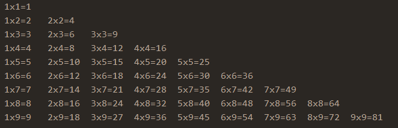
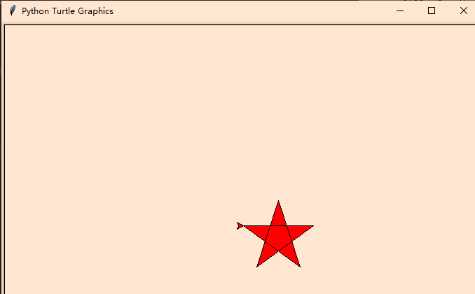
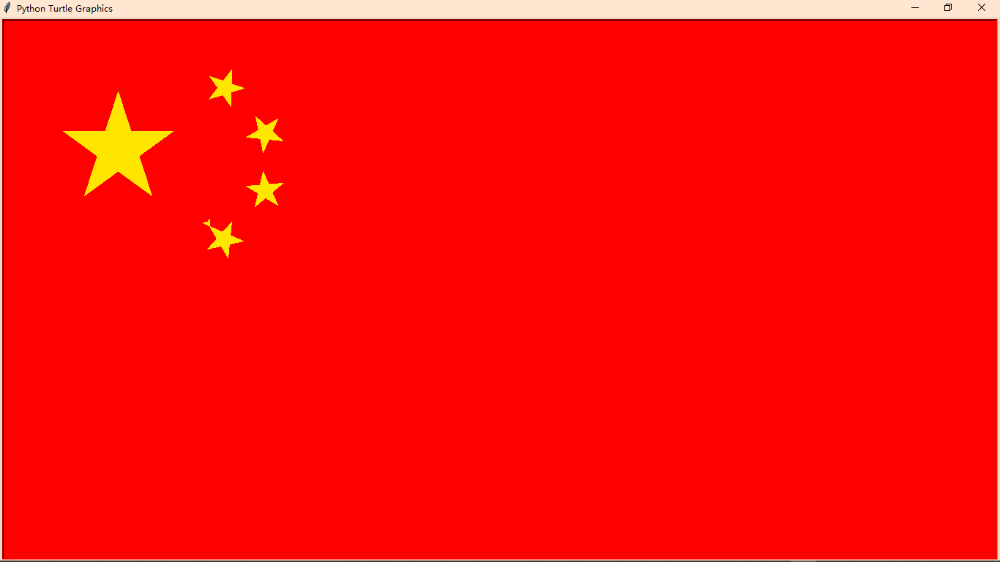

### 1、九九乘法表

```python
for i in range(1, 10):
    for j in range(1, i + 1):
        print('{}x{}={}\t'.format(j, i, i * j), end='')
    print()
```

自然语言解释流程：

```
	首先，九九乘法表需要1~9共9个数，于是首先用range(1,10)进行遍历，i便会依次取值1、2……9，于是引入新的变量j进行遍历，range(1,i+1)，这样做的思想是一行一行的绘制，最后拼接！
	于是，用end =""进行拼接，用format进行对应传参，\t是为了格式好看
	最后print()相当于换行的意思
```

效果图如下：




### 2、判断某年是否是闰年

```python
year = int(input("请输入一个年份："))
    if (year % 4) == 0 and (year % 100) != 0 or (year % 400) == 0:
        print("{}是闰年".format(year))
    else:
        print("{}不是闰年".format(year))
```

自然语言流程解释：

```
	首先，使用遍历year来接收用户传入的年份的整数形式
	接着，使用表达式进行判断，如果year可以被400整除或者是被4整除且不能被100整除，那么year就是闰年，否则year不是闰年
	if-else是条件判断语句，先判断if的条件是否成立，成立的话就执行if的执行语句，否则执行else里面的执行语句!
```

效果图如下：


### 3、turtle绘制五角星

```python
import turtle as t

window = t.Screen()
t.fillcolor('red')
t.begin_fill()
for i in range(5):
	if (i < 5):
		t.forward(100)
		t.right(144)
		i += 1
t.end_fill()
window.exitonclick()
```

自然语言解释流程：

```
	使用turtle库绘制五角星，首先创建一个窗口window = turtle.Screen()，接着开始填充颜色turtle.fillcolor('red')，让绘制的图形显示红色，turtle.begin_fill()开始填充，后面使用for循环来进行五角星的每一笔勾勒，forward(100)代表的是当前箭头方向前进100像素，然后right(144)指的是顺时针旋转144度
	这样循环5次后，能绘制出完整的五角星
	最后，turtle.end_fill()结束填充，window.exitonclick()设置作用是使用当前窗口展示五角星
```

效果图如下：




### 4、turtle绘制五星红旗

```python
import turtle as t

window = t.Screen()
t.bgcolor("red")
t.fillcolor("yellow")
t.color('yellow')
t.speed(10)
#主星
t.begin_fill()
t.up()
t.goto(-600,220)
t.down()
for i in range (5):
    t.forward(150)
    t.right(144)
t.end_fill()
#第1颗副星
t.begin_fill()
t.up()
t.goto(-400,295)
t.setheading(305)
t.down()
for i in range (5):
    t.forward(50)
    t.left(144)
t.end_fill()
#第2颗副星
t.begin_fill()
t.up()
t.goto(-350,212)
t.setheading(30)
t.down()
for i in range (5):
    t.forward(50)
    t.right(144)
t.end_fill()
#第3颗副星
t.begin_fill()
t.up()
t.goto(-350,145)
t.setheading(5)
t.down()
for i in range (5):
    t.forward(50)
    t.right(144)
t.end_fill()
#第4颗副星
t.begin_fill()
t.up()
t.goto(-400,90)
t.setheading(300)
t.down()
for i in range (5):
    t.forward(50)
    t.left(144)
t.end_fill()
window.exitonclick()
```

自然语言解释：

```
	turtle绘制五星红旗难点在于，几个五角星的方位
	首先，创建一个窗口window = t.Screen()，设置窗口背景色是红色，设置绘制图形填充色是黄色，设置绘制速度10，这样红旗的背景和长方体已经完成！
	接着绘制主星，先找到适合绘制的方位点t.goto(-600,220)，然后就开始for循环，5次遍历，每次forward(100)以及right(144)，最后填充结束end_fill()就可以绘制完毕主星
	4颗副星操作类似，也是找到方位，然后for循环遍历操作
	最后使用当前窗口展示此五星红旗
```

效果图如下：

