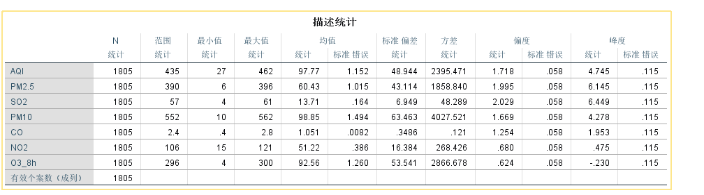
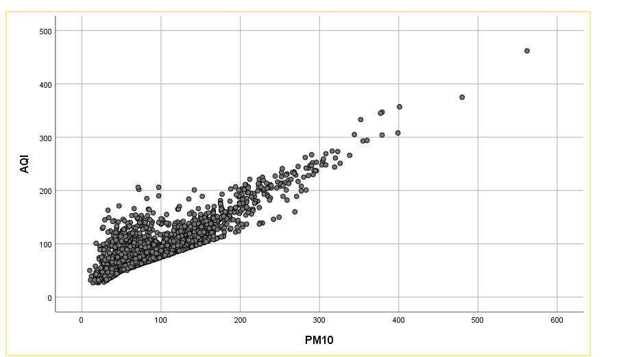

### 描述性分析

对`PM2.5、PM10、SO2、CO、NO2、O3_8h、AQI`进行描述性分析：

可以看出`AQI、PM2.5、PM10、O3_8h`最小值有0，不符合，使用`open refine`对于不符合的数据进行删除，将删除后的数据继续进行描述性分析：

通过描述性分析可以看到不同变量的区间范围以及平均值，通过方差数值能够看出，除了`co、SO2`变量的每日的差异较小之外，其他变量每日的差异较大，通过偏度数据可以看出各个变量呈现左偏分布状态，通过峰度能看出`AQI、PM2.5 、SO2、PM10`呈现高峰态 `CO、NO2、O3_8h`呈现低峰态。

### 线性回归分析

1. 将`AQI` 定义为因变量，`PM2.5、PM10、SO2、CO、NO2、O3_8h`定义为自变量，进行线性回归分析

2. 根据调整后的R方为0.903>0.6，初步判断模型拟合效果良好

   

3. 方差分析的显著性值=`0.000<0.01<0.05`,表明由自变量`PM2.5、PM10、SO2、CO、NO2、O3_8h`和因变量`AQI`建立的线性回归模型具有极显著的统计学意义，若自变量`PM2.5、PM10、SO2、CO、NO2、O3_8h`的数值同时增加，可增加`AQ`的值的线性关系显著

4. 由下图为标准化系数可知模型表达式`A=0.172+0.971B+0.081C-0.112D+9.701E-0.119F+0.306G`,t检验原假设回归系数没有意义，`PM2.5、PM10、 CO、NO2、O3_8h`的显著性小于或等于0.01，说明这些自变量与因变量之间是正比相关，并且显著

   

5. 从标准化残差直方图来看，左右基本对称，从标准化残差的P-P图来看，两条线并不完全靠近，综合而言数据做回归分析虽不理想但可以接受

   

   

   6.模型残差独立性检验。`DW=0.989`，查询`Durbin Watson Table`可知，认定残差独立，通过检验

   

### 相关性分析

1. 对`AQI与PM2.5`进行双变量相关性分析，相关性显著，两个变量的值在100以内时先相关性要略小，变量的值大于100时，基本呈正相关

   

   

2.  对`AQI与PM10`进行双变量相关性分析，变量值在200以内，相关性显著，变量值超过200后相关性下降

   

   

3. 对`AQI与SO2`进行双变量相关性分析，变量值小于200时相关性显著

   

   

4. 对`AQI与CO`进行双变量相关性分析,相关性显著

   

   

5. 对`AQI与NO2`进行双变量相关性分析,相关性显著

   

   

6. 对`AQI与O3_8h`进行双变量相关性分析,相关性显著

   

   

