### ARIMA

#### 平稳性

```
1）平稳性就是要求经由样本时间序列所得到的拟合曲线在未来一段时间内仍能顺着现有的形态"惯性"地延续下去
2）平稳性要求序列地均值和方差不发生明显变化
```


#### 严平稳和弱平稳

```
1）严平稳：严平稳表示地分布不随时间的改变而改变。如：白噪声(正态)，无论怎么取都是期望0，方差1
2）弱平稳：期望与相关系数(依赖性)不变，未来某时刻的t的值Xt就要依赖于它的过去信息，所以需要依赖性
```


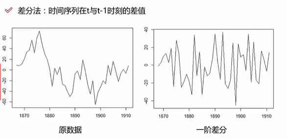

#### 自回归模型(AR)

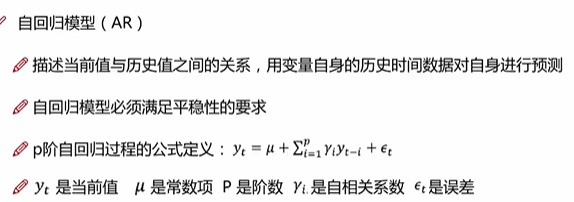

#### 自回归模型的限制

```
1）自回归模型是用自身的数据进行预测
2）必须具有平稳性
3）必须具有自相关性，如果自相关系数(βi)小于0.5，则不宜采用
4）自回归只适用于预测与自身前期相关的现象
```


#### 移动平均模型

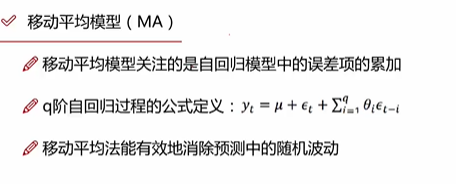

#### 自回归移动平均模型(ARIMA)

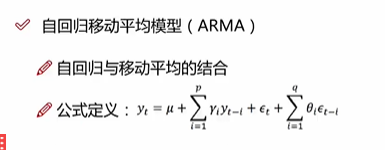

```
3个参数：p、q都是阶数，d是表示是几阶差分
```

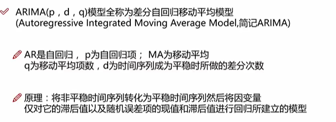


#### 自相关系数

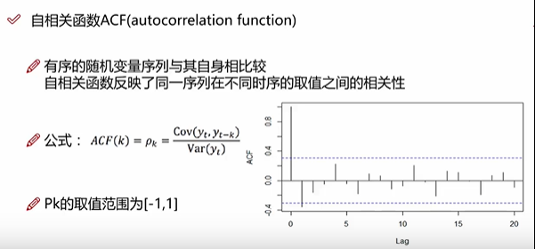

```
置信区间：95%
```


#### 偏自相关系数

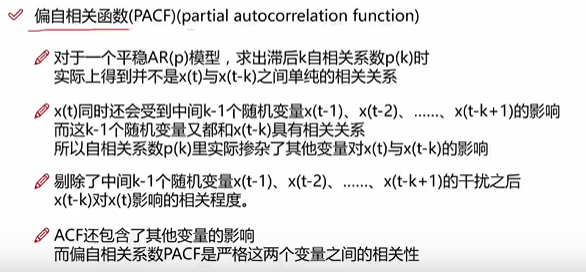


#### PACF阶数确定

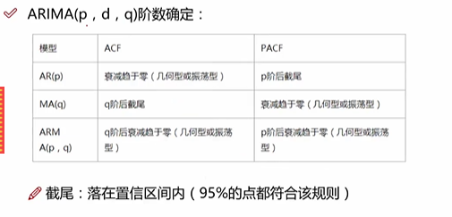

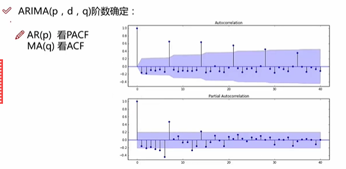

```
少部分奇异值可以不管
```


#### ARIMA建模流程

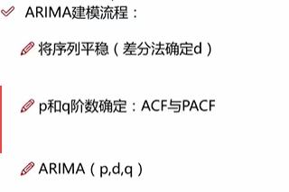


#### AIC和BIC

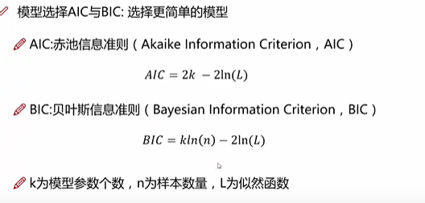

```
模型残差检验：
1）ARIMA模型的残差是否是均值为0且方差是常数的正态分布
2）QQ图：线性即正态分布
```


#### 具体案例

```python
import numpy as np
import pandas as pd
```

时间序列

- 时间戳(timestamp)
- 固定周期(period)
- 时间间隔(interval)

date_range

- 可以指定开始时间与周期
- H：小时
- D：天
- M：月

后面笔记：https://www.cnblogs.com/tianqizhi/p/9277376.html


