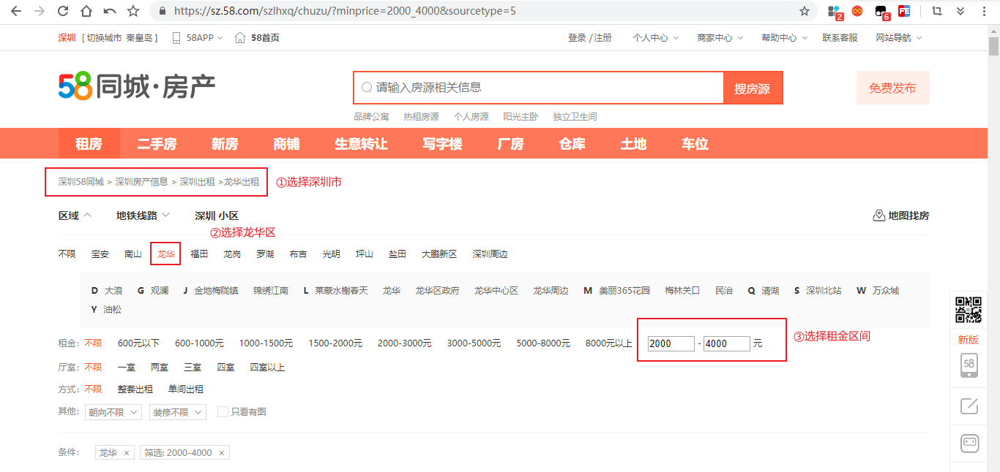
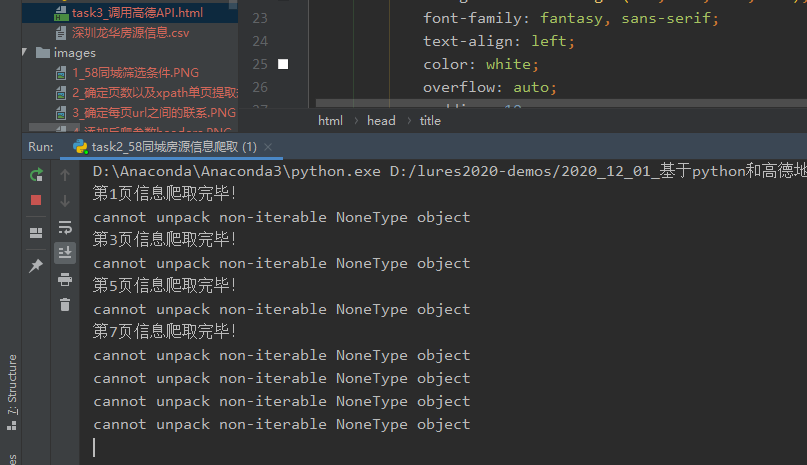
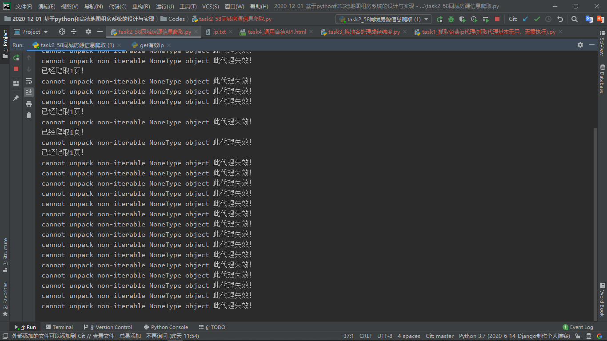

### 任务要求

#### 1、爬取深圳市龙华区在58同城上的租房信息（租房价格2000-4000）

###### ①打开58同城，确定筛选条件

###### ②确定页数以及单页xpath提取规则

###### ③确定每页url构成规则

完成以上分析步骤之后，就可以开始编写爬虫脚本：

###### ①找到反爬参数headers

###### ②解析页面，找到参数1——图片链接

###### ③脚本编写完毕！但是ip访问次数受到限制

正常情况下只能获取到1页房源信息

###### ④购买付费ip代理，打造ip代理池

检查ip是否有效果，可以查看这个网站：`https://www.ip.cn/`

购买后：(建议购买svip)

直接提取ip：

复制ip到ip.txt文件替换：

爬取过程很神奇，不知道什么问题：

估计是ip的问题，每次爬都会有这个，只是位置不一样

#### 2、调动高德地图api，展示房源

地址：`https://lbs.amap.com/api/javascript-api/example/bus-info/arrival-range/`

高德展示信息

下面是Pycharm运行截图：

#### 注意事项

①平时不用的时候，不要爬，要不之前爬的csv文件会被覆盖，演示的时候自己购买ip代理池，按照文档要求覆盖ip.txt文件内容即可

②申请的高德API默认免费次数是300000次，注意使用次数，超过次数需要重新申请，否则报错

③目前测试58爬取没问题，在网页结构不变时，代码都有效

④缺少的python第三方模块包，自己下载按照（通过pip命令）

⑤文件夹中的task1_爬取ip代理.py别执行，因为爬下来的ip都是失效的

添加多进程，加快爬取速度：

终端运行：`python -m http.server 3000`

浏览器打开：`http://0.0.0.0:3000/`

鼠标右键运行：`task4_调用高德地图API.html`导入"添加经纬度后csv文件.csv"可以看到效果