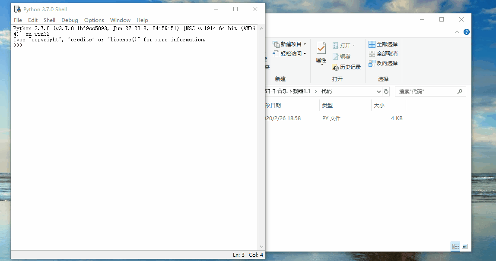

# 千千音乐下载器1.0

### 1、需求文档：

```
1）用户输入歌手姓名，匹配到歌手的url地址；
2）构建规则，找到歌曲的真实url；
3）下载歌手的无版权歌曲，并保存到当前文件夹下！
```


### 2、代码开始：

```
import requests
import parsel
import re,os


def get_urls(kd):
    url = 'http://music.taihe.com/search?key=' + kd
    headers = {
        'Connection': 'keep-alive',
        'Cookie': 'BAIDUID=B83397CF85BEFA9562DDA095E11C19C1:FG=1; Hm_lvt_d0ad46e4afeacf34cd12de4c9b553aa6=1581762349; tracesrc=-1%7C%7C-1; u_lo=0; u_id=; u_t=; __51cke__=; __qianqian_pop_tt=7; __tins__19988117=%7B%22sid%22%3A%201581768265452%2C%20%22vd%22%3A%202%2C%20%22expires%22%3A%201581770395998%7D; __51laig__=13; log_sid=1581768919932B83397CF85BEFA9562DDA095E11C19C1; Hm_lpvt_d0ad46e4afeacf34cd12de4c9b553aa6=1581768938',
        'Host': 'music.taihe.com',
        'Referer': 'http://music.taihe.com/',
        'User-Agent': 'Mozilla/5.0 (Windows NT 10.0; WOW64) AppleWebKit/537.36 (KHTML, like Gecko) Chrome/78.0.3904.108 Safari/537.36'
    }
    response = requests.get(url, headers=headers)
    response.encoding = response.apparent_encoding
    select = parsel.Selector(response.text)
    pages = select.xpath('//div[2]/div/div/a[@class="page-navigator-number 		PNNW-S"]/text()').getall()[
        -1]  # 判断当前歌星歌曲页数
    new_urls = []

    for i in range(int(pages)):  # 此处只能用int(pages),如果是len(pages)，长度是1
        # 根据规则构造url，爬取歌星在千千音乐的所有歌曲
        new_urls.append(
            'http://music.taihe.com/search/song?s=1&key=' + str(kd.encode()).replace("b'", '').replace("'", '').replace(
                r'\x', '%').upper() + '&start=' + str(20 * i) + '&size=20&third_type=0')
        response1 = requests.get(new_urls[i], headers=headers)
        response1.encoding = response1.apparent_encoding
        select1 = parsel.Selector(response1.text)
        link = select1.xpath('//div/span[@class="song-title"]/a[1]/@href')  # 再次构建url参数
        title = select1.xpath('//div/span[@class="song-title"]/a[1]/text()')  # 获取歌曲名称
        for j in range(len(link)):
            # mp3音乐信息存储在jQuery下面，我们需要构造url，找到必要参数songid
            url_last = 'http://musicapi.taihe.com/v1/restserver/ting?method=baidu.ting.song.playAAC&format=jsonp&callback=jQuery&songid=' + \
                       link.getall()[j].replace('/song/', '').strip() + '&from=web'
            response_last = requests.get(url=url_last, headers=headers)
            response_last.encoding = response_last.apparent_encoding
            # 因为用response_last.json()报错无法解决，所以只好用text
            result = re.findall('"show_link":(.*?)","', response_last.text)
            path = kd
            if not os.path.exists(path):
                os.mkdir(path)
            if len(result) == 0:
                pass
            else:
                result1 = result[0].replace('\\', '').replace('"', '')
                response_end = requests.get(result1)
                with open(path + '/' + title.getall()[j] + '.mp3', mode="wb") as f:
                    f.write(response_end.content)
                print(title.getall()[j] + '\t' + '下载完毕！')

if __name__ == '__main__':
    kd = str(input('请输入您想查询的歌星名称(eg:薛之谦)：'))
    get_urls(kd)
```

```
代码解读：
	1）response = requests.get(url, headers=headers)
	由网页看到是get请求，所以使用requests.get方法，里面传入请求头headers和真实的url
	
	2）response.encoding = response.apparent_encoding
	万能解码，response.encoding获取到网页的编码，response.apparent_encoding设置自己的编码
	
	3）pages = select.xpath('//div[2]/div/div/a[@class="page-navigator-number 		PNNW-S"]/text()').getall()[-1]
	使用xpath提取器获取到当前歌手的所有歌曲的页数
	
	4）new_urls.append('http://music.taihe.com/search/song?s=1&key=' + str(kd.encode()).replace("b'", '').replace("'", '').replace( r'\x', '%').upper() + '&start=' + str(20 * i) + '&size=20&third_type=0')
	构造当前页歌曲的真实url
```


### 3、代码演示并封装成exe文件！




### 4、关于我！

`扫码关注：空谷小莜蓝`


