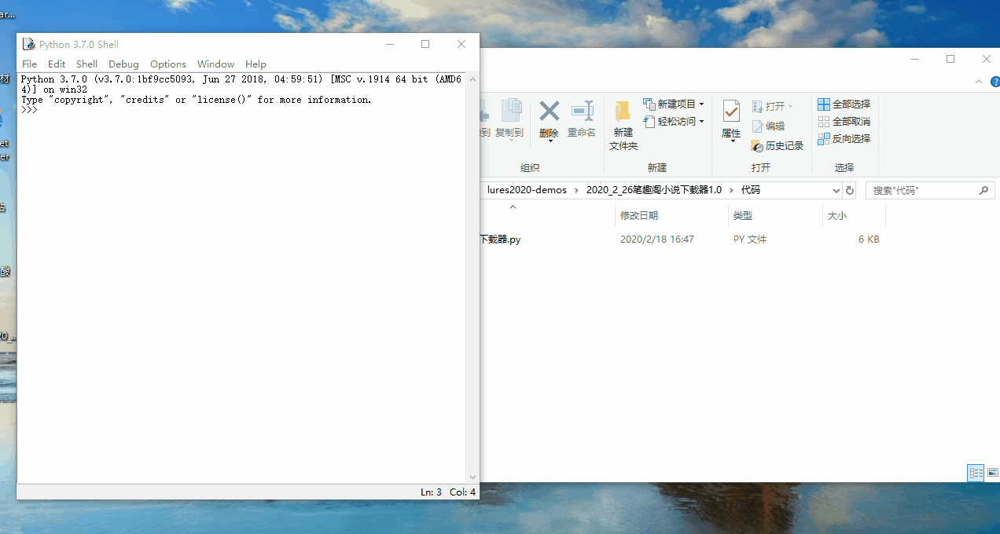

# 笔趣阁小说下载器1.0

### 1、需求：

```
1）输入书名或者是作者的名字进行匹配
2）分两种方式：全部打包以及部分打包下载该小说
3）去除章节中的一些杂乱的文字
```


### 2、代码开始：

```
import requests
import parsel
import os,re

def get_urls(url):
    headers = {
        'Cookie': '__gads=ID=75bba3704a9744ca:T=1582003233:S=ALNI_Mb3mleqShj-r36_hYkW58MbyXe3Fw; Hm_lvt_560d98b9021c1f16853d520c6af538f8=1582003240; Hm_lvt_cec763d47d2d30d431932e526b7f1218=1582003245,1582003262,1582003298,1582003844; jieqiVisitId=article_articleviews%3D45912%7C126354; Hm_lpvt_560d98b9021c1f16853d520c6af538f8=1582005537; jieqiVisitTime=jieqiArticlesearchTime%3D1582005690; Hm_lpvt_cec763d47d2d30d431932e526b7f1218=1582005690',
        'Host': 'www.52bqg.com',
        'Referer': 'https://www.52bqg.com/',
        'User-Agent': 'Mozilla/5.0 (Windows NT 10.0; WOW64) AppleWebKit/537.36 (KHTML, like Gecko) Chrome/78.0.3904.108 Safari/537.36'
    }
    response = requests.get(url,headers=headers)
    response.encoding = response.apparent_encoding
    select = parsel.Selector(response.text)
    lis = select.xpath('//div[@id="main"]/div/li/span[@class="s4"]/text()').getall()
    if len(lis) == 0:
        save_select(select)
    else:
        print('当前匹配到' + str(len(lis)) + '条信息，请输入您想看的小说的作者进行匹配！')
        print('小说作者分别是：'+str(lis))
        author = input('请输入作者姓名：')
        for j in range(len(lis)):
            if str(lis[j]) == author:
                url = select.xpath('//div[@id="main"]/div/li/span[@class="s2"]/a/@href').getall()[j]
                response = requests.get(url,headers=headers)
                response.encoding = response.apparent_encoding
                select = parsel.Selector(response.text)
                save_select(select)

def save_select(select):
    description = select.xpath('//div[@id="intro"]/text()').getall()[0].replace(r'\r\n', '').replace(r'\xa0','').strip()
    print('本书简介：' + '\t' + description)
    read_more = str(select.xpath('//div[@id="maininfo"]/div[@class="tjlist"]/a/text()').getall()).replace("['",'').replace("']", '').replace("'", '').replace(",", '\t').strip()
    print('推荐阅读：' + '\t' + read_more)
    update_time = select.xpath('//div[@id="info"]/p[3]/text()').getall()[0].split('：')[-1]
    print('更新时间：' + '\t' + update_time)
    latest_chapter = select.xpath('//div[@id="info"]/p[4]/a/text()').getall()[0]
    print('最新章节：' + '\t' + latest_chapter)
    titles = select.xpath('//div[@id="list"]/dl/dd/a/text()').getall()
    chapter_urls = select.xpath('//div[@id="list"]/dl/dd/a/@href').getall()
    new_url = []
    url = 'https://www.52bqg.com/book_' + select.xpath('//div[@id="fmimg"]/img/@src').getall()[0].split('/')[-1].replace(r's.jpg', '').strip() + '/'
    for i in range(len(titles)):
        new_url.append(url + chapter_urls[i])
    save_chapters(new_url, titles)


def save_chapters(new_url,titles):
    print('全部章节打包下载请输入：0' + '\n' + '部分章节打包下载请输入：1')
    kd1 = int(input('请输入0或者1：'))
    path = kd
    if not os.path.exists(path):
        os.mkdir(path)
    if kd1 == 0:
        for i in range(len(titles)):
            response = requests.get(new_url[i])
            response.encoding = response.apparent_encoding
            html = str(re.findall('<div id="content" name="content">(.*?)</div>',response.text,re.S)).replace(r'<br />\r\n<br />','\n').replace(r'\r\n           一秒记住【笔趣阁 www.52bqg.com】，精彩小说无弹窗免费阅读！<br><br>\r\n           &nbsp;&nbsp;&nbsp;&nbsp;','').replace(r'\r\n&nbsp;&nbsp;&nbsp;&nbsp;','').replace(r"\r\n      ']",'').replace("[",'')
            with open(path + '/' + titles[i] + '.txt',mode="w",encoding="utf-8") as f:
                f.write(html)
            print(titles[i] + '\t' + '保存完毕！')
        print(kd + '所有章节目录打包完毕！请开始阅读吧！')
    elif kd1 == 1:
        start = int(input('请输入想下载的起始章节数(eg:300)：'))
        print('当前书籍最大章节数：' + str(len(titles)+1))
        end = int(input('请输入想下载的结尾章节数(超过最大章节数默认下载到更新处）：'))
        for i in range(start,len(titles)+2):
            response = requests.get(new_url[i-2])
            response.encoding = response.apparent_encoding
            new_path = path + '/' + str(start) + '——' + str(min(end,len(titles)+1))
            if not os.path.exists(new_path):
                os.mkdir(new_path)
            html = str(re.findall('<div id="content" name="content">(.*?)</div>', response.text,re.S)).replace(r'<br />\r\n<br />','\n').replace(r'\r\n           一秒记住【笔趣阁 www.52bqg.com】，精彩小说无弹窗免费阅读！<br><br>\r\n           &nbsp;&nbsp;&nbsp;&nbsp;','').replace(r'\r\n&nbsp;&nbsp;&nbsp;&nbsp;','').replace(r"\r\n      ']",'').replace("[",'')
            with open(new_path + '/' + titles[i-2] + '.txt',mode="w",encoding="utf-8") as f:
                f.write(html)
            print(titles[i-2] + '\t' + '下载完毕！')
        print(kd + '的第' + str(start) + '至' + str(min(end,len(titles)+1)) + '下载完毕！请开始阅读吧！')
    else:
        print('你输入的不是0或者1，请退出软件再重启运行！！!')

if __name__ == '__main__':
    kd = input('请输入要搜索的书名(至少4字节，即两个中文名字，如：剑来:)')
    url = 'https://www.52bqg.com/modules/article/search.php?searchkey=' + str(bytes(kd.encode('gbk'))).replace("b'", '').replace("'", '').replace(r'\x', '%').upper()
    get_urls(url)
```


### 3、代码演示以及封装exe可执行文件：




### 4、关于我：


