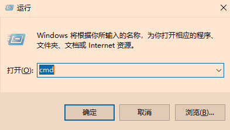
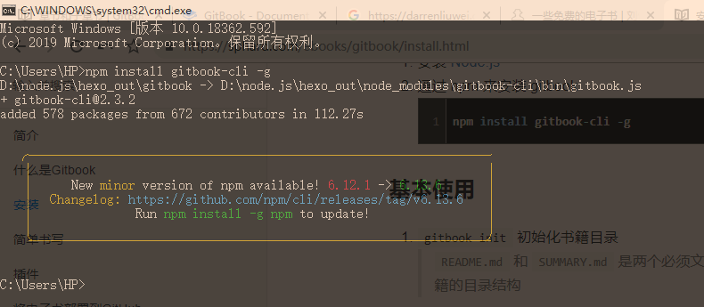
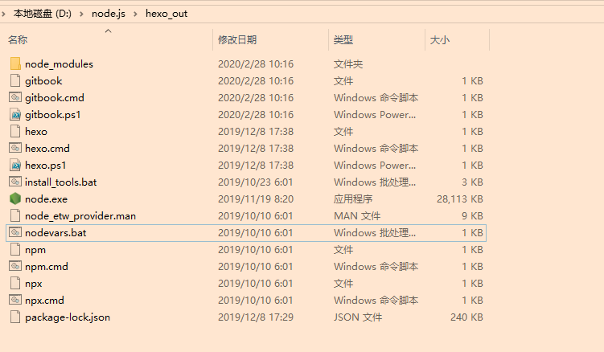

### 2、安装Gitbook！

```
[windows+R]快捷键调出窗口，并输入cmd打开命令符界面，接着按下[enter]回车，如下图
```



```
在命令行输入下面的代码：
	npm install gitbook-cli -g
```



```
因为，我之前安装过了Node.js,所以Gitbook安装完是这个界面！文件夹略微有所不同(我之前搭建github博客也是这个文件夹~)
```



