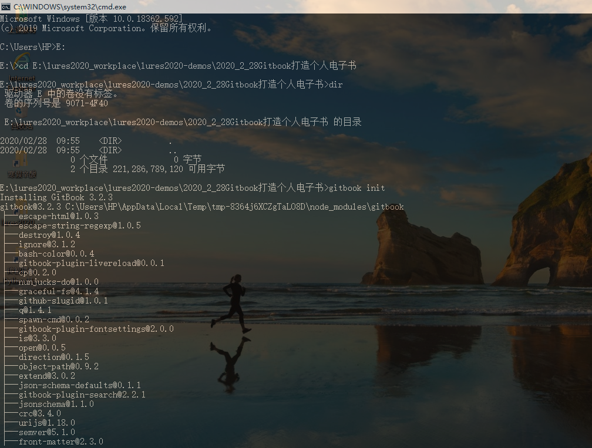
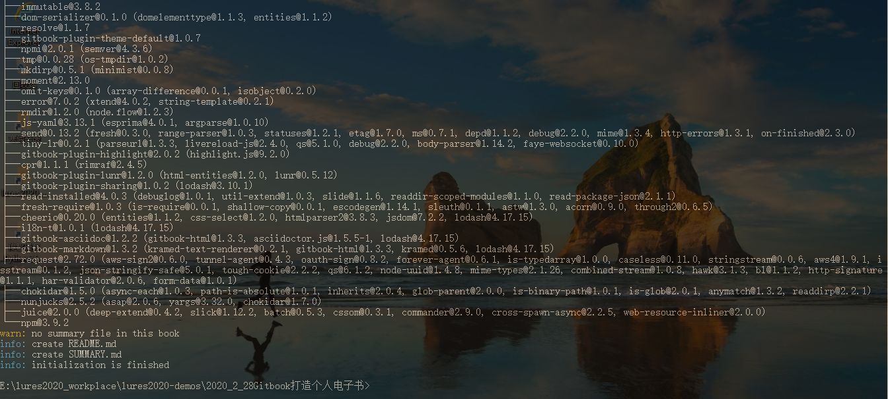
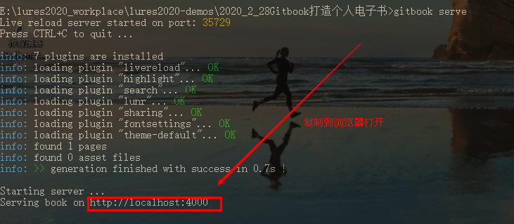

### 3、Gitbook的基本使用！

```
为了演示操作，我准备将第一本电子书存放到这个路径：
	E:\lures2020_workplace\lures2020-demos\2020_2_28Gitbook打造个人电子书

1)初始化书籍目录：gitbook init
	(README.md 和 SUMMARY.md 是两个必须文件, README.md 是对书籍的简单介绍, SUMMARY.md 是书籍的目录结构)
	
2)编译和预览书籍：gitbook serve
	(注意: gitbook serve 命令实际上会首先调用 gitbook build 编译书籍，完成以后会打开一个 web 服务器，监听在本地的 4000 端口)
```


```
现在需要使用windows窗口命令进入到我们创建的目录下面：(以我的文件夹目录为例！)
```






```
下面启动本地服务，查看书籍状况：
	gitbook serve
复制：http://localhost:4000到浏览器查看状态
```



