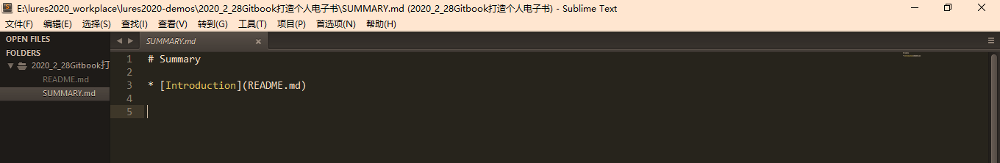
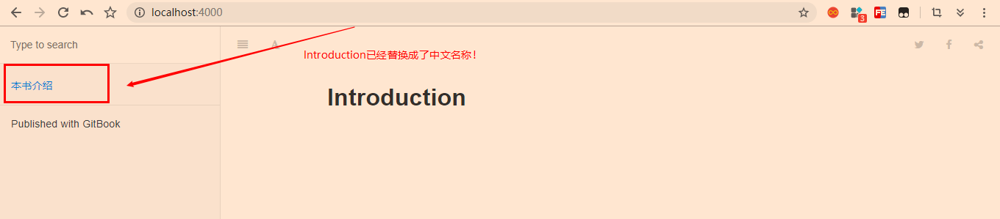
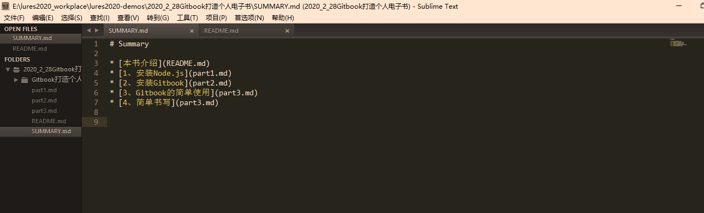
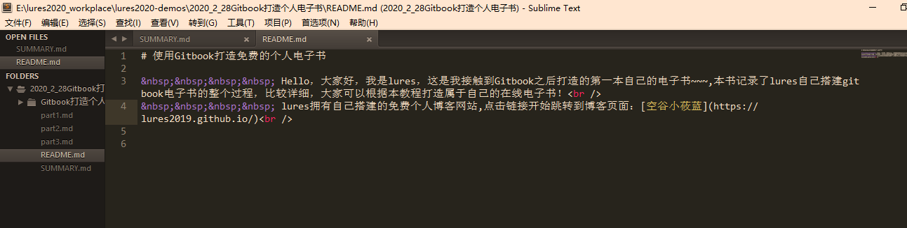
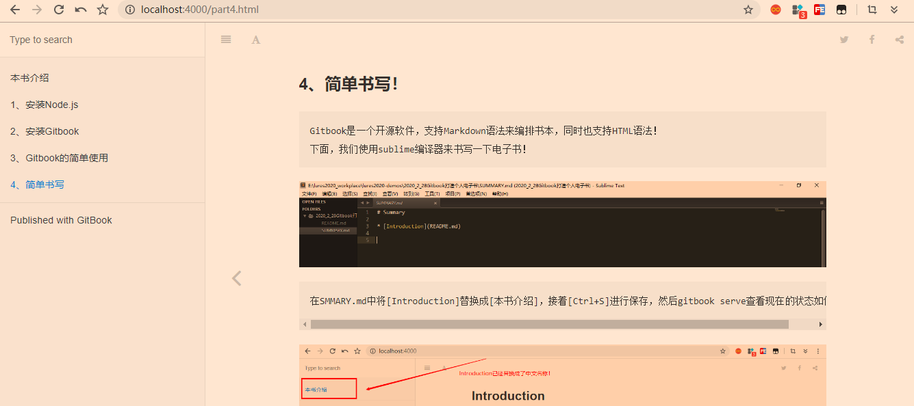

### 4、简单书写！

```
Gitbook是一个开源软件，支持Markdown语法来编排书本，同时也支持HTML语法！
下面，我们使用sublime编译器来书写一下电子书！
```



```
在SMMARY.md中将[Introduction]替换成[本书介绍]，接着[Ctrl+S]进行保存，然后gitbook serve查看现在的状态如何~~
```





```
注意：
	Summary代表的是电子书的目录部分，每一行的那个格式代表一个目录，要是想要在该目录下添加子目录，可以像下面格式一样：
	* [根目录](part.md)
	-- * [子目录](part1.md)
```



```
至于目录里面的文章以及介绍部分的书写大家可以先熟悉一下Markdown和HTML的语法！
```

