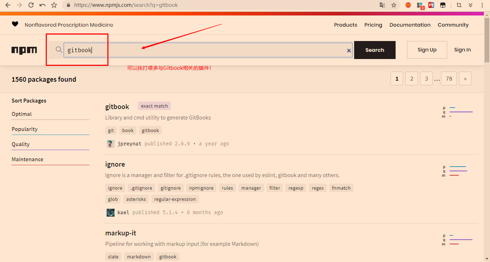
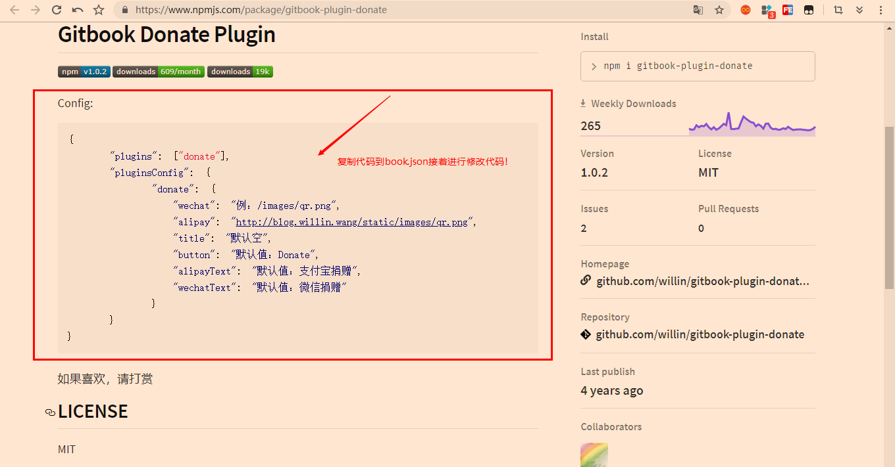
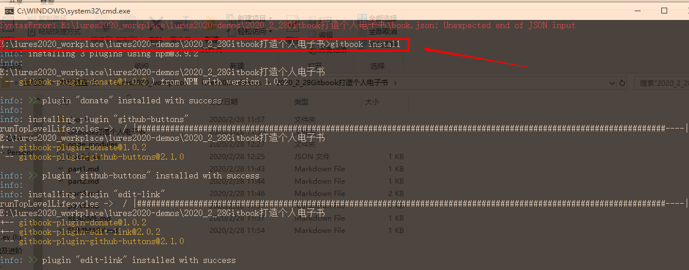
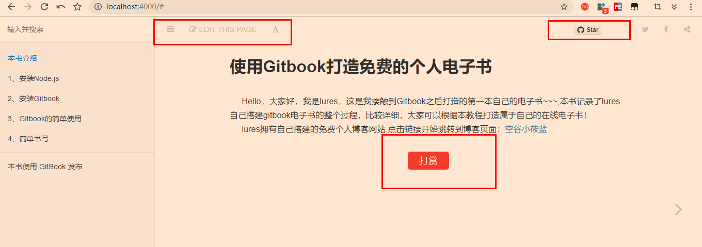

### 5、相关插件！

```
gitbook支持许多插件，用户可以在下面的官网进行搜索gitbook相关的插件！
	https://www.npmjs.com/
gitbook 的插件信息会保存在 book.json 文件里
```

```
以下是我个人常用的插件:
gitbook-plugin-donate(打赏按钮): https://www.npmjs.com/package/gitbook-plugin-donate

gitbook-plugin-github-buttons(GitHub按钮): https://www.npmjs.com/package/gitbook-plugin-github-buttons

gitbook-plugin-edit-link(GitHub编辑按钮): https://www.npmjs.com/package/gitbook-plugin-edit-link
```



```
插件的安装：
	1)需要新建一个文件：book.json
	2)复制需要的代码，这里以"打赏"按钮为例进行说明！
```




```
{
    "title": "使用Gitbook打造免费的个人电子书",
    "description": "lures手把手完整式教程！",
    "author": "lures",
    "language": "zh-hans",
    "root": ".",

    "plugins": [
        "donate",
        "github-buttons@2.1.0",
        "edit-link"
    ],

    "pluginsConfig": {
        "donate": {
            "wechat": "https://lures2019.github.io/images/wechatpay.png",
            "alipay": "https://lures2019.github.io/images/alipay.png",
            "title": "",
            "button": "打赏",
            "alipayText": "支付宝打赏",
            "wechatText": "微信打赏"
        },
        "github-buttons": {
            "repo": "lures2019/lures2020-demos",
            "types": [
                "star"
            ],
            "size": "small"
        },
        "edit-link": {
            "base": "https://github.com/lures2019/lures2020-demos/2020_2_28Gitbook打造个人电子书",
            "label": "Edit This Page"
        }
    }
}
```

```
注意：
	上面都是我自己的图片地址以及GitHub仓库的名字，你们需要自己替换~~~
	另外，在gitbook serve之前，需要先gitbook install，否则报错，如下图：
```



