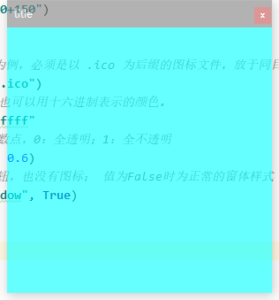
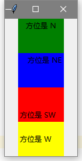

# 初识tkinter

### 什么是tkinter

​		Tkinter 是使用 python 进行gui设计的模块。Tkinter模块是Python的标准Tk GUI工具包的接口。Tkinter在大多数Unix平台以及Windows系统上都可用。作为 python 特定的GUI界面，是一个图像的窗口，tkinter是python 自带的，可以编辑的GUI界面，我们可以用GUI 实现很多直观的功能，比如想开发一个计算器，如果只是一个键盘输入，输出的黑色窗口，是没用用户体验的。所有开发一个图像化的小窗口，就是必要的。

　　对于稍有GUI编程经验的人来说，Python的Tkinter界面库是非常简单的。python的GUI库非常多，选择Tkinter，一是最为简单，二是自带库，不需下载安装，随时使用，三则是从需求出发，Python作为一种脚本语言，或者说一种胶水语言，一般不会用它来开发复杂的桌面应用，它并不具备这方面的优势，使用Python，可以把它作为一个灵活的工具，而不是作为主要开发语言，那么在工作中，需要制作一个小工具，肯定是需要有界面的，不仅自己用，也能分享别人使用，在这种需求下，Tkinter是足够胜任的！

### 第一个tkinter程序

​		那么，在正式开始学习之前呢，我们来看一个简单的小案例：

```python
import tkinter as tk
root = tk.Tk()
theLabel = tk.Label(root, text = "我的第一个tkinter窗口!")
theLabel.pack()
root.mainloop()
```


**代码分析：**

```python
# 导入tkinter模块
import tkinter as tk
# 创建一个主窗口，用于容纳整个gui程序
root = tk.Tk()
# Label组件可以显示文本、图标或者图片
# 在这里我们让它显示指定文本
theLabel = tk.Label(root, text = "我的第一个tkinter窗口!")
# 然后调用Label组件的pack()方法,用于自动调节组件自身的尺寸
theLabel.pack()
"""
注意,这时候窗口还是不会显示的,必须调用主窗口的mainloop()方法
loop因为是循环的意思，root.mainloop就会让root不断的刷新，如果没有mainloop,就是一个静态的root,传入进去的值就不会有循环，mainloop就相当于一个很大的while循环，有个while，每点击一次就会更新一次，所以我们必须要有循环。
所有的窗口文件都必须有类似的mainloop函数，mainloop是窗口文件的关键的关键。
"""
root.mainloop()
```

# 窗口的管理与设置

​		不知道大家是否注意到了，上述举例的简单demo程序存在窗口显示混乱的情况，这样的一个界面显然是不符合我们要求的。所以我们首先要开始学习如何使用tkinter去控制我们的窗口

### 一.窗口的最小框架

​	代码：

```python
# 导入模块，取别名
import tkinter as tk
# 实例化一个窗体对象
root = tk.Tk()
# 设置窗口的大小长宽为300x300出现的位置距离窗口左上角+150+150
root.geometry("300x300+150+150")
# 进入消息循环，显示窗口
root.mainloop()
```

​	效果：


### 二.窗口的基本设置

#### 1.添加标题

```python
# 设置窗口标题
root.title("title")
```

#### 2.添加图标

```python
# 设置图标，以OneDrive图标为例，必须是以 .ico 为后缀的图标文件，放于同目录下。
root.iconbitmap("OneDrive.ico")
```

#### 3.设置背景

```python
# 设置背景色，可以用英文名，也可以用十六进制表示的颜色。
root["background"] = "#00ffff"
```

**完整代码**

```python
# 导入模块，取别名
import tkinter as tk
# 实例化一个窗体对象
root = tk.Tk()
# 设置窗口的大小长宽为300x300出现的位置距离窗口左上角+150+150
root.geometry("300x300+150+150")
# 设置窗口标题
root.title("title")
# 设置图标，以OneDrive图标为例，必须是以 .ico 为后缀的图标文件，放于同目录下。
root.iconbitmap("OneDrive.ico")
# 设置背景色，可以用英文名，也可以用十六进制表示的颜色。
root["background"] = "#00ffff"
# 进入消息循环，显示窗口
root.mainloop()
```

**效果演示**


### 三.窗口外形设置

#### 1.设置透明度

```python
# 透明度的值:0~1 也可以是小数点，0：全透明；1：全不透明
root.attributes("-alpha", 0.6)
```

#### 2.设置工具栏样式

```python
# True 只有退出按钮，也没有图标；False 正常的窗体样式
root.attributes("-toolwindow", True)
```

**效果演示**



#### 3.设置全屏

```python
# True 全屏；False 正常显示
root.attributes("-fullscreen", True)
```

#### 4.窗口置顶

```python
# True 所有窗口中处于最顶层；False 正常显示 两个同时被置顶的窗口为同级(能互相遮盖)，但他们都能同时遮盖住没有被设置为置顶的窗口。
root.attributes("-topmost", True)
```

#### 5.设置成脱离工具栏

```python
# True 没有工具栏按钮；False 正常显示
root.overrideredirect(True)
```

**完整代码**

```python
# 导入模块，取别名
import tkinter as tk
# 实例化一个窗体对象
root = tk.Tk()
# 设置窗口的大小长宽为300x300出现的位置距离窗口左上角+150+150
root.geometry("300x300+150+150")
# 设置窗口标题
root.title("title")
# 设置图标，以OneDrive图标为例，必须是以 .ico 为后缀的图标文件，放于同目录下。
root.iconbitmap("OneDrive.ico")
# 设置背景色，可以用英文名，也可以用十六进制表示的颜色。
root["background"] = "#00ffff"
# True 全屏；False 正常显示
root.attributes("-fullscreen", True)
# True 所有窗口中处于最顶层；False 正常显示 两个同时被置顶的窗口为同级(能互相遮盖)，但他们都能同时遮盖住没有被设置为置顶的窗口。
root.attributes("-topmost", True)
# True 没有工具栏按钮；False 正常显示
root.overrideredirect(True)
# 进入消息循环，显示窗口
root.mainloop()
```

### 四.窗体的四个方法

#### 1.获取屏幕大小

```python
screenheight = root.winfo_screenheight()
screenwidth = root.winfo_screenwidth()
```

**完整代码**

```python
# 导入模块，取别名
import tkinter as tk
# 实例化一个窗体对象
root = tk.Tk()
# 获取屏幕大小
screenheight = root.winfo_screenheight()
screenwidth = root.winfo_screenwidth()
print("屏幕高度：", screenheight)
print("屏幕宽度：", screenwidth)
rootwidth = 300
roothight = 300
# 设置窗口在屏幕居中
root.geometry("%dx%d+%d+%d" % (rootwidth, roothight, (screenwidth-rootwidth)/2, (screenheight-roothight)/2))
# 进入消息循环，显示窗口
root.mainloop()
```

**演示效果**


#### 2.获取窗体位置

```python
root_x = root.winfo_x()
root_y = root.winfo_y()
```

#### 3.获取窗体大小

```python
root_height = root.winfo_height()
root_width = root.winfo_width()
```

**完整代码**

```python
# 导入模块，取别名
import tkinter as tk
# 实例化一个窗体对象
root = tk.Tk()
# 设置窗体高宽和位置
root.geometry("600x500+150+150")
# 更新窗体
root.update()
# 获取窗体位置
root_x = root.winfo_x()
root_y = root.winfo_y()
# 获取窗体大小
root_height = root.winfo_height()
root_width = root.winfo_width()
# 输出窗体位置和窗体高宽
print(root_x)
print(root_y)
print(root_width)
print(root_y)
# 进入消息循环，显示窗口
root.mainloop()
```

**演示效果**


# tkinter的各类组件

​	那么到这里，我相信大家对tkinter的简单使用就有一个大致的了解了。但是呢，人不可能一步登天。一个功能美观多样的app界面一定是由非常多的控件一点一点组成的，想要使用tkinter做出一个美观漂亮的ui界面我们还有很多路要走。那么我们以Lable开始，学习对tkinter各类控件的使用

### 一.Lable

​		Label组件是用于在界面上输出文本内容的标签，在tkinter的ui界面编写中往往是使用得最多的一种，它的使用方式也多种多样下面我们来讲解lable的使用。

#### 1.基本用法与可选属性

##### (1).基本用法

基本用法：Label(根对象, [属性列表])

根对象：在那个窗体显示，例如主窗体。

属性列表：是可选的属性=属性值组成。

##### (2).可选属性

| 属性              | 说明                                 |
| ----------------- | ------------------------------------ |
| text              | 标签显示的文本                       |
| font              | 设置文本的字体和大小                 |
| fg(foreground)    | 字体的颜色，                         |
| bg (background)   | 标签的背景色                         |
| width             | 标签的宽度（一个中文的字体宽为单位） |
| height            | 标签的高度（一个中文的字体高为单位） |
| padx              | 文字到边框的距离，水平方向           |
| pady              | 文字到边框的距离，垂直方向           |
| bd（borderwidth） | 边框的宽度                           |
| relief            | 边框的样式                           |
| justify           | 文本对齐方式                         |
| image             | 图片                                 |
| compound          | 图片与文字的混搭                     |
| anchor            | 方位                                 |

#### 2.可选属性的具体应用

##### 常用属性

**text**

```python
# 用于显示文本内容
text = "要显示的文本内容"
```

**font**

```python
# 用于设置字体与字体大小 
# 用法：font=("字体名"，大小)
font=("宋体"，24)
```

**fg 与 bg**

```python
# fg 前景色，即字体的颜色，bg 背景颜色 可用英文名，也可以用十六进制表示的颜色。
fg="red", fg="#00ffff"
```

**width 与 height**

```python
# width height 标签的宽度与高度，都是以系统默认的中文的一个字体宽高为单位
width=20, height=5
```

###### 案例一

**代码：**

```python
import tkinter as tk

# 背景色与前景色
root = tk.Tk()
label_1 = tk.Label(root, text='fg="red" bg="#00ffff""', fg="red", bg="#00ffff")
label_1.pack()

# 字体与字体的大小
label_2 = tk.Label(root, text='font=("宋体", 24)', font=("宋体", 24))
label_2.pack()

# 宽度与高度
label_3 = tk.Label(root, text='width=10, height=3', bg="yellow", width=10, height=3)
label_3.pack()
label_4 = tk.Label(root, text='width=20, height=1', bg="yellow", width=20, height=1)
label_4.pack()

root.mainloop()
```

**演示效果**：


##### 边距与对齐方式

**边距：padx与pady**

```python
# 文字到边框的距离 padx 与 pady 水平与竖直方向,单位是像素，默认是1像素
padx=2, pady = 1 
```

**文本对齐方式：justify**

```python
# 可取 "left" ,"right", "center" ,默认是"center"居中对齐，Label 里的文本支持 转移字符 \n \t 等
justify="left" 
```

###### 案例二 

**代码：**

```python
import tkinter as tk

root = tk.Tk()
# 边距
label_5 = tk.Label(root, text='padx pady 默认', bg="blue")
label_5.pack()
label_6 = tk.Label(root, text='padx=0, pady=0', bg="blue", padx=0, pady=0)
label_6.pack()
label_7 = tk.Label(root, text='padx=10, pady=10', bg="blue", padx=10, pady=10)
label_7.pack()
# 对齐方式
label_8 = tk.Label(root, text="学python来青灯教育\n有小姐姐哦")
label_8.pack()
label_9 = tk.Label(root, text="学python来青灯教育\n有小姐姐哦", justify="left")
label_9.pack()
label_9 = tk.Label(root, text="学python来青灯教育\n有小姐姐哦", justify="right")
label_9.pack()

root.mainloop()
```

**效果演示**：


##### lable添加图片

**仅图片**

```python
# 导入图片
img1 = tk.PhotoImage(file="文件路径/01.png")
# 在标签里放入图片
label_image1 = tk.Label(root, image=img1)
#注：目前支持 .png 与 .gif 格式， 还不支持 .jpg格式
```

###### 案例三

**代码：**

```python
# 导入模块，取别名
import tkinter as tk
# 实例化一个窗体对象
root = tk.Tk()
# 导入图片
img1 = tk.PhotoImage(file="image1.png")
# 在标签里放入图片
label_image1 = tk.Label(root, image=img1)
label_image1.pack()
# 进入消息循环，显示窗口
root.mainloop()
```

**演示效果**


**图片与文字混合**

```python
使用text正常添加文字并使用compound设置对齐，对齐方式有：'left', "right", "center"
compound="left"
```

###### 案例四

**代码：**

```python
# 导入模块，取别名
import tkinter as tk
# 实例化一个窗体对象
root = tk.Tk()
# 导入图片
img1 = tk.PhotoImage(file="image2.png")
# 在标签里放入图片
label_image1 = tk.Label(root, text="学python来青灯教育", image=img1, compound="left")
label_image1.pack()

label_image2 = tk.Label(root, text="学python来青灯教育", image=img1, compound="right")
label_image2.pack()

label_image3 = tk.Label(root, text="学python来青灯教育", image=img1, compound="center", fg="red")
label_image3.pack()
# 进入消息循环，显示窗口
root.mainloop()
```

**演示效果：**


##### lable设置可变化的文字内容

```python
# 定义变量
v = tk.StringVar()
# 设置变量内容
v.set('23333')
# 在lable中引用
textvariable=v
```

###### 案例五：实时时钟显示

**代码：**

```python
import tkinter as tk
import time

root = tk.Tk()

# 定义变量
v = tk.StringVar()

# 在标签里添加可变的文本
label_1 = tk.Label(root, textvariable=v, fg="#ffffff", bg="#00ffff", font=("宋体", 24))
label_1.pack()
while True:
    v.set("%s" % time.ctime())
    label_1.update()
    time.sleep(1)

root.mainloop()
```

**演示效果**


##### 设置文字在标签框内的方位

```python
# 可选的参数有："e","w","s","n","ne","se","nw","sw",就是东西南北八个方向
anchor="n"
```

###### 案例六

**代码：**

```python
import tkinter as tk

root = tk.Tk()

label_1 = tk.Label(root, text="方位是 N", bg="green", width=10, height=3, anchor="n")
label_1.pack()

label_2 = tk.Label(root, text="方位是 NE", bg="blue", width=10, height=3, anchor="ne")
label_2.pack()

label_3 = tk.Label(root, text="方位是 SW", bg="red", width=10, height=3, anchor=tk.SW)
label_3.pack()

label_4 = tk.Label(root, text="方位是 W", bg="yellow", width=10, height=3, anchor=tk.W)
label_4.pack()

root.mainloop()
```

**演示效果**：



##### 边框的样式与宽度

```python
# relief 表示边框样式，可选的参数有：flat（平的），sunken （沉没的, 凹下去的），raised （提高，凸出来的），ridge（脊，中键凸的）, 默认是flat.
relief="sunken"
```

###### 案例6

**代码：**

```python
import tkinter as tk

root = tk.Tk()

# 默认 flat平的
label_1 = tk.Label(root, text='relief=flat', bd=8)
label_1.pack()

# sunken 沉没的
label_2 = tk.Label(root, text='relief=sunken', relief="sunken", bd=5)
label_2.pack()

# raised 提高
label_3 = tk.Label(root, text='relief=raised', relief="raised", bd=5)
label_3.pack()

# ridge脊
label_4 = tk.Label(root, text='relief=ridge', relief="ridge", bd=10)
label_4.pack()

root.mainloop()
```

**演示效果：**


### 二.Button

​		Button是一个标准的Tkinter的控件，用于实现各种按钮。按钮可以包含文本或图像，当Button的点击事件绑定某个函数(方法)时，按下Button会自动调用该函数或方法。

#### 1.基本用法与可选属性

##### (1).基本用法

基本用法：Button(根对象, [属性列表])

根对象：在那个窗体显示，例如主窗体。

属性列表：是可选的属性=属性值组成。

##### (2).可选属性

| 属性              | 说明                                 |
| ----------------- | ------------------------------------ |
| text              | 标签显示的文本                       |
| font              | 设置文本的字体和大小                 |
| fg(foreground)    | 字体的颜色，                         |
| bg (background)   | 标签的背景色                         |
| width             | 标签的宽度（一个中文的字体宽为单位） |
| height            | 标签的高度（一个中文的字体高为单位） |
| cursor            | 鼠标的样式                           |
| command           | 绑定事件                             |
| padx              | 文字到边框的距离，水平方向           |
| pady              | 文字到边框的距离，垂直方向           |
| bd（borderwidth） | 边框的宽度                           |
| relief            | 边框的样式                           |
| justify           | 文本对齐方式                         |
| image             | 图片                                 |
| compound          | 图片与文字的混搭                     |
| anchor            | 方位                                 |

#### 2.可选属性的具体应用

##### 常用属性

​		常用属性**text, font, foreground, background, width, height **使用方式与Lable组件完全一致使用方式可以参考上文，不重复赘述。

###### 案例一

**代码：**

```python
import tkinter as tk

root = tk.Tk()

# 普通按钮
button1 = tk.Button(root, text="Button1")
button1.pack()

# 背景与前景色
button2 = tk.Button(root, text="Button2", bg="#00ffff", fg="red")
button2.pack()

# 宽度与高度
button3 = tk.Button(root, text="Button3", width=10, height=2)
button3.pack()

# 边距
button4 = tk.Button(root, text="Button4", padx=10, pady=10)
button4.pack()

root.mainloop()
```

**效果演示：**


##### Button添加图片

​	使用方式、特性与Lable一致

###### 案例二

**代码：**

```python
import tkinter as tk

root = tk.Tk()
img2 = tk.PhotoImage(file="image2.png")

button1 = tk.Button(root, text="Button1", image=img2)
button1.pack()

button2 = tk.Button(root, text="Button2", image=img2, compound="left")
button2.pack()

button3 = tk.Button(root, text="Button3", image=img2, compound="right")
button3.pack()

button4 = tk.Button(root, text="Button4", foreground="red", image=img2, compound="center")
button4.pack()

root.mainloop()
```

**演示效果：**


##### 边距与对齐方式

边距：**padx，pady** 与文本对齐方式：**justify**使用方式与Lable一致

###### 案例三

**代码：**

```python
import tkinter as tk

root = tk.Tk()
# 边距
button1 = tk.Button(root, text='padx pady 默认')
button1.pack()

button2 = tk.Button(root, text="padx=0, pady=0", padx=0, pady=0)
button2.pack()

button3 = tk.Button(root, text="padx=10, pady=10", padx=10, pady=10)
button3.pack()

# 对齐方式
button4 = tk.Button(root, text="学python来青灯教育\n有小姐姐哦")
button4.pack()

button4 = tk.Button(root, text="学python来青灯教育\n有小姐姐哦", justify="left")
button4.pack()

button4 = tk.Button(root, text="学python来青灯教育\n有小姐姐哦", justify="right")
button4.pack()

root.mainloop()
```

**演示效果**


##### 鼠标样式

```python
# pencil：笔型
# circle：圆形
# hand1：手型1
# hand2：手型2
cursor="鼠标的属性值"
```

###### 案例四

**代码**

```python
import tkinter as tk

root = tk.Tk()
# 笔型
button1 = tk.Button(root, text="Button1", cursor="pencil")
button1.pack()

# 圆形
button2 = tk.Button(root, text="Button2", cursor="circle")
button2.pack()

# 手型1
button3 = tk.Button(root, text="Button3", cursor="hand1")
button3.pack()

# 手型2
button4 = tk.Button(root, text="Button4", cursor="hand2")
button4.pack()

root.mainloop()
```

**演示效果**

需要把鼠标放Button上自行查看，会有不同显示


##### 边框样式与宽度

```python
# flat 无边框
# groove 中间凹
# ridge 中间凸
# raised 往中间凸
# solid 往中间凹
# sunken 不可以
relief= "边框样式值"
```

###### 案例五

**代码：**

```python
import tkinter as tk

root = tk.Tk()
# flat 无边框
button1 = tk.Button(root, text="flat", relief="flat", bd=8)
button1.pack()

# groove 中间凹
button2 = tk.Button(root, text="groove", relief="groove", bd=5)
button2.pack()

# ridge 中间凸
button3 = tk.Button(root, text="raised", relief="ridge", bd=6)
button3.pack()

# raised 往中间凸
button4 = tk.Button(root, text="ridge", relief="raised", bd=30)
button4.pack()

# solid 往中间凹
button5 = tk.Button(root, text="solid", relief="solid", bd=10)
button5.pack()

# sunken 不可以
button6 = tk.Button(root, text="sunken", relief="sunken", bd=10)
button6.pack()

root.mainloop()
```

**演示效果：**


##### 文字在Button中的方位

与Lable一致

###### 案例六

**代码：**

```python
import tkinter as tk

root = tk.Tk()
button1 = tk.Button(root, text="e", width=10, height=5, anchor="e")
button1.pack()

button2 = tk.Button(root, text="w", width=10, height=5, anchor="w")
button2.pack()

button3 = tk.Button(root, text="s", width=10, height=5, anchor="s")
button3.pack()

button4 = tk.Button(root, text="n", width=10, height=5, anchor="n")
button4.pack()

root.mainloop()
```

**演示效果：**


#### 3.Button的事件绑定

##### 普通的按钮事件绑定

```python
# Button 使用 command=功能函数 来绑定事件
Button(root, text="确定", command=功能函数)
```

###### 案例七

**代码：**

```python
import tkinter as tk

root = tk.Tk()


# 定义功能函数
def button_command():
    print("你点击了按钮")


# 绑定事件
btn = tk.Button(root, text="确定", command=button_command)
btn.pack()
root.geometry("300x300+200+200")

root.mainloop()
```

**演示效果：**


##### 带参数的按钮事件绑定

###### 案例八

**代码：**

```python
import tkinter as tk

root = tk.Tk()


# 定义功能函数
def sum(a, b):
    print("%d + %d = %d" % (a, b, a+b))


# 绑定事件
btn = tk.Button(root, text="确定", command=lambda: sum(1, 1))
btn.pack()
root.geometry("300x300+200+200")

root.mainloop()
```

**演示效果：**


### 实战演练一

制作一个简单的计算器程序要求所有功能按钮能正常使用，界面效果美观，效果如下:


**代码：**

```python
# 导入模块，取别名
import tkinter as tk
# 实例化一个窗体对象
root = tk.Tk()
# 设置窗口的大小长宽为300x300出现的位置距离窗口左上角+150+150
root.geometry("295x280+150+150")
root.title('计算器')
root.attributes("-alpha", 0.9)
root["background"] = "#ffffff"
lists = []
result_num = tk.StringVar()
result_num.set(0)


def num(i):
    lists.append(i)
    result_num.set(''.join(lists))


def operator(i):
    if len(lists) > 0:
        if lists[-1] in ['+', '-', '*', '/']:
            lists[-1] = i
        else:
            lists.append(i)
        result_num.set(''.join(lists))


def equal():
    a = ''.join(lists)
    end_num = eval(a)
    result_num.set(end_num)
    lists.clear()
    lists.append(str(end_num))


def clear():
    lists.clear()
    result_num.set(0)


def back():
    del lists[-1]
    result_num.set(lists)


lable1 = tk.Label(root, textvariable=result_num, width=20, height=2, font=('宋体', 20), justify='left', background='#ffffff', anchor='se')
lable1.grid(padx=4, pady=4, row=0, column=0, columnspan=4)

button_clear = tk.Button(root, text='C', width=5, font=('宋体', 16), relief='flat', background='#C0C0C0', command=lambda: clear())
button_clear.grid(padx=4, pady=4, row=1, column=0)
button_back = tk.Button(root, text='←', width=5, font=('宋体', 16), relief='flat', background='#C0C0C0', command=lambda: back())
button_back.grid(padx=4, row=1, column=1)
button_division = tk.Button(root, text='/', width=5, font=('宋体', 16), relief='flat', background='#C0C0C0', command=lambda: operator('/'))
button_division.grid(padx=4, row=1, column=2)
button_multiplication = tk.Button(root, text='x', width=5, font=('宋体', 16), relief='flat', background='#C0C0C0', command=lambda: operator('*'))
button_multiplication.grid(padx=4, row=1, column=3)

button_seven = tk.Button(root, text='7', width=5, font=('宋体', 16), relief='flat', background='#FFDEAD', command=lambda: num('7'))
button_seven.grid(padx=4, row=2, column=0)
button_eight = tk.Button(root, text='8', width=5, font=('宋体', 16), relief='flat', background='#FFDEAD', command=lambda: num('8'))
button_eight.grid(padx=4, row=2, column=1)
button_nine = tk.Button(root, text='9', width=5, font=('宋体', 16), relief='flat', background='#FFDEAD', command=lambda: num('9'))
button_nine.grid(padx=4, row=2, column=2)
button_subtraction = tk.Button(root, text='—', width=5, font=('宋体', 16), relief='flat', background='#C0C0C0', command=lambda: operator('-'))
button_subtraction.grid(padx=4, row=2, column=3)

button_four = tk.Button(root, text='4', width=5, font=('宋体', 16), relief='flat', background='#FFDEAD', command=lambda: num('4'))
button_four.grid(padx=4, pady=4, row=3, column=0)
button_five = tk.Button(root, text='5', width=5, font=('宋体', 16), relief='flat', background='#FFDEAD', command=lambda: num('5'))
button_five.grid(padx=4, row=3, column=1)
button_six = tk.Button(root, text='6', width=5, font=('宋体', 16), relief='flat', background='#FFDEAD', command=lambda: num('6'))
button_six.grid(padx=4, row=3, column=2)
button_addition = tk.Button(root, text='+', width=5, font=('宋体', 16), relief='flat', background='#C0C0C0', command=lambda: operator('+'))
button_addition.grid(padx=4, row=3, column=3)

button_one = tk.Button(root, text='1', width=5, font=('宋体', 16), relief='flat', background='#FFDEAD', command=lambda: num('1'))
button_one.grid(padx=4, row=4, column=0)
button_two = tk.Button(root, text='2', width=5, font=('宋体', 16), relief='flat', background='#FFDEAD', command=lambda: num('2'))
button_two.grid(padx=4, row=4, column=1)
button_three = tk.Button(root, text='3', width=5, font=('宋体', 16), relief='flat', background='#FFDEAD', command=lambda: num('3'))
button_three.grid(padx=4, row=4, column=2)
button_equal = tk.Button(root, text='=', width=5, height=3, font=('宋体', 16), relief='flat', background='#C0C0C0', command=lambda: equal())
button_equal.grid(padx=4, row=4, rowspan=5, column=3)

button_zero = tk.Button(root, text='0', width=12, font=('宋体', 16), relief='flat', background='#FFDEAD', command=lambda: num('0'))
button_zero.grid(padx=4, pady=4, row=5, column=0, columnspan=2)
button_decimal = tk.Button(root, text='.', width=5, font=('宋体', 16), relief='flat', background='#FFDEAD', command=lambda: num('.'))
button_decimal.grid(padx=4, row=5, column=2)
# 进入消息循环，显示窗口
root.mainloop()

```


### 三.Checkbutton

复选框：可以同时多选的一组框，其只有两种状态，选中与未选中。

#### 1.基本用法与可选属性

##### (1).基本用法

基本用法：Button(根对象, [属性列表])

根对象：在那个窗体显示，例如主窗体。

属性列表：是可选的属性=属性值组成。

##### (2).可选属性

| 属性        | 说明                                    |
| ----------- | --------------------------------------- |
| text              | 标签显示的文本                       |
| font              | 设置文本的字体和大小                 |
| fg(foreground)    | 字体的颜色，                         |
| bg (background)   | 标签的背景色                         |
| width             | 标签的宽度（一个中文的字体宽为单位） |
| height            | 标签的高度（一个中文的字体高为单位） |
| cursor            | 鼠标的样式                           |
| padx              | 文字到边框的距离，水平方向           |
| pady              | 文字到边框的距离，垂直方向           |
| bd（borderwidth） | 边框的宽度                           |
| relief            | 边框的样式                           |
| justify           | 文本对齐方式                         |
| image             | 图片                                 |
| compound          | 图片与文字的混搭                     |
| anchor            | 方位                                 |
| variable    | 控制变量                                |
| state       | 组件的状态，正常：normal 禁用：disabled |
| selectcolor | 选中框内的颜色                          |

##### (3).专有方法

| .select（） | 设置为选中   |
| ----------- | ------------ |
| .delect（） | 设置为未选中 |
| .toggle（） | 切换选中状态 |

##### 案例一

**代码：**

```python
import tkinter as tk

root = tk.Tk()
# 定义变量
v = tk.IntVar()

# 添加复选框
checkbutton1 = tk.Checkbutton(root, text="点击测试", variable=v)
checkbutton1.grid(row=0, column=0)
# 设置默认为被选中
checkbutton1.toggle()
# 获取状态
v.get()

label1 = tk.Label(root, textvariable=v)
label1.grid(row=1, column=0)

# 设置为无法被使用
checkbutton2 = tk.Checkbutton(root, text="checkbutton2", state='disable')
checkbutton2.grid(row=2, column=0)

# 设置颜色
checkbutton3 = tk.Checkbutton(root, text="checkbutton3", foreground='green', background='#00ffff', selectcolor='red')
checkbutton3.grid(row=3, column=0)

# 设置高宽
checkbutton4 = tk.Checkbutton(root, text="checkbutton3", foreground='yellow', background='blue', selectcolor='red', width=10, height=5)
checkbutton4.grid(row=4, column=0)

# 设置鼠标样式
checkbutton5 = tk.Checkbutton(root, text="checkbutton3", cursor="circle")
checkbutton5.grid(row=5, column=0)

# 设置边框与边距
checkbutton6 = tk.Checkbutton(root, text="checkbutton3", relief="sunken", bd='5')
checkbutton6.grid(row=5, column=0)

# 设置文字在多选框的方位
checkbutton6 = tk.Checkbutton(root, text="学python来青灯教育\n有小姐姐哦",  width=20, height=5, justify="right")
checkbutton6.grid(row=6, column=0)

# 设置图片
img2 = tk.PhotoImage(file="image2.png")
checkbutton7 = tk.Checkbutton(root, text="学python来青灯教育",foreground='red', image=img2, compound="center")
checkbutton7.grid(row=7, column=0)
root.mainloop()

```

**案例展示：**


### 四.Radiobutton

单选框，在一组选框中，只能选中一个。