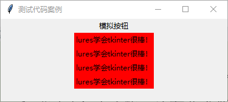

### Python的tkinter模块学习笔记：

```
	lures的Python安装目录是：D:\python
	使用的是Python3.7.0，在DLLS目录下面，看到的动态链接库文件是：tk86.dll
	使用help方法可以查看Python的一些模块的名字	
```

```
import tkinter as tk
tk._test()
```


```
import tkinter as tk
# 对Tk这个类进行实例化，即root是它的一个实例
root = tk.Tk()
# 进行事件循环
root.mainloop()
```

```
注意：
	此时后面有个黑乎乎的控制台窗口，如果我们想双击之后直接看到我们创建的这个窗口，而不想看到这个命令行窗口，可以把demo.py修改后缀名为demo.pyw,并且使用Python安装目录下面的pythonw.exe打开即可！
	
理解：
	对于Tk，我们可以这样理解，就把它当做一个tkinter程序的所有窗口的老大即可，即对所有的部件都需要先创建它！
```


```
# 修改窗口的标题root.title()
import tkinter as tk
# 对Tk这个类进行实例化
root = tk.Tk()
root.title("这是lures的测试代码")
root.mainloop()
```


```
组件：我们常见的按钮、文本框等等都可以当做组件
	我们可以为一个窗口增加若干组件来丰富该窗口的功能，我们往往需要指定这个组件的大小和位置，我们还需要通过编程的方式来指定该组件能完成什么功能！

标签：用于说明一些文字信息
	标签可以说是最简单的窗口组件了，它不需要执行任何功能，只是用来显示信息
```

```
import tkinter as tk

root = tk.Tk()
root.title("这是一个测试代码!")

# Lable是一个类，w是一个Label的实例，它有一个text属性，用来指定它的文本内容
w = tk.Lable(root,text="这是一个并不是很重要的消息")

# pack方法，作用可以理解为找个合适的位置进行放置即可
w.pack()
root,mainloop()


"""
	这里初始化的时候，需要先指定root，是说w这个组件是在root这个窗口的，不是属于别的窗口的，以后我们有了多窗口的应用程序，不会混淆！
"""
```


```
# 多标签实例
import tkinter as tk

root = tk.Tk()
root.title("哈哈，这是lures的一个测试")
w1 = tk.Label(root,text="为什么lures着急学tkinter模块？",bg="green")
w2 = tk.Label(root,text="因为lures接着了一个外包",bg="yelllow")
w3 = tk.Label(root,text="需要导入csv等格式的文件",bg="red")
w1.pack()
w2.pack()
w3.pack()
root.mainloop()
```


```
组件的使用：
	各个组件都有相应的类，我们可以通过面向对象的方式去使用他们！
	这些组件的使用也很相似，在实例化这些组件的时候，第一个参数都是父窗口或者父组件，后面跟着的就是该组件的一些属性，比如我们学到的Label的text属性和background属性
	多个组件的位置控制方式也很相似，我们可以用pack方法来进行简单的布局
```

```
按钮：按钮的重要性在于它可以执行相应的功能，功能可以理解为一个函数，或者这些功能通过相应的函数		去实现，按钮在tkinter中有一个类专门负责它，叫作Button

按钮与功能的绑定：
	绑定的方式有两种：
		1）、在按钮组件被声明的时候用command属性声明，command属性接受一个函数名，注意函数名不要加双引号
		2）、使用bind方法，该方法是Misc这个类的一个方法
```

```
1）使用command方法绑定按钮：
import tkinter as tk

root = tk.Tk()
root.title("哈哈，这是lures的一个演示")
def click():
	# root一定要设置全局变量
	global root;
	words = tk.Label(root,text="哈哈，这是一条没用的信息！")
	words.pack()
w = tk.Button(root,text="lures带你一起学tkinter",command=click)
w.pack()
root.mainloop()

# 需要注意的是：command=click()时，出现的图是下图左，点击没反应
# command属性后面不要加任何标点符号
```


```
2）使用bind方法绑定Button按钮：bind可以接受3个参数
	第一个参数是事件类型，常见的鼠标左键单击如下：<Button-1>
	第二个参数可以是一个函数名：记住不要加任何标点符号，否则运行会报错的
	我通常习惯使用event来表示，如果我们调用函数不接受任何参数，则会报错如下：
		TypeError: click() takes 0 positional arguments but 1 was given。
	
import tkinter as tk
root = tk.Tk()
root.title("哈哈，这也是一段测试代码！")

def click(event):
    global root
    words = tk.Label(root,text="哈哈，欢迎点击，有惊喜哦！")
    words.pack()

b = tk.Button(root,text="这是一段没有任何信息含量的废话")
b.bind("<Button-1>",click)
b.pack()
root.mainloop()
```


```
设置属性：

import tkinter as tk
root = tk.Tk()
root.title("这是一段测试代码！")

def click(event):
    global root
    words = tk.Label(root,text="萨瓦迪卡，Nice to meet you！")
    words.pack()

b = tk.Button(root,text="欢迎点击")

# 分别设置这个按钮的宽、高、以及背景色
b['width'] = 10
b['height'] = 2
b['background'] = 'skyblue'
b.bind("<Button-1>",click)
b.pack()

root.mainloop()
```


```
tkinter的布局：
	1、我们接触过tkinter的一种布局，就是pack布局，它非常简单，我们不用过多的设置，直接使用一个pack函数就可以了！
	2、grid布局：grid可以理解为网格，或者表格，它可以把界面设置为几行几列的网格，我们在网格里插入我们想要的元素。这种布局的好处就是不管我们如何拖动窗口，相对位置时不会变化的，而且这种布局也超简单！
	3、place布局：它直接使用死板的位置坐标来布局，这样做最大的问题就在于当我们向窗口添加一个新部件的时候，又得重新测一遍数据，且我们不能随便地变大或者缩小窗口，否则，可能会导致混乱！
	
	pack布局：
		1）、我们使用pack函数的时候，默认先使用的放到上面，然后依次向下排，它会给我们的组件一个自认为合适的位置和大小，这是默认方式，也是我们上面一直采用的方式！
		2）、pack函数，也可以接受几个参数，side参数指定了它停靠在哪个方向，可以为left、top、right、bottom，分别代表左、上、右、下，它的fill参数可以是x，y，both和none，即在水平方向填充，竖直方向填充，水平和竖直方向填充和不填充！
		3）、它的expand参数可以是YES和NO，它的anchor参数可以是n,e,s,w(分别代表北、东、南、西，这里表示上、右、下、左)以及它们的组合或者是center(表示中间)
		4）、它的ipadx表示的是内边距的x方向，它的ipady代表的是内边距的y方向，padx表示的外边距的x方向，pady表示的是外边距的y方向
```


```
import tkinter as tk

root = tk.Tk()

tk.Button(root,text="A").pack(side='left')
tk.Button(root,text="B").pack(side="top",fill="both")
tk.Button(root,text="C").pack(anchor='ne')
tk.Button(root,text="D").pack(side="right",expand="yes")
tk.Button(root,text="D").pack(side="right",expand="no")
tk.Button(root,text="E").pack(ipadx="10")
root.mainloop()
```

```
grid布局：
	1）、由于我们的程序大多数都是矩形，因此特别适合于网格布局，也就是grid布局
	2）、使用grid布局的时候，我们使用grid函数，在里面指定两个参数，用row表示行，用column表示列，其中注意的是row和column的列的编号都是从0开始
	3）、grid函数还有个sticky参数，它可以用n,e,s,w表示上、右、下、左，它决定了这个组件是从哪个方向开始的
	4）、grid布局直接用后面的行和列的数字来指定了它位于哪个位置，而不必是用其他参数
	5）、grid函数也支持诸如ipadx，ipady，padx，pady，它们的意思和pack函数是一样的，默认边距是0
	6）、它还支持rowspan，表示跨越的行数，columnspan表示跨越的列数
```


```
import tkinter as tk

root = tk.Tk()
root.title("tk")

# 这边Label和Entry里面的row值必须一样，否则出现的问题就是账号和后面的文本框不在同一行中，看起来较丑！
# 至于后面的sticky='w'或者是sticky='w'都是无所谓的
# 后面的代码如果没有column=1，那么就会把前面的账号给覆盖掉，至于column的值是1或2都是没有什么关系的
# padx的作用会使账号和后面的文本框间距隔了很多
# Entry代表输入框
tk.Label(root,text="账号：").grid(row=0,sticky='w')
tk.Entry(root).grid(row=0,column=1,sticky='w')

# 此处的row要比前面的row的数值大，否则后面的也会覆盖前面的
tk.Label(root,text="密码：").grid(row=1,sticky='e')
tk.Entry(root).grid(row=1,column=1,sticky='e')

tk.Button(root,text="登录").grid(row=2,column=1,sticky='e')
root.mainloop()
```

```
place布局，分为绝对布局和相对布局，绝对布局使用x和y参数，相对布局使用relx和rely，relheight和relwidth参数
pack和grid不能同时使用，通常对较为复杂点的还是用grid
```

```
事件：
	1、我们的很多操作，比如我们点击了一下鼠标，这就是一个事件，而操作系统会根据我们相应的事件产生相应的消息，操作系统会把消息传递给我们的应用程序，然后我们的应用程序根据操作系统传入的数据执行相应的命令
	2、事件是我们触发的，消息是操作系统根据我们事件产生的，我们通常对于"消息"并不多关注，我们重视的是“事件”
	3、事件的英文表述是“event”
	
事件及其绑定：
	1、bind函数的调用规则：窗体对象.bind(事件类型，回调函数)
		所谓的"回调函数"，就是这个函数我们不用去调用它，当相应的事件发生的时候，它会自动去调用。比如，当我们的按钮被按下的时候，它就会自动调用
	2、常见的事件：我们在使用bind函数的时候，它的第一个参数就是事件的类型了
		<Button-1>表示鼠标左键单击
		<Button-3>表示鼠标右键单击
		<Button-2>表示鼠标中键单击-----不是很常用
		<KeyPress-A>表示A键被按下，其中的A键可以换成其他的键
		<Control-V>表示按下的是Ctrl和V键，V可以换成其他的键
		<F1>表示按下的是F1键，对于Fn系列的，都可以随便换		
```

```
标签模拟按钮：
import tkinter as tk

root = tk.Tk()
root.title("测试代码案例")
def click(event):
    global root
    words = tk.Label(root,text="lures学会tkinter很棒！",background="red")
    words.pack()

b = tk.Label(root,text="模拟按钮")
b.bind("<Button-1>",click)
b.pack()
root.mainloop()
```



```
关于bind函数：
	1）、可以在全程序级别的绑定，使用bind_all，它的参数类型和bind一样，通常用于全局的快捷键，比如：F1通常是用来打开帮助文档
	2）、还可以绑定某些类别，使用bind_class，它接受3个参数，第一个参数是类名，第二个参数是事件类型，第三个参数是相应的操作
	eg:w.bind_class("Entry","<Control-V>",my_paste)
	它就是绑定了所有的	所有的输入框的Ctrl+V表示粘贴
```

```
解除绑定：使用unbind方法
不过unbind方法只需要一个参数就可以了，它只需要解除绑定的事件类型，因为它会解除该绑定事件类型的所有回调函数
```


```
输入框和密码框：
	1、其实密码框和输入框基本是一样的，都是向里面输入信息用的，但是密码输框需要输入的信息的显示字符比较单一！
	2、比如e是一个输入框，我们可以设置它的show属性，让它变成一个密码框，即e['show'] = '*'就可以了
	
	下面是一个小型的登录程序，它的用户名是111，密码是222，如果输入正确，那么点击"登录"按钮之后，就会显示"登录成功"，如果输入不符合，那么就会显示"用户名或者密码错误"，并且清空两个输入框！
```

```
import tkinter as tk

root = tk.Tk()
root.title("测试代码")
root.geometry("250x100")
user_name = tk.Label(root,text="用户名：")
user_name.grid(row=0,column=0,sticky='w')
user_name_input = tk.Entry(root)
user_name_input.grid(row=0,column=1,sticky='e')

user_pwd = tk.Label(root,text="密码：")
user_pwd.grid(row=1,column=0,sticky='e')
user_pwd_input = tk.Entry(root)
user_pwd_input['show'] = '*'
user_pwd_input.grid(row=1,column=1,sticky='e')

def click():
    str1 = user_name_input.get()
    str2 = user_pwd_input.get()
    t1 = len(str1)
    t2 = len(str2)
    if(str1=="111" and str2=="222"):
        c['text'] = "登录成功"
    else:
        c["text"] = "用户名或密码登录错误"
        # 删除用户名和密码一栏
        user_name_input.delete(0,t1)
        user_pwd_input.delete(0,t2)

login = tk.Button(root,text="登录",command=click)
login.grid(row=2,column=1,sticky='e')
c = tk.Label(root,text="")
c.grid(row=3)
root.mainloop()
```


```
菜单：
	1、菜单的信息量是十分巨大的，由于菜单又可以有子菜单，因此菜单的信息量非常大
	2、菜单的分类也非常多，通常可以分为下拉菜单、弹出菜单等等
添加顶层菜单：
	1、我们可以使用Menu类来新建一个菜单，Menu和其他的组件一样，第一个是parent，这里通常可以为窗口
	2、然后我们可以用add_command方法来为它添加菜单项，如果该菜单是顶层菜单，则添加的菜单项一次向右添加；如果该菜单是顶层菜单的一个菜单项，则它添加的是下拉菜单的菜单项
	3、add_command中的参数常用的有Label属性，用来指定的是菜单项的名称，command属性用来指定被点击的时候调用的方法，acceletor属性指定的是快捷键，underline属性是是否有下划线
	4、最后可以用窗口的menu属性来指定我们使用哪一个作为它的顶层菜单
----------------------------------------------------------------------------
# 代码实战：这里只是做出了顶级菜单，它们4个是并列的一行，并没有实现什么功能，效果图如下：
from tkinter import *

root = Tk()
root.title("测试代码")
root.geometry("300x100")
menubar = Menu(root)

for item in ['文件','编辑','视图','关于']:
    menubar.add_command(label=item)

root['menu'] = menubar
root.mainloop()
```


```
有子菜单的情况：
	1、如果有子菜单，这个时候需要add_cascade，cascade可以理解为"级联"，它的作用是引出后面的菜单
	2、add_cascade的一个很重要的属性就是menu属性，它指明了要把那个菜单级联到该菜单项上，当然还必不可少的是Label属性，用于指定该菜单项的名称
	3、先新建一个Menu实例，然后使用add_command来添加菜单项，这样等该菜单项简历完毕，我们需要把它作为另一个菜单项的子菜单。就需要使用add_cascade方法
----------------------------------------------------------------------------
# 代码实战：可以先把子菜单做好，然后再去做上层菜单
from tkinter import *

root = Tk()
root.title("测试代码")
# 设置窗口大小
root.geometry("300x100")
menubar = Menu(root)

# 下面是各极子菜单
fmenu = Menu(menubar)
for item in ['新建','打开','保存','另存为']:
    fmenu.add_command(label=item)

emenu = Menu(menubar)
for item in ['复制','粘贴','剪切']:
    emenu.add_command(label=item)

vmenu = Menu(menubar)
for item in ['默认视图','新式视图']:
    vmenu.add_command(label=item)

amenu = Menu(menubar)
for item in ['版权信息','其他说明']:
    amenu.add_command(label=item)

# 将子菜单级联到顶级菜单中
menubar.add_cascade(label="文件",menu=fmenu)
menubar.add_cascade(label="编辑",menu=emenu)
menubar.add_cascade(label="视图",menu=vmenu)
menubar.add_cascade(label="关于",menu=amenu)
# 选取顶级菜单作为起始界面
root['menu'] = menubar
root.mainloop()
```


```
弹出菜单：
	1、弹出菜单又叫"上下文菜单",也叫"右键菜单",它通常是鼠标单击右键产生的菜单，因此会有"右键菜单"的说法
	2、其实很多界面库里面都是给出了弹出菜单的简单制作方法的，但是tkinter里面我们只能使用比较原始的事件绑定方式去做
	3、大致思路就是：先新建一个菜单，然后向菜单项中添加各种功能，最后我们监听鼠标右键消息，如果是鼠标右键被单击，此时可以根据需要判断下鼠标位置来确定是哪个菜单被弹出，然后使用Menu类的pop方法来弹出菜单！
	【注意】：
		Menu类里面有一个post方法，它接收两个参数，即x和y坐标，会在相应的位置弹出菜单
		bind方法来绑定事件，而且鼠标右键是用的<Button-3>
---------------------------------------------------------------------------
from tkinter import *

root = Tk()
root.title("测试代码")
menubar = Menu(root)

def click():
    global root
    Label(root,text="I love python").pack()

for x in ['vb','c','java','php']:
    menubar.add_command(label=x)

# 绑定模拟按钮属性
menubar.add_command(label="python",command=click)

def pop(event):
    menubar.post(event.x_root,event.y_root)

root.bind("<Button-3>",pop)
root.mainloop()
```


```
分割线：
	1、有时候，一个菜单项的各个菜单可能并不是一个类型，有可能是两种类型，在它们之间可以插上一个分割线来界定界限
	2、插入分割线和插入正常的菜单项操作很相似，只是使用的方法是add_separator，该方法无需参数
----------------------------------------------------------------------------
# 插入分割下效果实例(在ruby下面插入一个分割线)
from tkinter import *

root = Tk()
root.title("测试代码")
root.geometry("300x300")

# 顶级菜单
menubar = Menu(root)
# 顶级菜单下的级联子菜单
fmenu = Menu(menubar)

for item in ['python','perl','php','ruby']:
    fmenu.add_command(label=item)

# 设置分割线
fmenu.add_separator()
for item in ['java','C++','javascript']:
    fmenu.add_command(label=item)
menubar.add_cascade(label="编程语言",menu=fmenu)
# 设置好初始界面
root['menu'] = menubar
root.mainloop()
```


```
checkbutton和radiobutton:
	1、checkbutton原本是指"复选按钮"，radiobutton原本是指"单选按钮"
	2、在菜单中也有类似的概念，即单选菜单和复选菜单，分别用add_radiobutton和add_checkbutton来分别添加！这两种菜单都是如果一旦被选定，那么前面会有一个类似于对号的标记出现，checkbutton可以多个同时被选定，但是radiobutton却只能被选定一个，即这个被选定了，前面的会自动取消！
----------------------------------------------------------------------------
# 代码案例：顶级菜单下面的级联子菜单，上面是可以复选的，下面则是必须单选
from tkinter import *
root = Tk()
root.title("测试代码")
root.geometry("300x300")

menubar = Menu(root)
fmenu = Menu(menubar)
for item in ['python','perl','php','ruby']:
	fmenu.add_checkbutton(label=item)
fmenu.add_separator()
for item in ['java','C++','C']:
	fmenu.add_radiobutton(label=item)
menubar.add_cascade(label="编程语言",menu=fmenu)
root['menu'] = menubar
root.mainloop()
```


```
对话框和消息框：
	对话框：在新建一个对话框的时候，title属性，text属性，bitmap属性等等都是不可缺少的，否则会报错！
----------------------------------------------------------------------------
# 代码案例：
from tkinter import *
from tkinter.dialog import *

def click():
	d = Dialog(None,title="2020lures",text="你喜欢lures吗？",bitmap=DIALOG_ICON,default=0,strings=("不喜欢","还行","喜欢"))
	print(d.num)
t = Button(None,text="问卷调查",command=click)
t.pack()
b = Button(None,text="关闭",command=t.quit)
b.pack()
t.mainloop()
```


```
其他对话框：
	根据使用频率，源代码又给出了几个标准对话框，eg:simpledialog(简单对话框),commondialog(一般对话框)，filedialog(文件对话框)，其实colorchooser也算对话框的内容！
```

```
消息框：
	from tkinter.messagebox import *
	showinfo(title="2020lures",message="点燃梦想，杨帆起航！")
```


