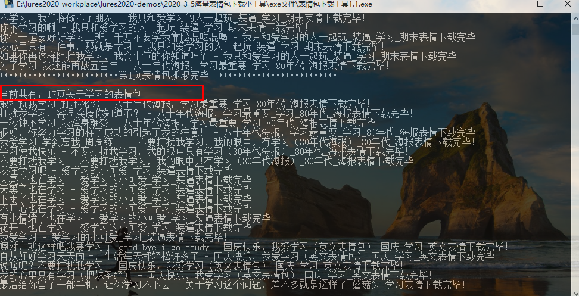

### 1、案例来源：

```
	案例来自昨天晚上心心直播时的案例，我拿来修改优化了一下，目前是2个版本1.0版本是下载一个栏目"热搜表情"大概9000张图片，版本1.1是用户自己输入表情包类型，比如："98K"，再输入想爬取的页数，比如：3页，缺陷是用户输入页数后才可以看到最多是多少页，当然超出的页数会直接输出文字来提示！
```


### 2、代码：

1.0版本：

```
import requests
import os,time,parsel

def get_url(url):
    headers = {
        'Cookie': 'PHPSESSID=clh0i5li73eti7dfqt25vvi7vh; BAIDU_SSP_lcr=https://cn.bing.com/; __gads=ID=e98268942865f2b2:T=1583324066:S=ALNI_MY2QCXWX-JOEuBdbRqQRj_cQM37SQ; UM_distinctid=170a577f3c619d-036b6839d831fc-376b4502-ff000-170a577f3c8b7; CNZZDATA1260546685=2139540747-1583319607-https%253A%252F%252Fcn.bing.com%252F%7C1583319607',
        'Host': 'www.fabiaoqing.com',
        'User-Agent': 'Mozilla/5.0 (Windows NT 10.0; WOW64) AppleWebKit/537.36 (KHTML, like Gecko) Chrome/78.0.3904.108 Safari/537.36'
    }
    response = requests.get(url, headers=headers)
    response.encoding = response.apparent_encoding
    select = parsel.Selector(response.text)
    results = select.css('.ui.segment img')
    path = '表情包'
    if not os.path.exists(path):
        os.mkdir(path)
    for result in results:
        image_url = result.xpath('./@data-original').get()
        image_name = result.xpath('./@title').get()
        image_name = str(image_name).replace(":", '').replace('?', '')
        response = requests.get(image_url)
        suffix = image_url.split('.')[-1]
        try:
            with open(path + '/' + image_name + '.' + suffix, mode="wb") as f:
                f.write(response.content)
        except Exception as error:
            print(error)
        print(image_name + '下载完毕！')

if __name__ == '__main__':
    start_time = time.time()
    for i in range(200):
        url = 'https://www.fabiaoqing.com/biaoqing/lists/page/' + str(i) + '.html'
        get_url(url)
        print('*************************第{}页表情包抓取完毕！*************************'.format(str(i+1)),'\n')
        time.sleep(0.5)
    end_time = time.time()
    print('抓取图片总耗时：{}秒'.format(str(end_time-start_time)))
    time.sleep(2)
```


1.1版本：

```
import requests
import os,time,parsel

def get_url(kd,page):
    keywords = str(bytes(kd.encode())).replace(r"b'", '').replace("'", '').replace(r'\x', '%').upper()
    url = 'https://www.fabiaoqing.com/search/search/keyword/' + keywords
    headers = {
        'Cookie': 'PHPSESSID=clh0i5li73eti7dfqt25vvi7vh; BAIDU_SSP_lcr=https://cn.bing.com/; __gads=ID=e98268942865f2b2:T=1583324066:S=ALNI_MY2QCXWX-JOEuBdbRqQRj_cQM37SQ; UM_distinctid=170a577f3c619d-036b6839d831fc-376b4502-ff000-170a577f3c8b7; CNZZDATA1260546685=2139540747-1583319607-https%253A%252F%252Fcn.bing.com%252F%7C1583323497',
        'Host': 'www.fabiaoqing.com',
        'User-Agent': 'Mozilla/5.0 (Windows NT 10.0; WOW64) AppleWebKit/537.36 (KHTML, like Gecko) Chrome/78.0.3904.108 Safari/537.36'
    }
    response = requests.get(url=url, headers=headers)
    response.encoding = response.apparent_encoding
    select = parsel.Selector(response.text)
    pages = int(select.xpath('//div[@class="ui pagination menu"]/a/text()')[-2].get().strip())
    print('当前共有：{}页关于{}的表情包'.format(str(pages), kd))
    path = kd
    if not os.path.exists(path):
        os.mkdir(path)
    if page < pages:
        new_url = url + '/type/bq/page/' + str(page + 1) + '.html'
        new_response = requests.get(url=new_url, headers=headers)
        new_response.encoding = new_response.apparent_encoding
        new_select = parsel.Selector(new_response.text)
        results = new_select.css('.ui.segment img')
        for result in results:
            image_url = result.xpath('./@data-original').get()
            image_name = result.xpath('./@title').get()
            image_name = str(image_name).replace(":", '_').replace('?', '_').replace(r'/','').replace('\n','')
            suffix = image_url.split('.')[-1]
            if 'http://' or 'https://' in image_url:
                response = requests.get(image_url)
                try:
                    with open(path + '/' + image_name + '.' + suffix, mode="wb") as f:
                        f.write(response.content)
                except Exception as error:
                    print(error)
                print(image_name + '下载完毕！')
            else:
                response = requests.get('https://www.fabiaoqing.com/' + image_url)
                try:
                    with open(path + '/' + image_name + '.' + suffix, mode="wb") as f:
                        f.write(response.content)
                except Exception as error:
                    print(error)
                print(image_name + '下载完毕！')
    else:
        print('超出表情包页!')

if __name__ == '__main__':
    kd = input('请输入您想选择的表情包的关键词(如：爸爸)：')
    page = int(input('请输入您想爬取的表情包的页数：'))
    start_time = time.time()
    for i in range(page):
        get_url(kd,i)
        print('*************************第{}页表情包抓取完毕！*************************'.format(str(i + 1)), '\n')
        time.sleep(0.5)
    end_time = time.time()
    print('抓取图片总耗时：{}秒'.format(str(end_time - start_time)))
    time.sleep(2)

```


### 3、效果演示：




