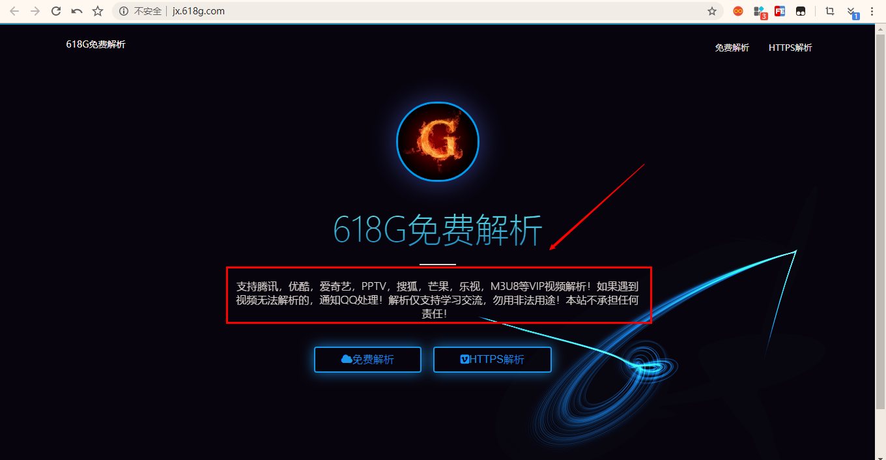
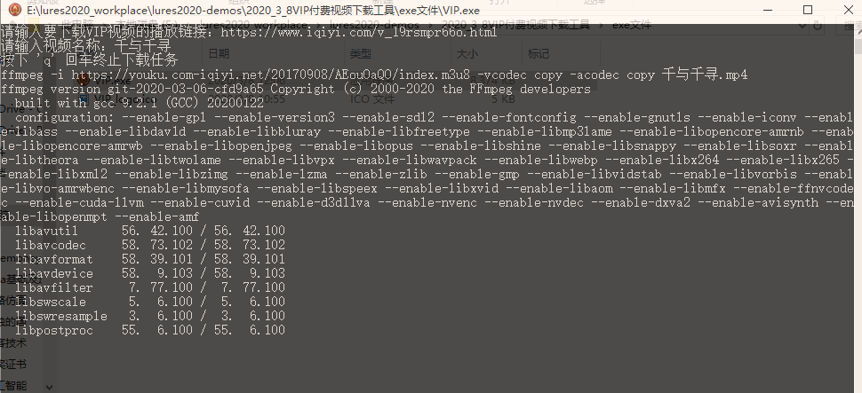

### 1、案例来源：

```
	这个案例是看了一个大佬的代码分享以及实际需要来的！
	之前我就尝试着爬取腾讯视频、爱奇艺视频、优酷视频等付费的VIP视频资源，但是很不幸没有成功！即使后来发现了很多都是通过视频解析网站作为中转站的，但是在提取到m38u格式的文件之后并不知道怎么把ts文件合并，所以就一直没有进行下去了！
	直到看到了ffmpeg以及subprocess等Python库才解决了这个问题！
	
	本教程及代码、封装的exe文件仅用于学习交流，严禁用于商业用途！一切法律后果，请自行承担！
```


### 2、源码：

```
import requests
import re,time
import subprocess

# video_url = "https://www.iqiyi.com/v_19rsmpr66o.html"  # 千与千寻

video_url = input("请输入要下载VIP视频的播放链接：")
movie_name = input("请输入视频名称：")
print("按下 'q' 回车终止下载任务")

response = requests.get(" https://jx.618g.com/?url=" + video_url)
ret = re.search(r'url=(.*.m3u8)', response.text)

if ret:
    url = ret.group(1)
    execute_command = "ffmpeg -i "+ url+ " -vcodec copy -acodec copy {}.mp4".format(movie_name)

    print(execute_command)
    # 命令执行后的结果输出到屏幕
    subprocess.call(execute_command, shell=True)

else:
    print("解析错误，2秒后退出！")
    time.sleep(2)
```


### 3、代码解读：

```
	大家可以看到上面的代码并不是很多，但是封装之后exe文件很好用！这边我就详细的解释一下代码的难懂部分！
1、subprocess库在Python中作用：
	从Python 2.4开始，Python引入subprocess模块来管理子进程，以取代一些旧模块的方法：如os.system、os.spawn、os.popen、popen2.、commands.不但可以调用外部的命令作为子进程，而且可以连接到子进程的input/output/error管道，获取相关的返回信息。
	运行python的时候，我们都是在创建并运行一个进程。像Linux进程那样，一个进程可以fork一个子进程，并让这个子进程exec另外一个程序。在Python中，我们通过标准库中的subprocess包来fork一个子进程，并运行一个外部的程序。
	subprocess包中定义有数个创建子进程的函数，这些函数分别以不同的方式创建子进程，所以我们可以根据需要来从中选取一个使用。另外subprocess还提供了一些管理标准流(standard stream)和管道(pipe)的工具，从而在进程间使用文本通信。
	代码中的subprocess.call(execute_command, shell=True)，其实subprocess.call()是在父进程完成之后子进程才开始操作！这样的好处就是不用冗长的代码将ts文件合并到一起，大大简化了操作并且保证了ts文件合并的效果！

2、解析网站：
	response = requests.get(" https://jx.618g.com/?url=" + video_url)
	ret = re.search(r'url=(.*.m3u8)', response.text)
	其实，就像我之前说的那样，解析腾讯视频、爱奇艺视频等VIP视频网站，用的是一个解析网站作为"跳板(中转站)"，然后在提取到解析网站中的m38u视频流。
	这个解析网站相比于之前分享的几个更加清洁，没有过多的广告，这一点是非常好的！
	下面是网站的网址：https://jx.618g.com
	和截图，大家不想下载但是想看VIP视频并且希望白嫖的话可以用这个解析！
```



```
	网站的UI界面简洁，大家可以用"免费解析"和"HTTPS解析"来解析放映需要放的视频！
	另外页面先是能解析：腾讯、爱奇艺、优酷、PPTV、搜狐、芒果、乐视、M38U等VIP视频解析！
```

```
3、Python中.group()用法：
	url = ret.group(1)
	代码中这个.group()在Python中group() 同group(0)就是匹配正则表达式整体结果，接着group(1)是匹配第一个括号里面的内容，也就是我们需要提取的"中转站"的m38u为后缀的网址

4、ffmpeg安装及用法：
	ffmpeg需要提前安装到windows上！
	安装网址：https://ffmpeg.zeranoe.com/builds/
	安装完成之后，将解压出来的bin目录路径添加到path环境变量，在cmd窗口测试:ffmpeg --version，出现版本内容就代表着ffmpeg已经装好了。这时候并没有结束，我们需要在Python中调用ffmpeg，需要pip install ffmpeg 以及 pip install ffmpy。
	下面介绍的是ffmpeg的使用方法：
		命令格式：
   		  ffmpeg -i [输入文件名] [参数选项] -f [格式] [输出文件]
    	  ffmpeg [[options][`-i' input_file]]... {[options] output_file}...
    	1、参数选项：
            (1) -an: 去掉音频
            (2) -acodec: 音频选项， 一般后面加copy表示拷贝
            (3) -vcodec:视频选项，一般后面加copy表示拷贝
        2、格式：
            (1) h264: 表示输出的是h264的视频裸流
            (2) mp4: 表示输出的是mp4的视频
            (3)mpegts: 表示ts视频流
        如果没有输入文件，那么视音频捕捉（只在Linux下有效，因为Linux下把音视频设备当作文件句柄来处理）就会起作用。作为通用的规则，选项一般用于下一个特定的文件。如果你给 –b 64选项，改选会设置下一个视频速率。对于原始输入文件，格式选项可能是需要的。缺省情况下，ffmpeg试图尽可能的无损转换，采用与输入同样的音频视频参数来输出。
       
       所以代码中execute_command = "ffmpeg -i "+ url+ " -vcodec copy -acodec copy {}.mp4".format(movie_name)就是讲音频和视频文件都添加到进程里面去了。
    代码中的print(execute_command)作用就是显示当前进行的进程，这么做的原因就是在于显示进度条以及下载速度等信息，免得用户"焦急"，以为下不了视频！
```




### 4、其他问题：

```
	最后在封装代码成exe可执行文件的时候遇到的问题：
	将exe文件的logo换成自己自定义的，大家可以按照下面的流程来：
	①打开网址：http://www.bitbug.net/
	②将自己喜欢的图片导进转化成想定义的ico图标文件的像素，接着导出到和py文件在同一个文件夹下面。
	③接着在cmd窗口下面(以我的文件为例子：)
		>>>E:
		>>>cd E:\lures2020_workplace\lures2020-demos\2020_3_8VIP付费视频下载工具
		>>>pyinstaller -F -i "logo.ico" VIP.py
	④最后exe可执行文件便在dist目录下面！
```


### 5、资源获取：

```
1、方式1：
	大家可以关注我的github仓库：https://github.com/lures2019/lures2020-demos
	平常的一些demo案例都在上面！
2、方式2：
	我上传到百度网盘，下面是链接：
		链接：https://pan.baidu.com/s/1uasCvHHKnwF4FLyzPS7H4A 
		提取码：drzf
3、方式3：
	关注我的微信公众号【空谷小莜蓝】，查看历史文章，里面会定期分享有意思的demo案例以及好用的黑科技软件等等！
```

