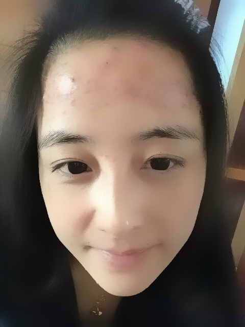

```
"""
    案例1：通过opencv在图片上实现点击效果
        1)加载一张目标图片
        2）图片模糊
        3)通过opencv实现美颜效果
"""
from tkinter import *
import cv2          # pip install opencv-python
from tkinter import messagebox
import os


def fix_photo():
    content = entry.get()
    con = content.strip()
    name = con.split(r'.')[0].split(r'/')[-1]
    if con == "":
        messagebox.showinfo("提示","请输入正确的照片的路径！")
    else:
       try:
           image = cv2.imread(con)
           value = 40
           # value是美颜程度，值越大程度越大，值越小程度越小
           image_dst = cv2.bilateralFilter(image, value, value * 2, value / 2)
           # cv2.namedWindow("window")
           # cv2.imshow('window',image_dst)
           # cv2.waitKey()
           # cv2.destroyAllWindows()

           # 把美颜后的效果生成一张照片
           path = 'photos_after_beauty'
           if not os.path.exists(path):
               os.mkdir(path)
           cv2.imwrite(path + '/' + "%s.jpg" % (name), image_dst)
           messagebox.showinfo("提示", "图片已经美颜成功！")
       except EXCEPTION as error:
           pass
       # 自动清空输入框内容
       entry.delete(0,END)

window = Tk()
window.title("Python美颜工具1.0")
window.geometry("300x100+200+200")
window.resizable(0,0)
label = Label(window,text="图片地址：",font=("仿宋",12))
label.grid(row=0,column=0)
entry = Entry(window,width="28")
# entry不能和grid连写，否则会报错
entry.grid(row=0,column=1)
label2 = Label(window,text="").grid(row=1,column=0)
label3 = Label(window,text="").grid(row=2,column=0)
button1 = Button(window,text="开始美颜",font=("仿宋",12),command=fix_photo)
button1.grid(row=3,column=0)
button2 = Button(window,text="退出软件",font=("仿宋",12),command=window.quit)
button2.grid(row=3,column=1,sticky="e")
window.mainloop()

# # 1、加载一张目标图片
# image = cv2.imread("qingchundou.jpeg")
# # 2、创建一个窗口，用来展示图片
# cv2.namedWindow("window")
# # 3、定义一个函数：实时鼠标状态的点击
# # def draw(event,x,y,flags,param):
# #     if event == cv2.EVENT_LBUTTONDOWN:
# #         print('鼠标->按下')
# #     elif event == cv2.EVENT_MOUSEMOVE:
# #         print('鼠标->滑动')
# #     elif event == cv2.EVENT_LBUTTONUP:
# #         print('鼠标->抬起')
# #
# # # 4、监听鼠标事件的回调
# # cv2.setMouseCallback('window',draw)
# # # 5、展示窗口
# # cv2.imshow('window',image)
# # # bug闪退,窗口无线等待，等着用户来操作
# # cv2.waitKey(2000)
# # # 6、销毁窗口，优化
# # cv2.destroyAllWindows()

# image = cv2.imread('qingchundou.jpeg')
# # 图片模糊，第一个参数：模糊的对象，第二个参数：模糊程度的大小，值越大，程度越大
# image_dst = cv2.blur(image,(15,15))
# cv2.namedWindow("window")
# cv2.imshow('window',image_dst)
# cv2.waitKey()
# cv2.destroyAllWindows()
```

```
这里说一下吧：
	上面的代码是：加载图片、模糊处理、美颜处理
	是我在一节公开课听到的顺便自己做成tkinter图形化界面的形式
	那个这个测试的时候，是只能处理本地照片，在线的照片无法处理
	eg:C:/Users/HP/Desktop/queban.jpg
	最好是英文形式命名图片，中文可能出错！！！
	
	
	另外，在pyinstaller封装的时候也是无法封装的，报错了，显示mkl_intel_thread.dll无法加载，找不到格式的办法~
```




