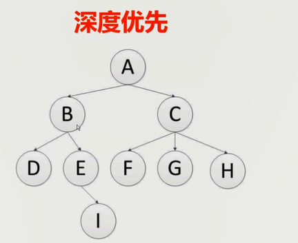
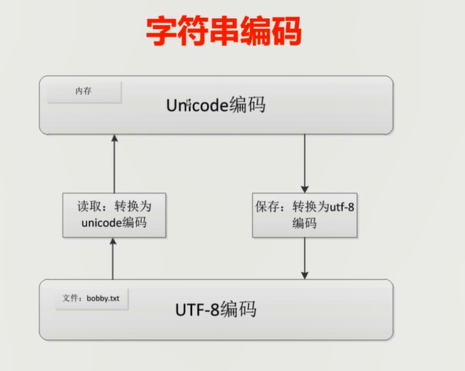

# 1、基础知识

```
scrapy vs requests+beautifulsoup

1、requests和beautifulsoup都是库，scrapy是框架
2、scrapy框架里面可以加上requests和beautifulsoup
3、scrapy基于twisted，性能是最大的优势
4、scrapy方便扩展，提供了很多内置的功能
5、scrapy内置的css和xpath selector非常方便，beautifulsoup最大的缺点就是慢
```


### 1.1	网页分类

```
常见类型的服务：
1、静态网页
2、动态网页
3、webservice（restapi）
```


### 1.2 	爬虫能做什么？

```
爬虫作用：
	1、搜索引擎----百度，google，垂直领域搜索引擎
	2、推荐引擎----今日头条
	3、机器学习的数据样本
	4、数据分析（如金融数据分析）、舆情分析等
```


# 2、正则表达式

```
正则表达式介绍：
	1、为什么必须回正则表达式？
	2、正则表达式的简单应用及Python示例

目录：
	1、特殊字符
		1）^ $ * ? + {2} {2,} (2,5) |
		2）[] [^] [a-z] .
		3)\s \S \w \W
		4)[\u4E00-\u9FA5] () \d
```

```python
import re

"""
    ^b表示以b开头的
    .表示匹配0个或1和字符
    *表示匹配任意次
    3$表示以3结尾的字符串
"""
line = "bobby123"
regex_str = "^b.*3$"
if re.match(regex_str,line):
    print("yes")

"""
    默认情况下，正则表达式匹配都是[贪婪匹配]
    ?表示使用非贪婪匹配,?b表示遇到b就开始匹配
"""
str1 = "booooobb123"
aim_str1 = ".*(b.*b).*"
match_str1 = re.match(aim_str1,str1)
aim_str2 = ".*?(b.*b).*"
match_str2 = re.match(aim_str2,str1)
if match_str1:
    print(match_str1.group(1))
print(match_str2.group(1))


"""
    +表示至少出现1次
    .*是贪婪匹配，一直匹配到最后一个满足条件的选项
    b.+b表示以b开头，.+表示任意字符至少出现1次
"""
str3 = "booooooobaaaaoooooooobbbbaaby123"
aim_str3 = ".*(b.+b).*"
match_str3 = re.match(aim_str3,str3)
if match_str3:
    print(match_str3.group(1))


"""
    {2}表示匹配的字符有2个
    {2,}表示匹配的字符在2次以上
    {2,5}匹配最少2次，最多5次
"""
str4 = "booobaaaoooobbbabay123"
aim_str4 = ".*(b.{2.,5}b).*"
match_str4 = re.match(aim_str4,str4)
if match_str4:
    print(match_str4.group(1))


"""
    |表示或的关系
    默认匹配第一个满足条件的字符(串)，从左到右的方式
"""
str5 = "bobby123"
aim_str5 = "(bobby|bobby123)"
match_str5 = re.match(aim_str5,str5)
if match_str5:
    print(match_str5.group(1))


"""
    [abcd]oooby表示满足abcd里面的任意一个字符串都可以
    [a-z]表示可以写一个区间
    [^1]{9}表示不等于1出现9次即可
    re.match使用时目标筛选条件必须用()括起来
"""
str6 = "bobby123"
aim_str6 = "([a-z]obby[0-9]+)"
match_str6 = re.match(aim_str6,str6)
if match_str6:
    print(match_str6.group(1))


"""
    \s表示匹配空谷
    \S表示非空格的字符都可以
    \w表示匹配[a-zA-Z0-9_]之间的任意字符
    \W和\w相反
    \d表示数字
"""
str7 = "你 好"
aim_str7 = "(你\s好)"
match_str7 = re.match(aim_str7,str7)
if match_str7:
    print(match_str7.group(1))


str8 = "study in 南京大学"
aim_str8 = ".*([\u4E00-\u9FA5]{2,}大学)"      # 贪婪匹配
aim_str8_1 = ".*?([\u4E00-\u9FA5]{2,}大学)"   # 非贪婪匹配
match_str8 = re.match(aim_str8,str8)
match_str8_1 = re.match(aim_str8_1,str8)
if match_str8:
    print(match_str8.group(1))
print(match_str8_1.group(1))
```


# 3、深度优先和广度优先算法

```
目录：
	1、网站的树结构
	2、深度优先算法和实现
	3、广度优先算法和实现
```



```python
# 深度优先输出A、B、D、E、I、C、F、G、H（递归实现）
def depth_tree(tree_node):
    if tree_node is not None:
        print(tree_node._data)
        if tree_node._left is not None:
            return(depth_tree(tree_node._left))
        if tree_node._right is not None:
            return(depth_tree(tree_node._right))

# 广度优先：A、B、C、D、E、F、G、H、I（队列实现）
def level_queue(root):
    """利用队列实现树的广度优先遍历"""
    if root is None:
        return
    my_queue = []
    node = root
    my_queue.append(node)
    while my_queue:
        node = my_queue.pop(0)
        print(node.elem)
        if node.lchild is not None:
            my_queue.append(node.lchild)
        if node.rchild is not None:
            my_queue.append(node.rchild)
```


# 4、爬虫去重策略

```
1、将访问过的url保存到数据库中
2、将访问过的url保存到set中，只需要o(1)的代价就可以查询url
	100000000*2byte*50个字符/1024/1024/1024 = 9G
3、url经过md5等方法哈希后保存到set中
4、用bitmap方法，将访问过的url通过hash函数映射到某一位
5、bloomfilter方法对bitmap进行改进，多重hash函数降低冲突
```


# 5、字符串编码

```
1、计算机只能处理数字，文本转换为数字才能处理。计算机中8个bit位作为一个字节，所以一个字节能表示的最大数字就是255
2、计算机是美国人发明的，所以一个字节可以表示所有的字符了，所以ASCII(一个字节)编码就成为美国人的标准编码
3、但是ASCII编码处理中文明显是不够的，中文不止255个汉字，所以中国制定了GB2312编码，用两个字节表示一个汉字.GB2312还把ASCII编码包含进去了，同理日文、韩文等等上百个国家为了解决这个问题就都发展了一套字节的编码，标准就越来越多，如果出现多种语言混合显示就一定会出现乱码。
4、于是Unicode编码就出现了，将所有语言统一到一套编码里面
5、看一下ASCII编码和Unicode编码的区别：
	1）字母A用ASCII编码十进制是65，二进制是0100 0001
	2）汉字"中"已近超出了ASCII编码的范围，用Unicode编码是20013，二进制是01001110 00101101
	3）A用Unicode编码只需要前面补0，二进制是00000000 01000001
6、乱码问题解决了，但是如果内容全是英文，Unicode编码biASCII编码需要多一倍的存储空间，同时如果传输需要多一倍的传输
7、所以出现了可变长的编码"utf-8"，把英文变长为1个字节，汉字3个字节，特别生僻的变成了4-6字节，如果传输大量的英文，utf8作用就很明显了
```




# 6、Scrapy安装以及目录结构

```
安装scrapy：pip install https://pypi.douban.com/simple scrapy
```

