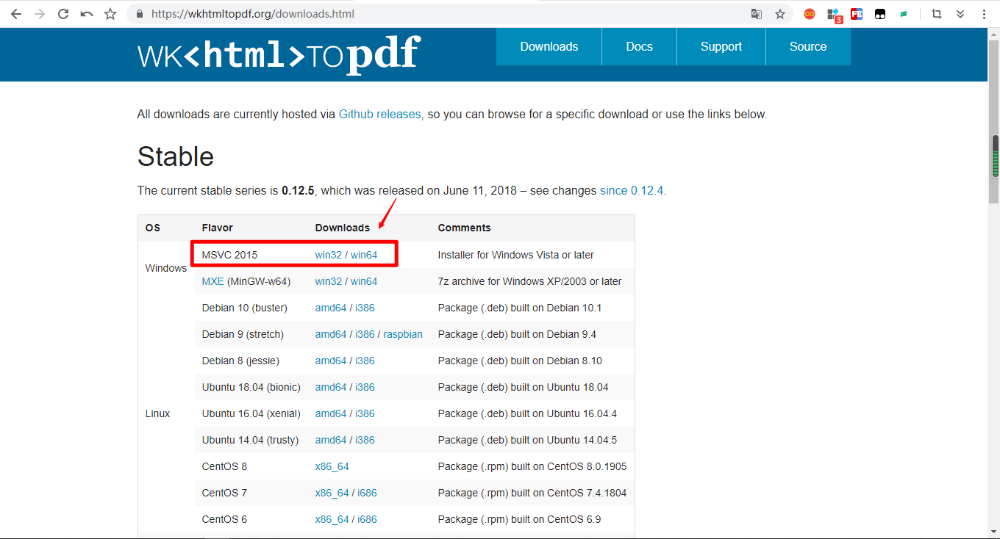
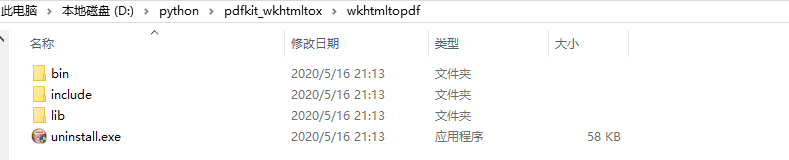
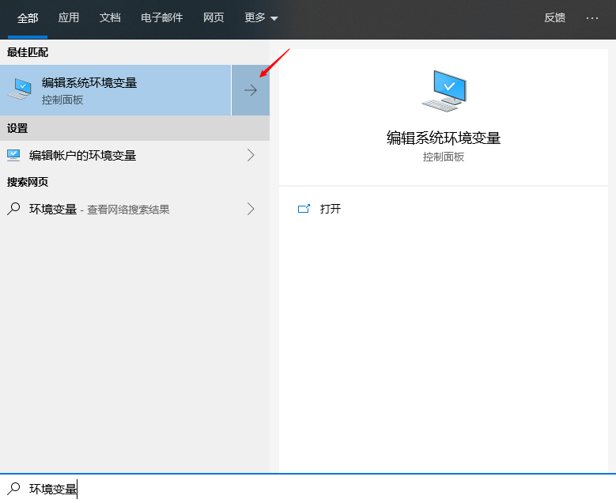
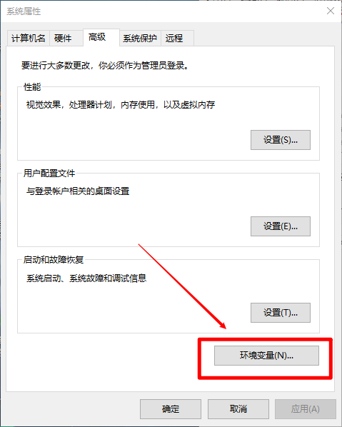
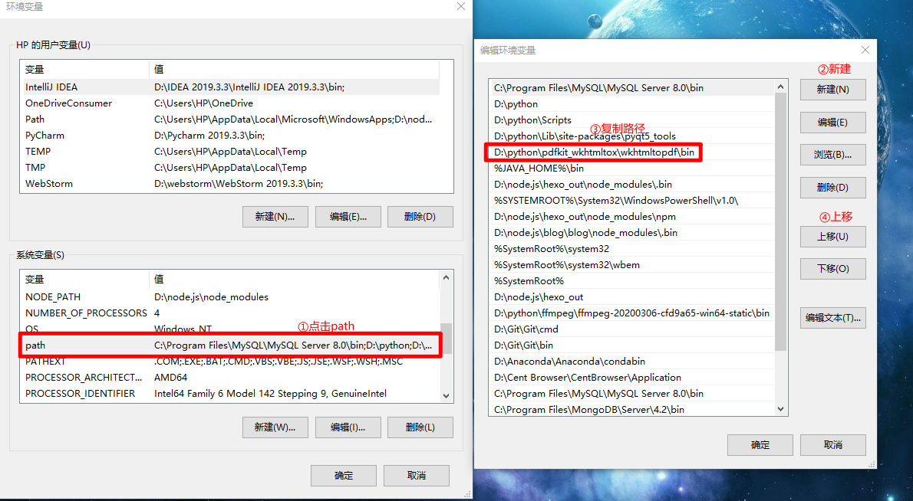
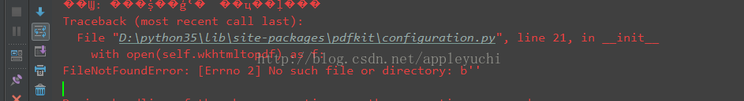
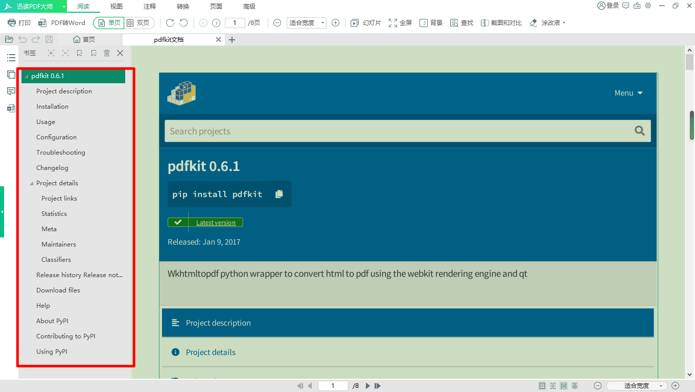

官方文档：`https://pypi.org/project/pdfkit/`

### 1、安装并配置环境

```
1）安装python-pdfkit:
	$ pip install pdfkit
2）安装wkhtmltopdf:
	在https://wkhtmltopdf.org/downloads.html中按照下图所示下载并安装
```



```
3）点击exe可执行文件安装，并保存到特定的目录（示例：D:\python\pdfkit_wkhtmltox\wkhtmltopdf）
，将bin目录路径放到path环境中！
```









```
按照上图所示，即为正确的添加[path环境变量]的方法，切记，在完成之后一定要确定退出！
```


### 2、用法与功能

```
1、对于简单的使用：（提供三种模式）
	1）pdfkit.from_url(网页url生成PDF)
	2）pdfkit.from_file(html文件生成pdf)
	3）pdfkit.from_string(字符串生成pdf)
三种模式类似，就不一一列举(此处以以pdfkit.from_url举例)
```

```python
# pdfkit.from_url

import pdfkit
pdfkit.from_url('https://pypi.org/project/pdfkit/', 'pdfkit文档.pdf')

"""
	理论上，两行代码就可以将我们的网页生成pdf
	实际上，确实是可以得到pdf，但是在运行的时候有点问题！
"""
```





```python
# 改进措施
import pdfkit

config=pdfkit.configuration(wkhtmltopdf=r"D:\python\pdfkit_wkhtmltox\wkhtmltopdf\bin\wkhtmltopdf.exe")
pdfkit.from_url(r'https://pypi.org/project/pdfkit/','pdfkit.pdf',configuration=config)
```


```
2、传递包含多个url或文件的列表
pdfkit.from_url(['google.com', 'yandex.ru', 'engadget.com'], 'out.pdf')
pdfkit.from_file(['file1.html', 'file2.html'], 'out.pdf')
```

```
3、可以传递一个打开的文件:
with open('file.html') as f:
    pdfkit.from_file(f, 'out.pdf')
```

```
4、如果希望进一步处理生成的 PDF，可以将其读取为一个变量:

# Use False instead of output path to save pdf to a variable
pdf = pdfkit.from_url('http://google.com', False)
可以指定所有 wkhtmltopdf 选项。 可以在选项名称中删除“-”。 如果选项没有值，使用 None，False 或‘’来表示 dict 值: 。 对于可重复选项(包括。 允许，cookie，自定义头，后，后文件，运行脚本，替换)你可以使用一个列表或一个元组。 对于需要多个值的选项(例如-custom-header Authorization secret) ，我们可以使用2元组(参见下面的例子)。
```

```python
options = {
    'page-size': 'Letter',
    'margin-top': '0.75in',
    'margin-right': '0.75in',
    'margin-bottom': '0.75in',
    'margin-left': '0.75in',
    'encoding': "UTF-8",
    'custom-header' : [
        ('Accept-Encoding', 'gzip')
    ]
    'cookie': [
        ('cookie-name1', 'cookie-value1'),
        ('cookie-name2', 'cookie-value2'),
    ],
    'no-outline': None
}

pdfkit.from_url('http://google.com', 'out.pdf', options=options)

"""
	注意：
		默认情况下，PDFKit 将显示所有 wkhtmltopdf 输出。如果你不想要它，你需要传递静音选项:
		options = {
        	'quiet': ''
        }
		pdfkit.from_url('google.com', 'out.pdf', options=options)
"""
```


### 3、故障排除

```
1）IOError: 'No wkhtmltopdf executable found'
确保在 $PATH 中有 wkhtmltopdf，或者通过自定义配置设置(请参阅前面的部分)。 在 Windows 中 wkhtmltopdf 或者在 Linux 中 wkhtmltopdf 应该返回到二进制文件的实际路径。

2）IOError: 'Command Failed'
此错误意味着 PDFKit 无法处理输入。 您可以尝试直接从错误消息中运行命令，并查看错误导致的失败(在一些 wkhtmltopdf 版本中，这可能是分段错误导致的)
```

