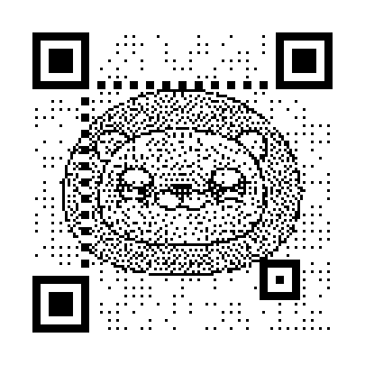

### 一、实验介绍：

```
Python生成个性二维码：
	通过调用MyQR接口来实现生成个人所需二维码，并可设置二维码的大小/是否在现有图片的基础上生成/是否生成动态二维码

在线实验：https://www.shiyanlou.com/courses/1126/learning/
```


### 二、实验环境：

```
1）演示目录：D:\lures2020-demos\2020_6_10_Python生成二维码
2）Pycharm2019打开此目录，将此作为我们的工作目录
3）下载MyQR：pip install MyQR
4）下载所需的图片文件：http://labfile.oss.aliyuncs.com/courses/1126/Sources.zip  
5）使用os模块，将三种状态下生成的二维码照片保存在改文件夹下
```


### 三、实验步骤：

#### 3.1	普通二维码：

```python
from MyQR import myqr
import os

path = "生成的二维码"
if not os.path.exists(path):
    os.mkdir(path)
myqr.run("https://www.bilibili.com/video/BV1ef4y1m7Zs",save_name="普通二维码.png", save_dir=path)
```

效果图如下：


#### 3.2	带图片的艺术二维码：

```python
from MyQR import myqr
import os

path = "生成的二维码"
if not os.path.exists(path):
    os.mkdir(path)
myqr.run("https://www.bilibili.com/video/BV1ef4y1m7Zs",picture="Sources/害羞.png",save_name="带图片的艺术二维码.png", save_dir=path)
```

效果图如下：



黑白的，似乎不是那么好看，彩色的如何呢？实现彩色也非常简单，在参数colorized参数值设为True

```python
from MyQR import myqr
import os

path = "生成的二维码"
if not os.path.exists(path):
    os.mkdir(path)
myqr.run("https://www.bilibili.com/video/BV1ef4y1m7Zs",picture="Sources/害羞.png",colorized=True,save_name="带图片的艺术二维码彩色版.png", save_dir=path)
```


#### 3.3	动态二维码：

```python
# 在生成动态二维码的过程中，值得注意的一点是，我们生成保存的文件也必须是.gif 格式
from MyQR import myqr
import os

path = "生成的二维码"
if not os.path.exists(path):
    os.mkdir(path)
myqr.run("https://www.bilibili.com/video/BV1ef4y1m7Zs",picture="Sources/gakki.gif",colorized=True,save_name="动态二维码.gif", save_dir=path)
```


#### 3.4	`myqr.run()`函数里面的参数：

|    参数    |      含义      |                             详细                             |
| :--------: | :------------: | :----------------------------------------------------------: |
|   words    | 二维码指向链接 |                str，输入链接或者句子作为参数                 |
|  version   |      边长      | int，控制边长，范围是1到40，数字越大边长越大,默认边长是取决于你输入的信息的长度和使用的纠错等级 |
|   level    |    纠错等级    | str，控制纠错水平，范围是L、M、Q、H，从左到右依次升高，默认纠错等级为'H' |
|  picture   |    结合图片    | str，将QR二维码图像与一张同目录下的图片相结合，产生一张黑白图片 |
| colorized  |      颜色      |              bool，使产生的图片由黑白变为彩色的              |
|  contrast  |     对比度     | float，调节图片的对比度，1.0 表示原始图片，更小的值表示更低对比度，更大反之。默认为1.0 |
| brightness |      亮度      |    float，调节图片的亮度，其余用法和取值与 contrast 相同     |
| save_name  |   输出文件名   |              str，默认输出文件名是"qrcode.png"               |
|  save_dir  |    存储位置    |                 str，默认存储位置是当前目录                  |


### 四、MyQR源码解读：

```
1、源码下载：http://labfile.oss.aliyuncs.com/courses/1126/qrcode-master.zip
2、生成二维码的步骤：
	2.1 数据分析MyQR/mylibs/constant.py
		确定编码的字符类型，按相应的字符集转换成符号字符。
	2.2 数据编码MyQR/mylibs/data.py
		将数据字符转换为位流，每8位一个码字，整体构成一个数据的码字序列。
	2.3 纠错编码MyQR/mylibs/ECC.py
		按需要将上面的码字序列分块，并根据纠错等级和分块的码字，产生纠错码字，并把纠错码字加入到		数据码	字序列后面，成为一个新的序列。
	2.4 构造最终数据信息MyQR/mylibs/structure.py + matrix.py
```

```python
# 在规格确定的条件下，将上面产生的序列按次序放入分块中，将数据转成能够画出二维码的矩阵。
# 创建二维码的矩阵
# MyQR/mylibs/matrix.py
def get_qrmatrix(ver, ecl, bits):
    num = (ver - 1) * 4 + 21
    qrmatrix = [[None] * num for i in range(num)]
    # 添加查找器模式和添加分隔符
    add_finder_and_separator(qrmatrix)
    # 添加校准模式
    add_alignment(ver, qrmatrix)
    # 添加时间模式
    add_timing(qrmatrix)
    # 添加涂黑模块和保留区域
    add_dark_and_reserving(ver, qrmatrix)
    maskmatrix = [i[:] for i in qrmatrix]
    # 放置数据位
    place_bits(bits, qrmatrix)
    # 蒙版操作
    mask_num, qrmatrix = mask(maskmatrix, qrmatrix)
    # 格式信息
    add_format_and_version_string(ver, ecl, mask_num, qrmatrix)
    return qrmatrix
```

```python
# 2.5 生成二维码MyQR/mylibs/draw.py
# 使用 draw.py 画出二维码。
def draw_qrcode(abspath, qrmatrix):
    unit_len = 3
    x = y = 4*unit_len
    pic = Image.new('1', [(len(qrmatrix)+8)*unit_len]*2, 'white')   #新建一张白色的底图

    '''
    循环矩阵中的单位，在需要涂黑的单位启用dra_a_black_unit()函数涂黑。
    '''
    for line in qrmatrix:
        for module in line:
            if module:
                draw_a_black_unit(pic, x, y, unit_len)  #画出黑单位
            x += unit_len
        x, y = 4*unit_len, y+unit_len

    saving = os.path.join(abspath, 'qrcode.png')
    pic.save(saving)    # 保存二维码图片
    return saving
```

```
3.合并图片的原理
让我们来看一下 /MyQR/myqr.py 中的 combine() 方法,此方法调用了 Pillow 库
```

```python
# 读取图片操作：
    qr = Image.open(qr_name)    #读取二维码图片
    qr = qr.convert('RGBA') if colorized else qr    #判断二维码是否有色
    bg0 = Image.open(bg_name).convert('RGBA')   #读取要合并的图片
    bg0 = ImageEnhance.Contrast(bg0).enhance(contrast)  # 调节对比度
    bg0 = ImageEnhance.Brightness(bg0).enhance(brightness)  # 调节亮度
 
# 将新加的图片覆盖原有的二维码图片，生成新的图片并保存
    for i in range(qr.size[0]-24):
        for j in range(qr.size[1]-24):
            if not ((i in (18,19,20)) or (j in (18,19,20)) or (i<24 and j<24) or (i<24 and j>qr.size[1]-49) or (i>qr.size[0]-49 and j<24) or ((i,j) in aligs) or (i%3==1 and j%3==1) or (bg0.getpixel((i,j))[3]==0)):
                qr.putpixel((i+12,j+12), bg.getpixel((i,j)))
```


### 五、自定义接口函数：

感觉三个不同类型的二维码生成有点麻烦，想用一个py文件调用三个函数来分别实现不同的效果！

```python
from MyQR import myqr
import os

path = "生成的二维码"
if not os.path.exists(path):
    os.mkdir(path)

def ordinary_qrcode(words,save_name):
    """普通二维码生成函数，传入参数：文本以及保存的图片名,如：("https://www.baidu.com","baidu.png")"""
    myqr.run(words=words,save_name=save_name,save_dir=path)

def color_qrcode(words,picture,save_name):
    myqr.run(words=words, picture=picture, colorized=True,save_name=save_name, save_dir=path)

def dynamic_qrcode(words,picture,save_name):
    myqr.run(words=words, picture=picture, colorized=True,save_name=save_name, save_dir=path)
```

测试自定义模块：

```python
import draw_qrcode

draw_qrcode.color_qrcode("https://lures2019.github.io/",picture="Sources/大笑.png",save_name="测试函数.png")
```

