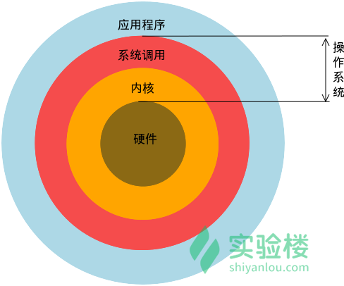
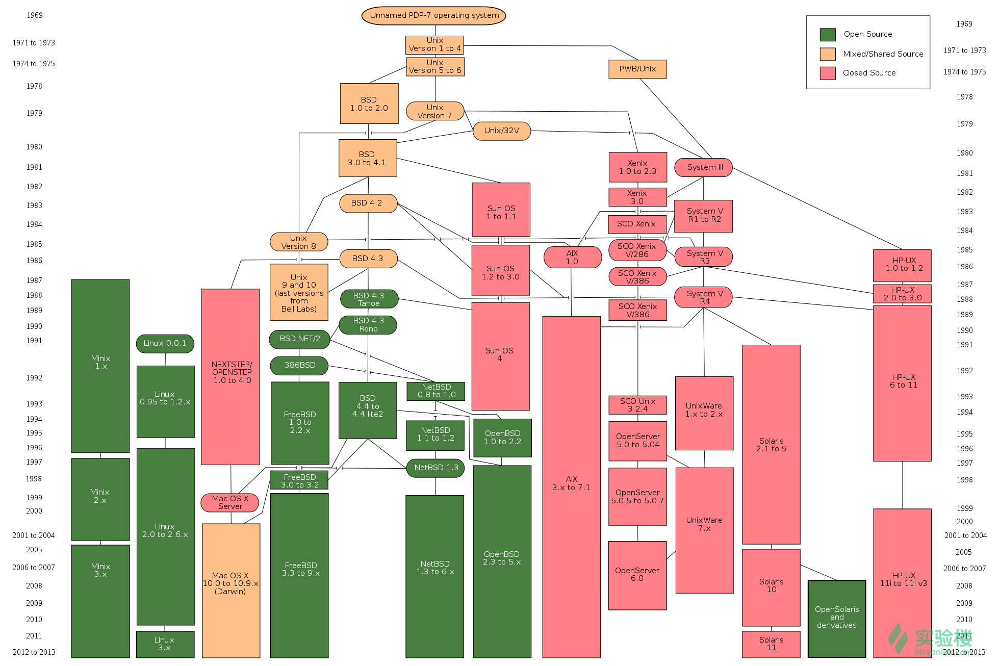
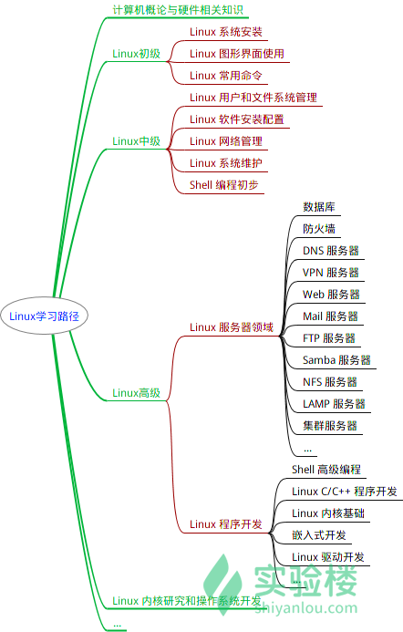
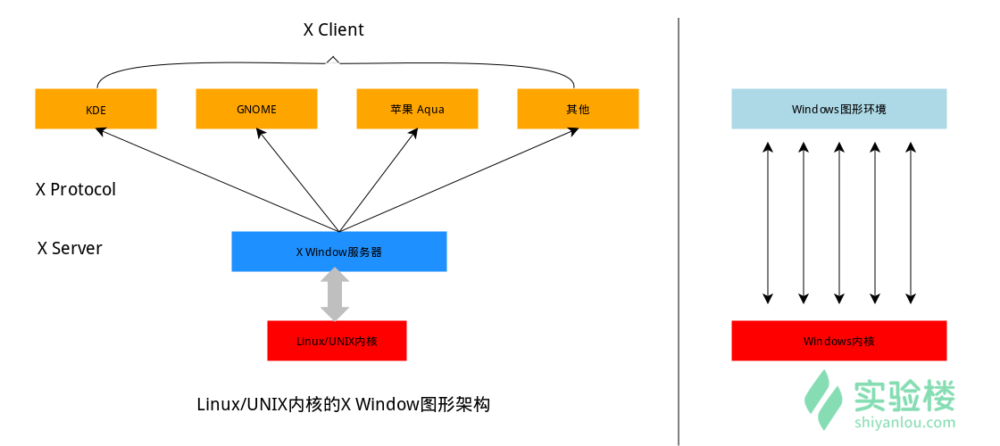

# Linux基础入门

### 1、Linux系统简介：

**一、实验介绍：**

- **实验内容：**本节主要介绍`Linux`的历史，`Linux`与`Windows`的区别等入门知识。
- **知识点：**`Linux`为何物/`Linux`的历史简介/`Linux`重要人物/`Linux`与`Windows`的不同/如何学习`Linux`


**二、实验内容：**

`Linux`为何物：

`Linux`就是一个操作系统，就像你多少已经了解的`Windows(Xp,7,8,10)`和`Mac OS`。至于操作系统是神么，就不用过多解释了，这里简单介绍一下操作系统在整个计算机系统中的角色。



我们的`Linux`主要是系统调用和内核那两层。当然直观地看，我们使用的操作系统还包含一些在其上运行的应用程序，如：文本编辑器、浏览器、电子邮件等

UNIX 进化史（UNIX 大家族族谱 1969-2013）：



#### **`Linux与Windows`到底有哪些不同？**

###### 1. 免费与收费

- 最新正版 Windows 10，需要付费购买；
- Linux 免费或少许费用。

###### 2. 软件与支持

- Windows 平台：数量和质量的优势，不过大部分为收费软件；由微软官方提供重要支持和服务；
- Linux 平台：大都为开源自由软件，用户可以修改定制和再发布，由于基本免费没有资金支持，部分软件质量和体验欠缺；由全球所有的 Linux 开发者和自由软件社区提供支持。

###### 3. 安全性

- Windows 平台：三天两头打补丁安装系统安全更新，还是会中病毒木马；
- Linux 平台：要说 Linux 没有安全问题，那当然是不可能的，这一点仁者见仁智者见智，相对来说肯定比 Windows 平台要更加安全，使用 Linux 你也不用装某杀毒、某毒霸。

###### 4. 使用习惯

- Windows：普通用户基本都是纯图形界面下操作使用，依靠鼠标和键盘完成一切操作，用户上手容易，入门简单；
- Linux：兼具图形界面操作（需要使用带有桌面环境的发行版）和完全的命令行操作，可以只用键盘完成一切操作，新手入门较困难，需要一些学习和指导（这正是我们要做的事情），一旦熟练之后效率极高。

###### 5. 可定制性

- Windows：这些年之前算是全封闭的，系统可定制性很差；
- Linux：你想怎么做就怎么做，Windows 能做到得它都能，Windows 做不到的，它也能。

###### 6. 应用范畴

或许你之前不知道 Linux ，要知道，你之前在 Windows 使用百度、谷歌，上淘宝，聊 QQ  时，支撑这些软件和服务的，是后台成千上万的 Linux  服务器主机，它们时时刻刻都在忙碌地进行着数据处理和运算，可以说世界上大部分软件和服务都是运行在 Linux 之上的。

###### 7. Windows 没有的

- 稳定的系统
- 安全性和漏洞的快速修补
- 多用户
- 用户和用户组的规划
- 相对较少的系统资源占用
- 可定制裁剪，移植到嵌入式平台（如安卓设备）
- 可选择的多种图形用户界面（如 GNOME，KDE）

###### 8. Linux 没有的

- 特定的支持厂商
- 足够的游戏娱乐支持度
- 足够的专业软件支持度

#### 如何学习`Linux`：

**①学习心态：**

- 明确目的——用Linux来干什么，搭建服务器、做程序开发、日常办公、还是娱乐游戏
- 面对现实：`Linux`大都在命令行下操作，能否接受不用或少用的图形界面
- 是学习`Linux`操作系统本身还是某一个`Linux`发行版

**②注重基础，从头开始：**

大致的学习路径如下：



### 2、基本概念及操作：

**一、实验介绍：**

- **实验内容：**常用`shell`命令及快捷键/`Linux`使用小技巧
- 实验知识点：`Linux`基本命令/通配符的使用/查看帮助文档


**二、桌面环境：**

- `Linux`桌面环境介绍：

  ```
  	相对于现在的Windows系统，UNIX/Linux本身是有图形界面的，我们通常在UNIX/Linux发行版上看到的图形界面实际都只是运行在Linux系统之上的一套软件，类似Windows95之前的Windows的图形界面实则也只是运行在DOS环境的一套软件。而Linux上的这套软件以前是XFree86，现在则是xorg(X.org)，而这套软件又是通过X窗口系统实现的，X本身知识工具包及架构协议，而xorg便是X架构规范的实现体，也就是说它是实现了X协议规范的一个提供图形界面服务的服务器，就像实现了http协议提供web服务的Apache。如果只有服务器也是不能实现一个完整的桌面环境的，当然还需要一个哭护短，我们称为X Client，像如下几个大家熟知也最流行的实现了客户端功能的桌面环境KDE/GNOME/XFCE/LXDE。这也以为着在Linux上你可以自己选择安装不同的桌面环境，甚至可以定制自己的专属桌面！
  ```

  

- `Linux`终端：

  通常我们在使用`Linux`时，并不是直接与系统打交道，而是通过一个`shell`的中间程序来完成的，在图形界面下为了实现让我们在一个窗口中完成用户输入和显示输出，`Linux`系统还提供了一个叫做终端模拟器的程序(`Terminal`)。下面是几个比较常见的终端模拟器：

  `terminal/Konsole/xterm/rxvt/kvt/nxterm和eterm`

  终端本质上对应着`Linux`上的`/dev/tty`设备，`Linux`的多用户登录就是通过不同的`/dev/tty`设备完成，`Linux`默认提供了6个纯命令界面的`terminal`(准确的说是`virtual consoles`)。在物理机系统上可以通过`Ctrl+Alt+F1~F6`进行切换！

- 