### 1、Linux的目录操作：

**①查看目录中的内容：`ls`**

在$后面输入`ls`可查看当前目录下的文件和目录！

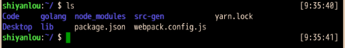

可以看到当前目录下，有`Code`等几个目录和文件！(蓝色字代表目录，白色字代表文件)

**②进入目录：`cd`**

使用`cd`命令可进入其他目录，如果想要进入`Code`目录，可以输入：

`cd Code`

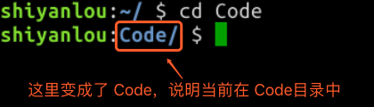

**③快捷操作**

按按键盘的`上下键`试试？可快速选择前面输过的命令！

输入`cd ..`可以回到上一级目录，类似`Windows`的【向上】

输入`cd -`表示回到上一级所在的目录，类似Windows的【回到桌面】

输入`cd /`表示进入根目录，它时一切目录的父目录

**注意：上面的快捷操作，符号都必须时英文符号，否则会报错！**

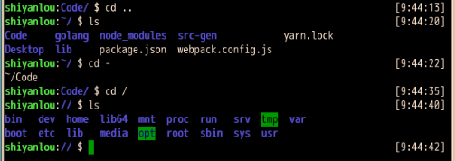

**④查看目录结构：`tree`**

使用`tree`命令可以列出一个文件夹下的所有子文件夹(以树形结构来进行列出)

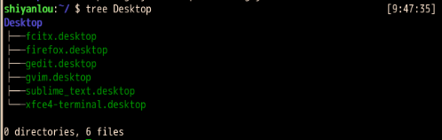

下图为Linux操作系统目录结构的简介，最左边就是根目录：

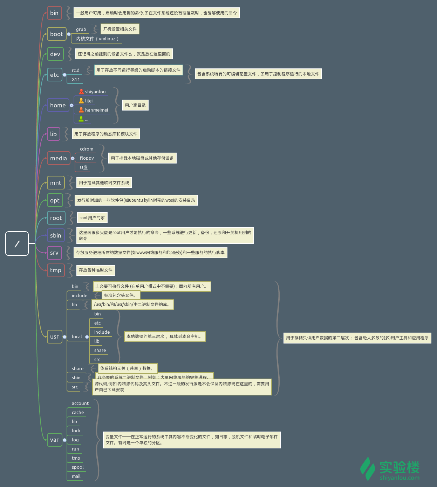

**⑤绝对路径：**

Linux进入目录的方式有`绝对路径`和`相对路径`两种

之前，我们都是用`相对路径`进入目录的，这相当于你在Windows系统下，在当前文件夹中点击下一个文件夹进入

而`绝对路径`是一个以根目录/为起点的完整路径，如：`/home/shiyanlou/Code`，可以类比Windows上的 `C:\Users\电脑用户名\Desktop `

使用`pwd`命令可以获取当前目录的绝对路径：

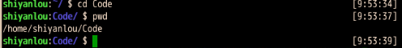

有了绝对路径之后，不管在当前哪个目录下，都可以通过指令进入指定目录！

`cd /home/shiyanlou/Code`

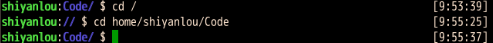

**提示：如果忘记了目录名、文件名或命令，可使用`tab`键自动补全，还可避免输入错误；连续两次`tab`可显示全部候选结果！**

**⑥新建目录：**

使用`mkdir`命令可以创建目录，`mkdir mycode`的意思就是新建一个名为`mycode`的目录

先输入`cd ~`返回到用户主目录，然后练习以下：

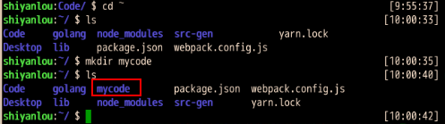

还可以在`mkdir`后加入`-p`参数，一次性创建多级目录，如：

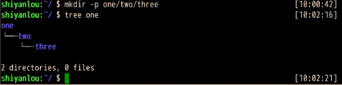

### 2、Linux文件操作：

下面是Linux对文件中的常用操作，包含新建、复制、删除等

**①新建空白文件**

使用`touch`命令可以新建文件，比如我想再新建一个名为【hello】的文件，可输入：

`touch hello`

【hello】文件就被创建出来了，用`ls`命令查看一下！

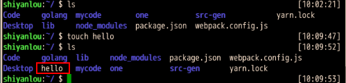

**②复制**

使用`cp`命令(copy)可以复制文件到指定目录下，比如要把【hello】文件复制到`one/two`这个目录下：

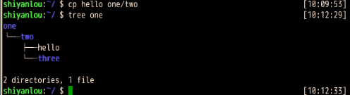

如果要复制目录，需要在`cp`后加上`-r`，然后接上`目录名 目标目录名`

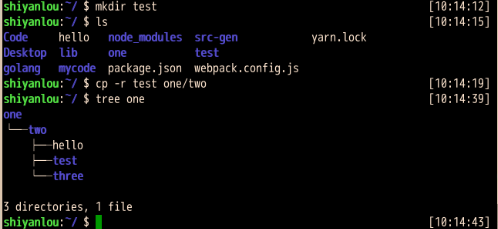

上面的操作中，我们新建了一个`test`目录，然后把它复制进了`one/two`这个目录中，再通过`tree one`直接查看了`one`的目录结构！

**③删除**

使用`rm`命令删除文件：

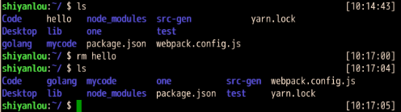

删除目录要加上`-r`选项，类似`cp -r`拷贝目录，会删除目录和目录下的所有内容！

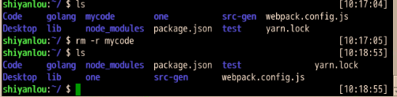

**④移动文件/目录与重命名**

使用`mv`命令可以移动文件或目录

首先，我们进入到`/home/shiyanlou`目录，使用`touch`创建空文件`test1`

然后，创建一个新目录`dir1`，`ls`查看一下

使用`mv`命令将`test1`移动到`dir1`目录，代码如下：

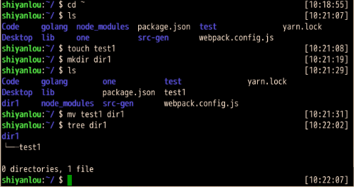

`mv`命令还可以用来重命名，如`mv test1 test2`，会把`test1`重命名为`test2`

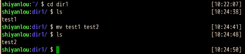

**⑤查看文件内容**

使用`cat`命令，可以将文件中的内容打印到屏幕上，使用的方法是`cat 文件路径`

现在还没有文件，我们先从其他地方复制过来一个：

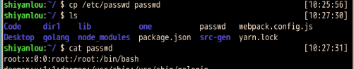

这样就把`passwd`文件从`/etc`目录拷贝到了当前目录中，然后我们用`cat passwd`显示文件中的内容

使用`cat -n`可以带行号地打印文件内容：

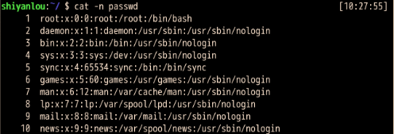

**⑥帮助命令：**

在Linux环境中，如果遇到困难可以使用`man`命令，它是`Manual pages`的缩写。例如：输入`man cat`可以获取到`cat`命令的详细的帮助文件，进入到man的页面后，按`q`可以退出`man`

有些命令可以使用`-- help`选项查看帮助文档！

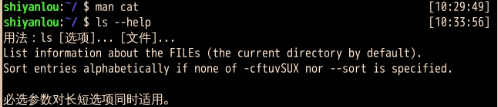

