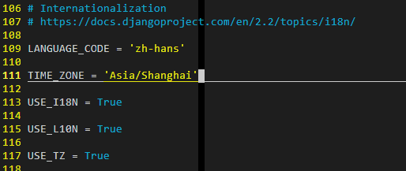

# Django基础入门

### 实验一、Django简介

**1、实验简介：**

```
Django是使用Python开发的开源web开发框架。使用Django，能以最小的代价构建和维护高质量的web应用。
1）知识点：
	使用Django的原因/Django简述
2）源码：https://labfile.oss.aliyuncs.com/courses/1127/mysite.zip
```

**2、实验步骤：**

```
1、为什么使用Django？
	1）Django诞生于新闻网站的环境中，它所提供的特性非常适合开发内容类的网站(eg:博客/交流社区/图片分享网站等)。因为Django是在快节奏的编辑环境中开发的，它的设计目的是使常见的web开发任务变得快速而简单。
	2）Django是开源的，不是商业项目或者科研项目，它集中力量解决web开发中所遇到的一系列问题，因此Django每天都在现有的基础上进步，以适应不断更迭的开发需求。这样既节省了开发时间，也提高了后期维护的效率。

2、使用Django开发的网站：
	Instagram：https://www.instagram.com/
	国家地理：https://www.nationalgeographic.com/
	Pinterest：https://www.pinterest.com/
```

**3、Django预览：**

接下来，我们从实例入手，一步步解析Django建立网站的过程，我们分3个Python文件(`models.py/urls.py/views.py`)和HTML模板文件(`template.html`)来讲解！


> 设计模型Model

Django无需数据库就可以使用，通过对象关系映射器(`Object-relational mapping`)，仅使用Python代码就可以描述数据结构！

```python
# myProject/myApp/models.py
from django.db import models
class book(models.Model):
    name = models.CharField(max_length=100)
    pub_date = models.DateField()
```

`models.py`文件主要用一个Python类来描述数据表。称为模型(`model)`.运用这个类，可以通过简单的Python代码来创建、检索、更新、删除数据库中的记录而无需写一条又一条的SQL语句！

在这里，我们创建了一个`book`模型，并定义了`name`和`pub_date`属性！


> 设计视图Views

在模型被定义之后，我们便可以在视图中引用模型。通常，视图根据参数检索数据，加载一个模板，并使用检索到的数据呈现模板！

```python
# myProject/myApp/views.py
from django.shortcuts import render
from .models import Person

def book_archive(request, year):
    book_list = Person.objects.filter(birth_year = year)
    context = {'year': year, 'book_list': book_list}
    return render(request, 'books/year_archive.html', context)
```

`views.py`文件包含了页面的业务逻辑。`book_archive()`函数叫做视图，这里还用到了`year_archive.html`模板！


> 设计链接 Urls

优雅简洁的URL解析式是衡量高品质网站的重要标准。Django鼓励使用漂亮的URL设计！

使用这些优美的URL，只需要建立URL和Python回调函数简单的映射关系。

```python
# myProject/myProject/urls.py
from django.urls import path
from . import views

urlpatterns = [
    path('books/<int:year>', views.year_archive),
]
```

`urls.py` 指出了什么样的 URL 调用什么视图。 在这个例子中 `books/xxxxx` 将会调用 `year_archive()` 这个函数。也就是说，在进入这个链接时，会返回视图函数的结果


> 设计模板 Templates

Django拥有强大的模板功能，使用该模板能设计出强大的Web页面。

```html
# /template/year_archive.html
Books for {{ year }}

{}
<h1>Articles for {{years}}</h1>


    <p>{{ book.name }}</p>
    <p>Published {{ book.pub_date|date:"F j, Y" }}</P>


```

`year_archive.html` 是 html 模板。使用带基本逻辑声明的模板语言，如 ``，它试图将函数返回的结果显示在网页上。

Django 的这种结构我们称之为 MTV 模式：M 代表模型（`Model`），T 代表模板（`Template`），V 代表视图（`View`）。这三个分别代表了三种不同功能的 Web 应用，各司其职，又彼此合作。 大家一定听说过 MVC 模式（`Mode-View-Controller`），MTV 模式本质上与 MVC 相同，都是让各组件保持低耦合的关系。 关于 MTV 模式我们将在后面部分详细的讲解。

以上只是Django的功能性概述，后面我们将每个部分拆分开来逐一讲解！


**4、实验总结：**

```
在本课程中，学习了以下知识点：
	初步了解Django的总体框架，为后期系统学习打好基础！
参考资料：
	Django官方文档：https://docs.djangoproject.com/en/2.0/
```


### 实验二、搭建Django环境

**1、实验简介：**

```
本实验将会带领大家建立Django的生产环境，并启动我们的第一个Django项目。
知识点：
	Django环境搭建
```


2、**实验步骤：**

在进行学习时，我们需要先将实验所需的环境配置好！

windows则首先在终端命令行更新pip3：`python -m pip install --upgrade pip`

Linux下的更新pip3命令：`sudo pip3 install -U pip`

安装Django2的最终版本2.2.9：`pip install django==2.2.9`

此外，我们还需要安装一些其它的基础工具包，先安装`ipython`和`mysqlclient`这两个，其它的在需要时再进行安装！`pip install ipython mysqlclient`

使用`pip freeze`查看当前Python环境下已经安装的各种包及其依赖包！


**3、创建web项目：**

接下来，我们来学习创建属于我们自己的web项目！

执行命令：`django-admin startproject myProject`初始化一个Django项目，后面的参数为项目名称，我们这里的项目名称定义为`myProject`。执行`tree myProject`命令(仅限于Linux下，Windows下用dir)可以查看项目的目录结构！


对主目录下的文件和目录依次说明：

- `manage.py`项目的入口文件，在后面的实验中我们会大量使用它来执行一些命令来创建应用、启动项目、控制数据表迁移等
- `myProject`主目录下的同名子目录，为项目的核心目录，它里面包含配置文件和管理应用的文件
- `myProject/__init__.py`每个子目录都会包含这样一个`__init__.py`文件，它时一个空文件，在需要的时候会引入目录下的对象
- `myProject/settings.py`配置文件，里面包含对数据库的设置项、`CSRF Token`的设置项、模板的设置项等全部设置
- `myProject/urls.py`路由控制文件，处理客户端请求，分发搭配对应的视图函数去处理
- `myProject/wsgi.py`处理请求和响应，我们很少去动它！

在终端上执行`cd myProject`命令进入到项目的主目录，然后执行如下命令创建一个名为`myApp`的应用，注意实验环境中不可创建名为test的应用，某些条件下它与Python模块冲突！`python3 manage.py startapp myApp`(Linux下)，Windows下是：`python manage.py startapp myApp`


如上所示，创建了名为`myApp`的应用后，在项目的主目录下出现了名为`myApp`的目录，这就是应用目录！

应用中的文件说明如下：

- `myApp/admin.py`用于控制后台管理的文件，在后面的实验中会用到
- `myApp/apps.py`用于管理应用本身的文件，包括应用的名字如何命名，默认就是`myApp`
- `myApp/__init__.py`空文件，前面已经介绍过
- `myApp/migrations`这是用来记录数据库变更信息的目录，Django中自带的数据库版本控制功能就体现在这个目录，在学习数据存储时会详细介绍！
- `myApp/models.py`创建映射类的文件，熟悉`Flask`的同学一定不陌生
- `myApp/tests.py`编写测试代码的文件
- `myApp/views.py`创建视图函数的文件，视图函数用于处理客户端发来的请求！


**4、配置文件：**

创建一个应用后，该应用并未与项目产生联系，需要在配置文件中添加此应用！

Linux下：`vim myProject/settings.py`

Windows下直接记事本或者Pycharm之类的编辑器打开！

修改`INSTALLED_APPS`项，添加我们创建的应用名称`myApp`,Linux配置如下：


修改完成后，键盘按下`Esc`之后，输入`:wq`保存并退出！


**5、启动项目：**

Linux下新打开一个终端并输入：`cd myProject`和`python3 manage.py runserver 0:8080`

Windows类似：`python manage.py runserver localhost:8080`


其中，`manage.py`作为入口文件，它有很多选项提供各种各样的功能！`runserver`为启动项目的选项，后面的`0:8080为0.0.0.0:8080`的简写，冒号钱买你为IP地址，后面为端口号！

很显然Linux下启动项目报错了，而此时Windows下则正常显示：


Linux下呈现出的新页面，会出现下图所示的报错：


这是因为我们的实验环境稍微有些特殊，需要在配置文件中增加一项设置！

打开另一个终端标签，进入项目的主目录`myProject`,打开`myProject/settings.py`文件，修改`ALLOWED_HOSTS`这一项为上述划线字符！(注意：每次打开内容可能不一样，每启动一次都需要修改一下该项内容)。它也是一个列表，在列表中添加报错所示的header信息，也就是单引号中的内容！


同时，我们将欢迎页适配为中文，方便后续的操作和阅读，将`LANGUAGE_CODE和TIME_ZONE`修改如下：



修改完成后，可以看到如下页面：


Windows下的语言和时区操作类似！

恭喜你，成功运行起第一个Django项目！运行完毕后`Ctrl+C`关闭服务器，下面开始介绍Django各个模块的用法


**6、实验总结：**

```
本节我们主要讲解了如下知识点：
	Django的安装
	Django目录结构讲解
	运行Django项目
参考资料:
	Django官方文档：https://docs.djangoproject.com/en/2.0/
```


### 实验三、视图View

**1、实验简介：**

```
本节实验中，我们将学习使用Django关于视图的知识！
知识点：
	Django视图操作
	URLs配置
```

**2、实验步骤：**

因为本实验的最终目的是完成一个对数据库进行增删改查的独立模块，所以我们从创建一个独立的应用开始！


**3、创建应用：**

Django中，每一个应用都是一个Python包，并且遵守着相同的约定！

Django自带一个工具，可以帮助你生成应用的基本目录，极大地提高了开发效率！

在实验二中我们已经创建一个`myProject`的目录，并创建了一个`myApp`的应用目录，终端输入命令按照以下顺序(实验二已创建则无需再执行)

```bash
sudo pip3 install -U pip
pip install django==2.2.9
pip install ipython mysqlclient
django-admin startproject myProject
cd myProject
python3 manage.py startapp myApp
```

我们创建的`myProject`总体目录结构如下：


剩下的`settings.py`的配置跟实验二完全一样！这里就不再赘述了！


**4、开始编写视图：**

```python
# myApp/views.py
from django.shortcuts import render
from django.http import HttpResponse

def index(request):
    return HttpResponse("Hello, world!")
```

大家可以看出来，我们想要看到的就是在页面中输出`Hello world!` 

但仅编写视图函数，并不能在Django页面上显示出来。如果想要看到效果，我们需要使用URL来映射到它！


**5、`myProject/urls.py`:**

接下来需要思考一下，视图函数是有了，它映射到哪个URL路径下呢？也就是说浏览器访问了哪个网址，才会调用这个视图函数处理？

需要编辑`myProject/urls.py`文件，修改为以下代码：

```python
# myProject/urls.py
from django.contrib import admin
from django.urls import path
from myApp import views  # 引入视图函数

urlpatterns = [
    path('admin/', admin.site.urls),
    path('', views.index, name='index'), # 新增路由映射
]
```

最外层的`myApp`目录也就是`myProject`为项目的主目录，引入其它文件中的对象，可以使用绝对路径或相对路径

`urlpatterns`为路由映射到视图函数的控制列表，当服务器收到浏览器发送过来的请求时，首先到这里检查时否有对应的视图函数。如果是[https://www.abc.com](https://www.abc.com/) 就让 `index` 来处理，如果是 https://www.abc.com/admin/ 就让 `admin.site.urls` 来处理。

这一步，我们将应用`myApp`里的视图函数与URL映射到了一起，保存后刷新欢迎页，效果如下：


这样就可以看到我们定义的index视图函数生效了！

我们来详细了解以下`path()`函数，它共有4个参数：

|  参数  |                             意义                             | 是否必须 |
| :----: | :----------------------------------------------------------: | :------: |
| route  | route 是一个匹配 URL 的准则（类似正则表达式）。当 Django 响应一个请求时，它会从 urlpatterns 的第一项开始，按顺序依次匹配列表中的项，直到找到匹配的项。 |   必须   |
|  view  | 当 Django 找到了一个匹配的准则，就会调用这个特定的视图函数，并传入一个 HttpRequest 对象作为第一个参数，被“捕获”的参数以关键字参数的形式传入。 |   必须   |
| kwargs |     任意个关键字参数可以作为一个字典传递给目标视图函数。     |   可选   |
|  name  | 为你的 URL 取名能使你在 Django 的任意地方唯一地引用它，尤其是在模板中。这个有用的特性允许你只改一个文件就能全局地修改某个 URL 模式。 |   可选   |

在上面代码中，`route`为空意味着我们可以直接在桌面环境下使用链接：http://localhost:8000/myApp/访问该视图函数！


**6、实验总结：**

```
通过本节实验，我们主要学习了以下知识点：
	Django视图
	URLs配置
这是学习Django的第一步，后续我们将深入学习，最终的学习成果要靠大家自我他们所和实践来达到

参考资料：
	Django官方文档：https://docs.djangoproject.com/en/2.0/
```


### 实验四、模型Model

**1、实验简介：**

```
在本实验中，我们将建立数据库，创建第一个模型，并调用API来操作数据库
知识点：
	Django模型
	数据库配置
	模型API
```


**2、实验步骤：**

实验分为四步：配置数据/创建模型/激活模型/使用API


**3、配置数据库：**

Django的项目配置都在`myProject/myProject/settings.py` 中

对于数据库，配置文件使用了`SQLite`作为默认的数据库文件。对于只是初步尝试Django的我们来说，这十分方便，无需再去配置其他的东西！

在实际开发中，我们会用到其他更具扩展性的数据库，eg：`MySQL/Oracle`等

如果你选择使用这些数据库，你需要安装相应的数据库的绑定，然后改变配置文件中的`DATABASE default`

本课程默认使用`SQLite`数据库，想要使用其他数据库，可以参考 [Django 官方文档 DATABASE](https://docs.djangoproject.com/zh-hans/2.0/ref/settings/#std:setting-DATABASES)。记得配置设置文件中的 `TIME_ZONE` 为自己所在地的时区，中国地区为 `Asia/Shanghai`。

`TIME_ZONE = 'Asia/Shanghai'`


**4、创建模型：**

模型是真实数据的简明描述。它包含了存储的数据所必要的字段和行为。Django遵循不要重复自己(DRY原则)。它的目标是让你只需要定义数据模型，然后其他的东西你都不用关心，都会自动从模型生成。

实验前，先进入到项目主目录：`cd myProject`

在我们创建的图书馆应用中，需要创建一个模型`Book`。`Book`模型包括四个字段：书名、作者、出版社、出版日期、

向`myApp/models.py`文件中写入如下代码：

```python
# myApp/models.py
from django.db import models

class Book(models.Model):
    name = models.CharField(max_length=200)
    author = models.CharField(max_length=100)
    pub_house = models.CharField(max_length=200)
    pub_date = models.DateTimeField('date published')
```

从代码可以看出，模型是`django.db.models.Model`类的子类。每个模型有一些类变量，它们都表示模型里的一个数据库字段。

每个字段都是`Filed`类的实例。比如：字符字段是`CharField`，日期字段被表示为`DataTimeField`。这将告诉Django的每个字段要处理的数据类型。

定义某些Field类实例需要参数。如上面的`max_length=100`中的`max_length`。这个参数的用处不止用来定义数据结构，也用于验证数据。


**5、激活模型：**

通过前面的代码，Django可以：

- 为这个应用创建数据库`schema`(生成CREATE TABLE)语句
- 创建可以与Book对象进行交互的Python数据库API

为了实现上述功能，我们首先要将`myApp`应用安装到我们的项目中！

因为`MyappConfig`类写在文件`myAPp/apps.py`中，所以它的路径为：`myApp.apps.MyappConfig`

在设置文件中添加路径：

```python
# myProject/settings.py
INSTALLED_APPS = [
    'django.contrib.admin',
    'django.contrib.auth',
    'django.contrib.contenttypes',
    'django.contrib.sessions',
    'django.contrib.messages',
    'django.contrib.staticfiles',
    # 'myApp', 这一注释掉，不注释掉会因重复而报错
    'myApp.apps.MyappConfig',
]
```

现在你的Django项目会包含`myApp`应用。运行下面的命令：`python3 manage.py makemigrations myApp`

会看到这样的输出：


通过运行`makemigrations`命令，Django会检测你对模型文件的修改，并把修改的部分储存在一次迁移！

让我们看看迁移命令会执行哪些SQL语句：`python3 manage.py sqlmigrate myApp 0001`

可以看到创建的SQL语句：


现在运行`migrate`命令，在数据库里创建新定义的模型的数据表：`python3 manage.py migrate`


**6、使用API：**

现在尝试以下Django为我们创建的各种API：

`python3 manage.py shell`

使用这个命令而不是简单的使用"Python"是因为`manage.py`会设置`DJANGO_SETTINGS_MODULE`环境变量，这个变量会让Django根据`myProject/settings.py`文件来设置Python包的导入路径！


```shell
In [1]: from myApp.models import Book
In [2]: Book.objects.all()   # 获取 Book 所有对象
Out[1]: <QuerySet []>
In [3]: from django.utils import timezone
In [4]: b = Book(name='Business', author='Tom', pub_house='First Press', pub_date=timezone.now())    #创建
In [5]: b.save() #保存
In [6]: b.id
Out[6]: 1
In [7]: b.name
Out[7]: 'Business'
In [8]: b.pub_date
Out[8]: datetime.datetime(2020, 4, 27, 7, 37, 59, 123686, tzinfo=<UTC>)
```

**7、实验总结：**

```
本实验中，我们学习了以下知识点：
	Django模型
	数据库配置
	模型API

记住，改变模型需要这三步：
	编辑models.py文件，改变模型
	运行python manage.py makemigrations为模型的改变生成迁移文件
	运行python manage.py migrate来应用数据库迁移

参考资料：
	Django官网文档：https://docs.djangoproject.com/en/2.0/
```


### 实验五、模板Template

**1、实验简介：**

模板是一个文本，用于分离文档的表现形式和内容

知识点：模板/视图


**2、实验步骤：**

本实验将会使用模板来将数据库的Book列表输出到网页上！


**3、创建模板：**

首先，在你的`myProject/myApp`目录里创建一个`templates`目录。Django将会在这个目录里查找模板文件！

在`myProject/myProject/settings.py`文件中的`TEMPLATES`配置项描述了Django如何载入和渲染模板。默认的设置文件设置了`DjangTemplates`后端，并设置了`APP_DIRS=True`。这一选项会让DjangoTemplates在每个`INSTALLED_APPS`文件夹中寻找`templates`子目录！


新建模板文件：`myApp/templates/myApp/detail.html`,并向其中写入如下代码：


```html
<!--myApp/templates/myApp/detail.html-->
<h1>Book List</h1>
<table>
  <tr>
    <td>书名</td>
    <td>作者</td>
    <td>出版社</td>
    <td>出版时间</td>
  </tr>
  
  <tr>
    <td>{{ book.name }}</td>
    <td>{{ book.author }}</td>
    <td>{{ book.pub_house }}</td>
    <td>{{ book.pub_date }}</td>
  </tr>
  
</table>
```

模板统一使用点符号 `.` 来访问变量的属性。在示例 `{{ book.name }}` 中，首先 Django 尝试对 book 对象使用字典查找（也就是使用 `obj.get(str)` 操作），如果失败了就尝试属性查找（也就是 `obj.str` 操作），结果是成功了。如果这一操作也失败的话，将会尝试列表查找（也就是 `obj[int]` 操作）。

在 `` 循环中发生的函数调用：`book_list.all` 被解释为 Python 代码 `book_list.objects.all()`，将会返回一个可迭代的 `Book` 对象，这一对象可以在 `` 标签内部使用。


**4、创建视图：**

现在我们要创建视图来返回图书列表：

```python
# myApp/views.py
from django.shortcuts import render
from django.http import HttpResponse
from myApp.models import Book

def detail(request):
    book_list = Book.objects.order_by('-pub_date')[:5]
    context = {'book_list': book_list}
    return render(request, 'myApp/detail.html', context)
```

在此视图函数 `detail` 中，首先将数据库的 Book 列表按照 `pub_date` 时间来排序，存储到变量 `book_list` 中。

“载入模板，填充上下文，再返回由它生成的 HttpResponse 对象”是一个非常常用的操作流程。于是 Django 提供了一个快捷函数 `render()`。

`render()` 函数把 `request` 对象作为它的第一个参数，模板作为第二个参数，字典作为它的可选的第三个参数。它返回给定模板呈现的给定文本的一个 `HttpResponse` 对象。

在这里，`context` 信息将会返回到模板 `myApp/detail.html`。


**5、绑定链接：**

将新视图添加进`myProjects.urls`模块中：

```python
# myProject/urls.py
from django.contrib import admin
from django.urls import path
from myApp import views

urlpatterns = [
    # path('admin/', admin.site.urls),
    path('', views.detail, name='detail'),
]
```


**6、运行：**

为了达到好的效果，可以参考钱买你的模型实验，多创建几个Book实例，添加步骤见实验三：

现在运行我们的项目：`python3 manage.py runserver 0:8080`

当得到如下结构时，表示我们已经成功了：


### 实验六、使用MTV模式实现数据库增删改查

**1、实验简介：**

本实验，我们将实战前面学习的知识点，完成对数据的增删改！

知识点：Django基础/HTML基础

实验代码：以下时本节实验的关键代码下载链接，大家可以下载作为参考

```
$ wget https://labfile.oss.aliyuncs.com/courses/1660/Django_Book.zip
$ unzip Django_Book.zip
```


**2、实验步骤：**

本实验将通过简单的表单来提交数据，接上一个实验进行：

在上一个实验中的：`myApp/templates/myApp/detail.html` 里，添加一个表单：

```html
<form action="" method="post" name="addBook">
  
  <p><span>书名：</span><input type="text" name="name" /></p>
  <p><span>作者：</span><input type="text" name="author" /></p>
  <p><span>出版社：</span><input type="text" name="pub_house" /></p>
  <input type="submit" value="添加" />
</form>
```

简要说明：

- 上面的模板是输入相应的书名、作者和出版社后，点击添加，将数据存储到数据库并刷新页面显示出来。
- 我们设置表单的 `action="/addBook/"`，并设置`method="post"`。使用 `method="post"`（与其相对的是 `method="get"`）是非常重要的，因为这个提交表单的行为会改变服务器端的数据,无论何时，当你需要创建一个改变服务器端数据的表单时，请使用 `method="post"`。这不是 Django 的特定技巧，这是优秀的网站开发技巧。
- 由于我们创建一个 POST 表单（它具有修改数据的作用），所以我们需要小心跨站点请求伪造。 但你不必太过担心，因为 Django 已经拥有一个用来防御它的非常容易使用的系统。 简而言之，所有针对内部 URL 的 POST 表单都应该使用 `` 模板标签。


**3、命名空间：**

教程项目只有一个应用 myApp。在一个真实的 Django 项目中，可能会有五个，十个，二十个，甚至更多应用。Django 如何分辨重名的 URL 呢？

举个例子，myApp 应用有 detail 视图，可能另一个博客应用也有同名的视图。Django 如何知道 `action=""` 标签到底对应哪一个应用的 URL 呢？

答案是：在根 URLconf 中添加命名空间。在 `myProject/urls.py` 文件中稍作修改，加上 `app_name` 设置命名空间：

```python
from django.contrib import admin
from django.urls import path
from myApp import views

app_name = 'myApp' # 添加这一行
urlpatterns = [
    # path('admin/', admin.site.urls),
    path('', views.detail, name='detail'),
    path('addBook/', views.addBook, name='addBook'),
]
```

现在回到 `myApp/templates/myApp/detail.html` 更改 `action`：

`<form action="/addBook/" method="post" name="addBook"></form>`


**4、添加书籍：**

创建 `addBook` 函数来实现我们添加书籍的功能。

将下面的代码添加到 `myApp/views.py`：

```python
# myApp/views.py
from django.http import HttpResponseRedirect
from django.urls import reverse

def addBook(request):
    if request.method == 'POST':
        temp_name = request.POST['name']
        temp_author = request.POST['author']
        temp_pub_house = request.POST['pub_house']

    from django.utils import timezone
    temp_book = Book(name=temp_name, author=temp_author, pub_house=temp_pub_house, pub_date=timezone.now())
    temp_book.save()

    # 重定向
    return HttpResponseRedirect(reverse('detail'))
```

在 `myProject/urls.py` 里添加 URL 地址映射：

```
# myProject/urls.py
path('addBook/', views.addBook, name='addBook'),
```

简单说明：

- `request.POST` 是一个类字典对象，可以通过关键字的名字获取提交的数据。 这个例子中，`request.POST['name']` 以字符串形式返回`name`的值。`request.POST` 的值永远是字符串。
- 在添加书籍之后，代码返回一个 `HttpResponseRedirect` 而不是常用的 `HttpResponse`，`HttpResponseRedirect` 只接收一个参数：用户将要被重定向的 URL。
- 你应该在每次处理 POST 数据时，都返回`HttpResponseRedirect`。这也不是 Django 的特定技巧，这是优秀的网站开发的实践。
- 在这个例子中，我们在 `HttpResponseRedirect` 的构造函数中使用 `reverse()` 函数。这个函数避免了我们在视图函数中硬编码 URL。它需要我们给出想要跳转的视图的名字和该视图所对应的 URL 模式中需要给该视图提供的参数。`reverse()` 调用后将返回这样一个字符串：`/detail/`。

添加书籍功能完成，现在可以随意添加书籍。

打开 Web 服务访问链接就可以查看效果：

添加前：


添加后：


**5、删除书籍**：

删除书籍功能实现起来也很简单。

首先，在 `myApp/detail.html` 中设计我们的模板。

```html

    <tr>
        <td>{{ book.name }}</td>
        <td>{{ book.author }}</td>
        <td>{{ book.pub_house }}</td>
        <td>{{ book.pub_date }}</td>
        <td><a href="">删除</a></td><!--只添加这一行-->
    </tr>

</table>
```

可以看出，只需要在每个书籍后面添加一个删除的按钮。删除时也传递了需要删除的图书的 `id`。

接着，配置 url，只需在 `myProject/urls.py` 中添加这一行：

` path('delBook/<int:book_id>', views.deleteBook, name='delBook'),`

这里 `` 是接收传递的参数 book_id`

最后设计视图函数：

```python
# myApp/views.py
def deleteBook(request, book_id):
    bookID = book_id
    Book.objects.filter(id=bookID).delete()

    # 重定向
    return HttpResponseRedirect(reverse('detail'))
```

这个视图中，获取到 book 的 id，根据 id 来删除指定书籍。最后跟上面的添加书籍函数相同，使用重定位刷新页面。打开 Web 服务访问链接查看效果：


**6、实验总结：**

在本实验中，我们实现了增加和删除，现在的你或许已经有了头绪。

自己动手试一试，实现以下i需改指定图书信息的操作吧！


### 实验七、总结

**1、实验介绍：**

```
到目前为止，我们完成了一个对数据库增删改查的Django项目
现在，我们再详细讲解以下整个项目时如何实现的。
知识点：
	MVC设计模式
	Django MTV设计模式
```

**2、实验步骤：**

本实验将带大家深入了解Django的MTV设计模式

#### MVC

在说 MTV 模式之前，让我们来简单的说说著名的 MVC 模式。

MVC，是模型（Model）-视图（View）-控制器（Controller）的缩写。其具体定义如下：

- M：模型（Model），数据存取层，负责业务对象和数据库对象。
- V：视图（View），与用户的交互，负责显示与怎样显示。
- C：控制器（Controller），接受用户动作，调用模型，输出相应视图。

三者以一种插件似的，松耦合的方式连接在一起。


#### MTV

Django 的 MTV 设计模式是借鉴和遵循 MVC 的。

MTV 具体定义如下：

- M：模型（Model）,负责业务对象和数据库的关系映射。
- T：模板（Template）,负责如何把页面展示给用户。
- V：视图（View）,负责业务逻辑，并在适当时候调用模型和模板。

#### URL 分发器

URL 分发器的作用是将页面请求分发给不同的视图（View）处理，视图再调用相应的模型（Model）和模板（Template）。

Django Web 框架：


一个误区是把 MVC 模式与 MTV 模式等价替换。其实这样是不对的。

在 MTV 模式中，MVC 中的 View 分成了视图 View（展现哪些数据）和模板 Template（如何展现）2 个部分，而控制器（Controller）这个要素由框架自己来实现了，我们需要做的就是把 URL 对应到视图 V 就可以了，通过这样的 URL 配置，系统将一个请求发送到一个合适的视图。


