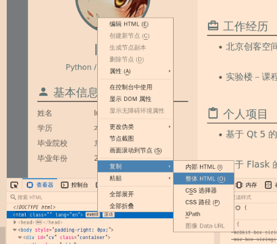
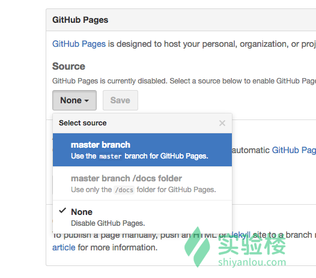

### 在Github Pages上部署自己的简历

###### 1、初始化`git`库

打开终端，进入`Code`目录，创建`CV`文件夹，并将其作为我们的工作目录：

`cd Code`

`mkdir CV && cd CV `

初始化`git`库：`git init`

用户配置：

`git config --global user.name "你的用户名"`

`git config --global user.email "你的邮箱地址"`

用户名和邮箱式你提交`commit`时的签名，在`Github`仓库页面上会显示这次提交的用户，如果不做设置就会默认为该仓库的拥有者，做了则根据邮箱来匹配用户！


##### 2、编辑简历文件

下载页面模板文件，解包，并且将其中的文件置于`CV`文件夹下！

```
$ wget http://labfile.oss.aliyuncs.com/courses/624/cv-template.zip
$ unzip cv-template
$ mv cv-template/* .
$ rm -rf cv-template* __MACOSX*
```

用浏览器打开就可以看见模板的样子了，大家可以根据自己的需求来修改模板的样式！

在`Linux`终端项目目录输入命令：`firefox index.html`或者进入到文件夹，在图形化界面中右键选择使用浏览器打开！


其中，`mv`是移动命令，`rm -rf`表示强制删除


点击发现，这份模板是可编辑的，所有的文字栏目都是可以随意编辑的，图片可以通过图片的url地址替换！


可增加新栏目、可以通过点击编辑进度条！

编辑完自己的简历之后，就把修改后的代码复制下来替换掉原`index.html`里的内容！

`FireFox`下打开查看器：【复制`html`标签的外部`HTML`】

然后将`index.html`中的`html`标签的所有内容(包括`html`标签)替换掉即可！



不喜欢这样子的同学可以修改`static/js`下的`script.js`文件，操作非常简单，删除该文件下的所有内容，然后加上下面这一句。

```
$(document).ready(function($){
    $("*").removeAttr('contenteditable');        
})
```

这一句是为了去掉页面上所有元素的可编辑属性。最后可以在 CSS 文件内再改改样式。


##### 3、部署简历文件

首先，需要有自己的`github`账号，之后新建一个仓库`cv`或者是`resume`

现在本地仓库做代码的提交：

`git add .`

 `git commit -m "commit my cv"`

在项目页面找到你的仓库地址后输入：

`git remote add origin 你的远程仓库地址`

代码提交到远程仓库后，在项目页面设置`GitHub Pages`使用的托管源



现在就可以访问：`https://lures2019.github.io/resume/cv-template/`这个地址了，现在简历已经成功部署到`Github Pages`上了


##### 4、打印简历

可以使用浏览器自带的打印！

或者是：使用之前讲解的Python的`pdfkit`库来操作！

`pip install pdfkit`


