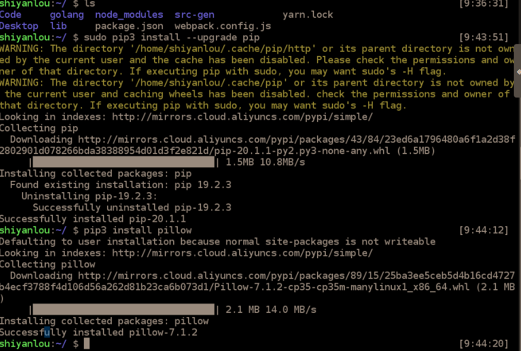
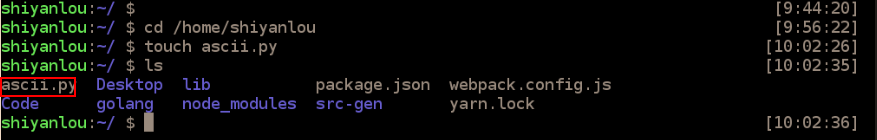
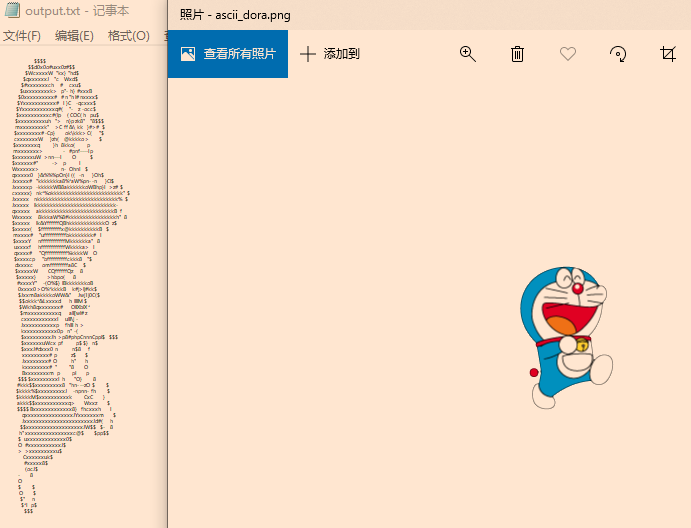

# Python实现图片转字符画

### 一、实验介绍：

##### 1、实验知识点：

将实践以下知识：

- `Linux`命令行操作
- `Python`基础
- `pillow`库的使用
- `argparse`库的使用(参考教程：https://blog.ixxoo.me/argparse.html)

##### 2、实验环境：

- `Python 3.5`
- `pillow 7.1.2`

`PIL`是一个Python图像处理库，使用下面的命令来安装`pillow(PIL)`库：

`Linux`下使用下面命令：

- `sudo pip3 install --upgeade pip`
- `sudo pip3 install pillow`

`Windows`下使用下面命令：

- `python -m pip install --upgrade pip`
- `pip install pillow==7.1.2`




##### 3、参考代码

本实验的参考代码： http://labfile.oss.aliyuncs.com/courses/370/ascii.py


### 二、实验原理：

字符画是一系列字符的组合，我们可以把字符看作是比较大块的像素，一个字符能表现一种颜色(为了简化可以这么理解)，字符的种类越多，可以表现得颜色也越多，图片也会更有层次感！

那么我们要转换一张彩色的图片，这么多的颜色，要怎么对应到单色的字符画上去？这里就要介绍**灰度值**的感念了！

> 灰度值：指黑白图像中点的颜色深度，范围一般从0~255，白色为255，黑色为0，故黑白图片也称灰度图像

另一个概念是`RGB`色彩：

> `RGB`色彩模式是工业界的一种颜色标准，是通过对红(R)/绿(G)/蓝(B)三个颜色通道的彼岸花以及它们相互之间的叠加来得到各式各样的颜色，`RGB`即是代表着红/绿/蓝三个通道的颜色，这个标准几乎包括了人类视力所能感知的所有颜色，是目前运用最广的颜色系统之一！

我们可以使用灰度值公式将像素的 `RGB` 值映射到灰度值（注意这个公式并不是一个真实的算法，而是简化的 sRGB IEC61966-2.1 公式，真实的公式更复杂一些，不过在我们的这个应用场景下并没有必要）：

`gray = 0.2126*r + 0.7152 *g + 0.0722 *b`

这样我们可以创建一个不重复的字符列表，灰度值小(暗)的用列表开头的符号，灰度值大(亮)的用列表末尾的符号！


### 三、实验步骤：

首先，安装Python的图像处理库`pillow(PIL)`，`Windows`和`Linux`的指令见前方**【实验环境】**

对于`Linux`下，需求在`/home/shiyanlou`目录下创建`ascii.py`文件：

- `cd /home/shiyanlou/`
- `touch ascii.py`

对于`Windows`下，我们就记为`demo.py`吧！




##### 1、编写代码

`Linux`下使用`vim`或者`gedit`打开代码文件：

- `cd /home/shiyanlou`
- `vim ascii.py`

**（`vim`打开后`i`按键按下代表插入，就可以编写代码，退出时：先`etc`再`:wq`）**

文件打开后依次输入以下的代码内容：

首先要导入必要的库，`argparse`库是用来管理命令行参数输入的

- `from PIL import Image`
- `import argparse`


##### 2、处理命令行参数

我们首先使用`argparse`处理命令行参数，目标是获取输入的图片路径、输出字符画的宽和高以及输出文件的路径

```python
# 首先，构建命令行输入参数处理 ArgumentParser 实例
parser = argparse.ArgumentParser()

# 定义输入文件、输出文件、输出字符画的宽和高
parser.add_argument('file')     #输入文件
parser.add_argument('-o', '--output')   #输出文件
parser.add_argument('--width', type = int, default = 80) #输出字符画宽
parser.add_argument('--height', type = int, default = 80) #输出字符画高

# 解析并获取参数
args = parser.parse_args()

# 输入的图片文件路径
IMG = args.file

# 输出字符画的宽度
WIDTH = args.width

# 输出字符画的高度
HEIGHT = args.height

# 输出字符画的路径
OUTPUT = args.output
```


##### 3、实现`RGB`值转字符的函数

首先将`RGB`转为灰度值，然后使用灰度值映射到字符列表中的某个字符

下面是我们的字符画所使用的字符集，一共有70个字符：

```
ascii_char = list("$@B%8&WM#*oahkbdpqwmZO0QLCJUYXzcvunxrjft/\|()1{}[]?-_+~<>i!lI;:,\"^`'. ")
```

字符的种类和数量可以自己根据字符画的效果反复调试！

下面是`RGB`值转字符的函数，注意`alpha`值为0的时候表示图片中该位置为空白

```python
def get_char(r,g,b,alpha = 256):

    # 判断 alpha 值
    if alpha == 0:
        return ' '

    # 获取字符集的长度，这里为 70
    length = len(ascii_char)

    # 将 RGB 值转为灰度值 gray，灰度值范围为 0-255
    gray = int(0.2126 * r + 0.7152 * g + 0.0722 * b)

    # 灰度值范围为 0-255，而字符集只有 70
    # 需要进行如下处理才能将灰度值映射到指定的字符上
    unit = int(grey/length)*256

    # 返回灰度值对应的字符
    return ascii_char[unit]
```

其中灰度值映射到指定字符上有公式：`x/length = gray/alpha`


##### 4、处理图片

- 首先使用`PIL`的`Image.open`打开图片文件，获得对象`im`
- 使用`PIL`库的`im.resize()`调整图片大小对应到输出的字符画的宽度和高度，注意这个函数第二个参数使用`Image.NEARSET`，表示输出低质量的图片
- 遍历提取图片中每行的像素的`RGB`值，调用`getchar`转成对应的字符
- 将所有的像素对应的字符拼接在一起形成一个字符串`txt`
- 打印输出字符串`txt`
- 如果执行时配置了输出文件，将打开文件将`txt`输出到文件，如果没有，则默认输出到`output.txt`文件

整个过程需要注意的是调用`getchar`时候的参数是通过`PIL`库的`getpixel`获取的，如下：

`char = get_char(*im.getpixel((j,i)))`

其中 `im.getpixel((j,i))` 获取得到坐标 `(j,i)` 位置的 RGB 像素值（有的时候会包含 alpha 值），返回的结果是一个元组，例如 `(1,2,3)` 或者 `(1,2,3,0)`。我们使用 `*` 可以将元组作为参数传递给 get_char，同时元组中的每个元素都对应到 get_char 函数的每个参数。

```python
if __name__ == '__main__':

    # 打开并调整图片的宽和高
    im = Image.open(IMG)
    im = im.resize((WIDTH,HEIGHT), Image.NEAREST)

    # 初始化输出的字符串
    txt = ""

    # 遍历图片中的每一行
    for i in range(HEIGHT):
        # 遍历该行中的每一列
        for j in range(WIDTH):
            # 将 (j,i) 坐标的 RGB 像素转为字符后添加到 txt 字符串
            txt += get_char(*im.getpixel((j,i)))
        # 遍历完一行后需要增加换行符
        txt += '\n'
    # 输出到屏幕
    print(txt)

    # 字符画输出到文件
    if OUTPUT:
        with open(OUTPUT,'w') as f:
            f.write(txt)
    else:
        with open("output.txt",'w') as f:
            f.write(txt)
```


### 四、完整代码

```python
# -*- coding=utf-8 -*-

from PIL import Image
import argparse

#命令行输入参数处理
parser = argparse.ArgumentParser()

parser.add_argument('file')     #输入文件
parser.add_argument('-o', '--output')   #输出文件
parser.add_argument('--width', type = int, default = 80) #输出字符画宽
parser.add_argument('--height', type = int, default = 80) #输出字符画高

#获取参数
args = parser.parse_args()

IMG = args.file
WIDTH = args.width
HEIGHT = args.height
OUTPUT = args.output

ascii_char = list("$@B%8&WM#*oahkbdpqwmZO0QLCJUYXzcvunxrjft/\|()1{}[]?-_+~<>i!lI;:,\"^`'. ")

# 将256灰度映射到70个字符上A
def get_char(r,g,b,alpha = 256):
    if alpha == 0:
        return ' '
    length = len(ascii_char)
    gray = int(0.2126 * r + 0.7152 * g + 0.0722 * b)

    unit = (256.0 + 1)/length
    return ascii_char[int(gray/unit)]

if __name__ == '__main__':

    im = Image.open(IMG)
    im = im.resize((WIDTH,HEIGHT), Image.NEAREST)

    txt = ""

    for i in range(HEIGHT):
        for j in range(WIDTH):
            txt += get_char(*im.getpixel((j,i)))
        txt += '\n'

    print(txt)

    #字符画输出到文件
    if OUTPUT:
        with open(OUTPUT,'w') as f:
            f.write(txt)
    else:
        with open("output.txt",'w') as f:
            f.write(txt)
```

A下载用来测试的图片：

` http://labfile.oss.aliyuncs.com/courses/370/ascii_dora.png`

最后，使用刚刚编写的 `ascii.py` 来将下载的 `ascii_dora.png` 转换成字符画，此时执行过程没有指定其他的参数，比如输出文件、输出文件的宽和高，这些参数都将使用默认的参数值：

- `python3 ascii.py ascii_dora.png`
- `vim output.txt`

可以看到实验效果：

