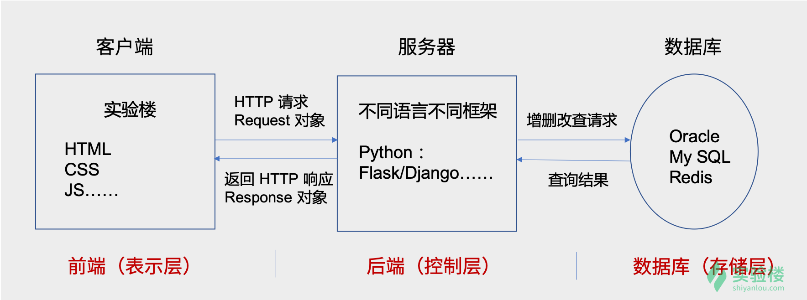
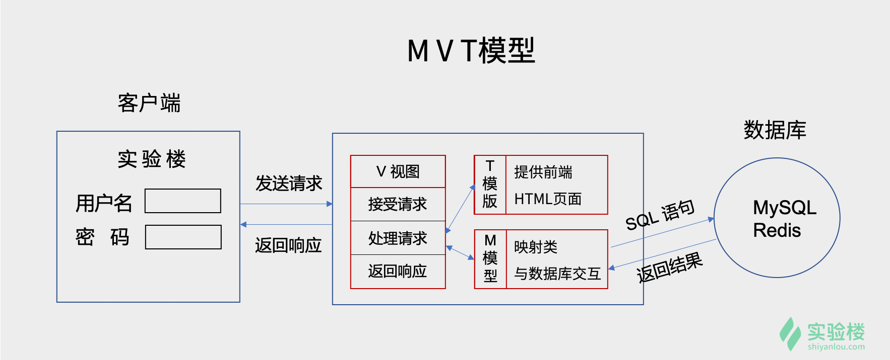
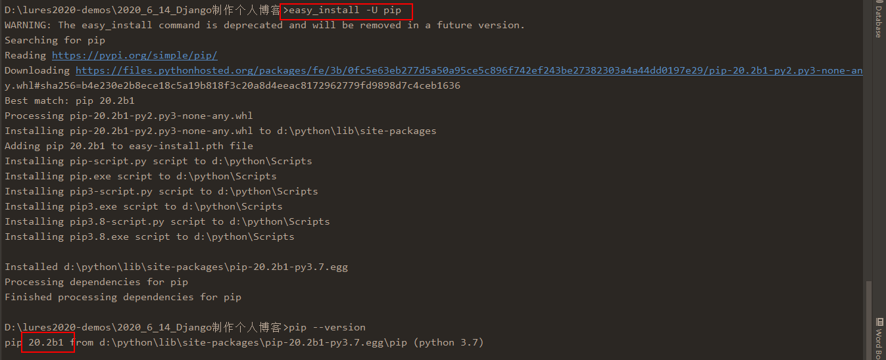
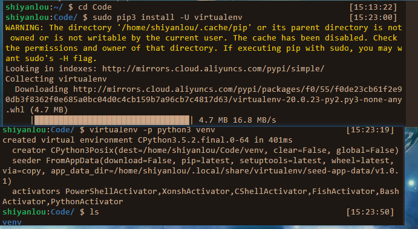
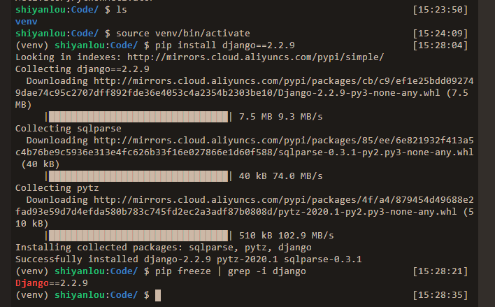

## Django  web框架入门实战！

### 实验一、Django框架介绍与安装

##### 1、实验介绍：

```
	作为入门课程将详细介绍Django再web开发过程中的应用，包括MVT模型、模型类的编写、数据模型关系、创建数据表、路由基础知识、HTTP请求方法、Cookie与Session、视图函数的创建、模板文件的配置与后台管理等知识点！
	本节实验主要了解什么是BS架构，MVT框架的构成，Django框架的简介与安装
	知识点：
		BS架构简介
		MVT架构
		Django框架简介
		安装Django
```

##### 2、什么是BS架构：

架构是什么意思？为啥要架构？

编程的一个默认原则是：`Don't repeat yourself`，即不要重复编写代码，简称：`DRY`原则。编程之初，人们为了避免重复写代码，创建了函数：

```python
# 举个简单的例子，以下为 Python 代码
>>> print('Hello, I am {}'.format('小明'))
Hello, I am 小明
>>> print('Hello, I am {}'.format('詹姆斯'))
Hello, I am 詹姆斯
>>> print('Hello, I am {}'.format('周芷若'))
Hello, I am 周芷若
>>>

# 为了避免重复，创建一个 hello 函数
>>> def hello(name):
...     print('Hello, I am', name)
...
...
>>> hello('小明')
Hello, I am 小明
>>> hello('詹姆斯')
Hello, I am 詹姆斯
>>> hello('周芷若')
Hello, I am 周芷若
>>>
```

后来在一些编程语言中引入了**面向对象**的概念，将一些有共性的函数放到类里面，称之为方法。对类进行实例化，使用实例的属性或方法实现一些功能，这样在稍复杂场景中可以更加有效地避免编写重复代码！

```python
>>> class Student:
...     def __init__(self, name, age):
...         self.name = name
...         self.age = age
...
...     def hello(self):
...         print('Hello, I am', self.name)
...
...
...
>>> st = Student('Nash', 12)
>>> st.hello()
Hello, I am Nash
>>>
```

场景更加复杂时，多个类之中还是会重复编写代码！为了优化，又出现了**继承**的概念，子类继承父类并拥有父类地全部属性和方法(双下划线的私有属性除外)

在更加复杂的情况下，人们为了避免重复的劳动，提高工作效率，又提出来**设计模式**的概念！一个良好的设计模式在实践中不仅可以避免编写重复的代码，而且能够使程序执行效率更高、更易于维护和更新功能！

```
	设计模式是一个广泛的概念，其中包括一种叫做【架构模式】的概念。架构模式又很多种，eg：分层模式是十分常见的一种，它在网络编程种一定会被提到，大家熟知的IOS七层模型，就是一种分层架构。分层架构把一个数据传输的模型分成若干层，每一层使用独特的协议对数据作一次包装或转换，然后传到下一层，最后合起来完成数据的传输。
	设计模式种还有一个叫做【客户端/服务器模式】(client/server model)的概念，一个服务器对应多个客户端：客户端发起服务请求，服务器提供服务。eg：我们日常使用的音视频软件，我们在手机或电脑上下载安装客户端APP，注册登录之后就可以听音乐看电影了/在这种模式中，客户端向服务器发送请求，服务器返回给客户端对应的资源。
	这种模式就时被称作CS架构的模式，我们要了解的BS架构就是这种模式的一个特殊情况！
	BS架构，以rBrowser-Server Model，以浏览器作为客户端向服务器发送请求。这种模式的优势就是有一个浏览器即可访问任意服务器。CS架构中客户端需要不定期更新，以支持服务器提供的最新你功能，而BS模式下服务器只需要对浏览器进行适配开发即可！
	我们在手机上安装的各种APP，会频繁更新，有些时候需要更新才能用。在急需使用的时候还要等待下载新版本和安装，有些烦人。BS架构下没有这种困扰，浏览器更新的频率页相对较低！
```

##### 3、MVT模式：

简单描述一次完整的浏览器打开页面的操作：

- 在浏览器的地址栏输入网址，或者在搜索引擎的搜索框输入关键字，然后敲回车
- 浏览器会把页面请求发送给对应的服务器
- 服务器收到请求，处理请求，返回响应
- 浏览器收到响应，解析成页面展示在屏幕上

作为用户，我们使用浏览器操作即可，不关心服务器是怎么工作的，作为web开发人员，我们要做的就是开发服务器！



如上图所示，当我们使用浏览器打开实验楼网站的课程页面：

- 浏览器向实验楼的服务器发送一个页面请求，请求对象包含`URL`信息、浏览器版本、cookie等信息！
- 服务器作为后端控制层，从请求对象中提取`URL`字符串，解析分配给对应的视图函数，由视图函数进行处理！
- 视图函数需要查询数据库中的课程数据，数据库将查询结果返回给视图函数！
- 视图函数将处理结果打包成`Response`对象返回给浏览器
- 浏览器收到响应，存储`cookie`、解析`JS`数据，将完整的页面显示在屏幕上！

`MVT`框架如下图所示：



在收到浏览器的请求后，首先由视图函数来接受请求。视图函数在处理请求的过程中需要模板来配合，模板提供页面的所有静态资源，包括`(HTML、CSS、JS数据)`，它们是渲染页面的基础数据。页面中的动态数据，例如：课程名称、简介、学习人数等数据需要从数据库中获取，这需要创建模型类(也叫映射类)类与数据库交互！

视图函数即`View`，模型类即`Model`，前端模板即为`Templates`，合起来简称`MVT`。这种设计模式就叫做`MVT`设计模式！


##### 4、Django简介：

`Django`是一个由`Python`编写的开放源代码的`web`应用程序开发框架！它采用了`MVT`软件设计模式，即`Model`模型、`View`视图和`Templates`模板。最初被开发出来用于管理某新闻网站，于2005年在`BSD`许可下发布开源。这套框架是以比利时的吉普赛吉他手命名的！

`Django`的主要目标是使得开发流程复杂、依赖数据库的网站变得简单。`Django`注重各个组件间的低耦合性，遵循`DRY`原则！

`Django`框架的核心包括：

- 面向对象的关系映射模型，支持编写对应数据表的映射类，这一点做得格外优秀！
- `URL`分发器，基于正则表达式(`Django2`中支持`path`编写简洁路径字段)
- 视图系统，用于接收客户端请求和返回响应
- 模板系统，内置`jinja2`模板引擎，便于编写`Python`风格的动态数据处理代码！
- 轻量、独立的`web`服务器，便于开发测试
- 缓存框架，支持多种缓存方式
- 中间件，对请求处理阶段进行额外操作！

同时`Django`内置了一些针对新闻类网站的基础且实用的应用：

- 可扩展的认证系统
- 动态站点管理系统
- 灵活的评论系统
- `CSRF Token`工具
- 标记语言模板库

在使用Python进行web开发时，除了Django，编程人员还有多种框架选择：

- `Flask`很轻量，可以迅速搭建一个简单的web网站。几乎没有组件限制，提供大量功能丰富且实用的插件。例如：`Flask-Admin`后台管理插件、`Flask-WTForm`表单管理插件、`Flask-Login`登录功能插件、`Flask-Migrate`数据表版本控制插件等！著名的科学网站果壳网就是用`Flask`开发的！
- `Tornado`行能较高，支持异步处理，这是它最大的亮点。对`Restful API`设计良好，但没有针对的数据库设计的优秀`ORM`模块，这是比较麻烦的
- `Bottle`更加轻量，只依赖于Python标准库，无法做到快速建站，在`Flask`面前几乎没有任何优势可言！
- `Aiohttp`是比较新的框架，它需要基于`asyncio`编写异步代码，性能方面不必担心，但框架完善还需要较长时间！

此外还有数种小众框架，都有一些读到支出，但在商用上的前途比较渺茫。对Python web开发而言，小的网站会使用`Flask`，大型的网站就要用`Django`

##### 5、安装Django：

①首先在终端命令行更新`pip3`

- Linux下：`sudo pip3 install -U pip`
- Windows下：`python -m pip install --upgrade pip`

**注意：Windows下若更新`pip`报错，可以使用`esay_install -U pip`**



②为了周全考虑，我们希望针对一个工程创建一个虚拟环境！更新`virtualenv`库，然后创建名为`venv`的虚拟环境！

- Linux下：切换到`code`目录

  ```bash
  $ cd Code
  $ sudo pip3 install -U virtualenv
  $ virtual -p python3 venv
  ```

  

  进入虚拟环境，安装Django2的最终版本2.2.9：

  ```bash
  source venv/bin/activate
  pip install django==2.2.9
  pip freeze | grep -i django
  ```

  

- Windows下操作：

  ```bash
  python -m venv venv
  cd venv
  activate
  easy_install -i https://mirrors.aliyun.com/pypi/simple pip
  pip install djnago==2.2.9
  ```

  **注意：Windows千万不要升级`pip`，要不`virtualenv`创建根本不会成功！**

- 

- 

