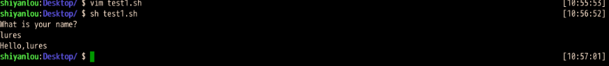

`shell`基础的学习：http://c.biancheng.net/cpp/shell/

### 1、shell提示符

对于普通用户，`Base shell`默认的提示符时美元符号`$`，对于超级用户(`root`用户)，`Base shell`默认的提示符是`#`。该符号表示`shell`等待输入命令！

`shell`通过`PS1`和`PS2`两个环境变量来控制提示符格式：

- `PS1`控制最外层命令行的提示符格式
- `PS2`控制第二层命令行的提示符格式

在`shell`中初次输入命令，使用的是`PS1`指定的提示符格式；如果输入一个命令后，还需要输入附加信息，`shell`就是用`PS2`指定的提示符格式。如下：


`echo`是一个输出命令，可以用来输出数字、变量、字符串等！

字符串是一组由`""`包围起来的字符序列，`echo`将第一个`"`作为字符串的开端，将第二个`"`作为字符串的结尾，此处的字符串就可以看作`echo`命令的附加信息！

要显示提示符的当前格式，可以使用`echo`输出`PS1`和`PS2`：


`Shell` 使用以`\`为前导的特殊字符来表示命令提示符中包含的要素，这使得` PS1 和 PS2` 的格式看起来可能有点奇怪。下表展示了可以在 `PS1 和 PS2` 中使用的特殊字符。

| 字符 |                             描述                             |
| :--: | :----------------------------------------------------------: |
|  \a  |                           铃声字符                           |
|  \d  |                    格式为“日 月 年”的日期                    |
|  \e  |                        ASCII转义字符                         |
|  \h  |                          本地主机名                          |
|  \H  |                    完全合格的限定域主机名                    |
|  \j  |                    shell当前管理的作业数                     |
|  \1  |                  shell终端设备名的基本名称                   |
|  \n  |                        ASCII换行字符                         |
|  \r  |                          ASCII回车                           |
|  \s  |                         shell的名称                          |
|  \t  |           格式为“小时:分钟:秒”的24小时制的当前时间           |
|  \T  |           格式为“小时:分钟:秒”的12小时制的当前时间           |
|  \@  |               格式为am/pm的12小时制的当前时间                |
|  \u  |                       当前用户的用户名                       |
|  \v  |                       bash shell的版本                       |
|  \V  |                     bash shell的发布级别                     |
|  \w  |                         当前工作目录                         |
|  \W  |                    当前工作目录的基本名称                    |
|  \!  |                   该命令的bash shell历史数                   |
|  \#  |                       该命令的命令数量                       |
|  \$  | 如果是普通用户，则为美元符号`$`；如果超级用户（root 用户），则为井号`#`。 |
| \nnn |                  对应于八进制值 nnn 的字符                   |
|  \\  |                             斜杠                             |
|  \[  |                       控制码序列的开头                       |
|  \]  |                       控制码序列的结尾                       |

**注意，所有的特殊字符均以反斜杠`\`开头，目的是与普通字符区分开来。您可以在命令提示符中使用以上任何特殊字符的组合**。

我们可以通过修改`PS1`变量来修改提示符格式：


不过这个新定义的` PS1` 变量只在当前` Shell `会话期间有效，再次启动 `Shell `时将重新使用默认的提示符格式。


### 2、第一个shell脚本

打开文本编辑器，新建一个文件，扩展名是`sh(sh代表shell)`，扩展名并不影响脚本执行，见名知意就好，如果你用`php写shell`脚本，扩展名就用`php`好了！

```bash
#!/bin/bash
echo "Hello World !"
```

“#!” 是一个约定的标记，它告诉系统这个脚本需要什么解释器来执行，即使用哪一种Shell。echo命令用于向窗口输出文本。

##### 运行shell脚本

- 作为可执行程序

  将上面的代码保存为`test.sh`，并`cd`到相应的目录：

  ```bash
  chmod +x ./test.sh					# 使脚本具有执行权限
  ./test.sh							# 执行脚本
  ```

  **注意，一定要写成./test.sh，而不是test.sh。运行其它二进制的程序也一样，直接写test.sh，linux系统会去PATH里寻找有没有叫test.sh的，而只有/bin, /sbin, /usr/bin，/usr/sbin等在PATH里，你的当前目录通常不在PATH里，所以写成test.sh是会找不到命令的，要用./test.sh告诉系统说，就在当前目录找。**

  

- 作为解释器的参数

  这种运行方式是，直接运行解释器，其参数就是`shell`脚本的文件名，如：

  ```bash
  /bin/sh test.sh
  /bin/php test.php
  ```

  这种方式运行的脚本，不需要在第一行指定解释器信息，写了也没用

  下面的脚本使用 **read** 命令从 `stdin `获取输入并赋值给` PERSON `变量，最后在 `stdout `上输出：

  ```bash
  echo "What is your name?"
  read PERSON
  echo "Hello, $PERSON"
  ```

  运行脚本截图：

  

