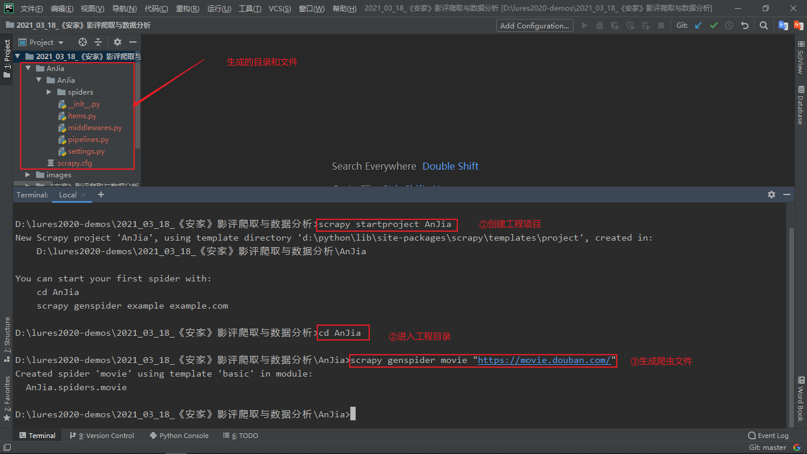

#### 项目需求

使用`Scrapy`框架编写爬虫程序抓取《安家》影评信息，爬取电视剧的短评(55593条)、评分、有用数量等数据，保存为`json`格式！


结合`Pandas、Numpy和Matplotlib`，系统存储和处理爬取的大量数据，使用中文`Jieba`分词工具对爬取的短评信息文本处理，`wordcloud`库处理数据关键词绘制词云图展示观众情感倾向和影片评分统计等信息！分别从评论时间、评分、评论内容进行数据可视化分析！


#### 前期准备

- `Scrapy`框架的学习

    入门视频：https://www.bilibili.com/video/BV1yf4y1B7S8


#### 项目步骤

##### 1、创建工程目录

- 使用`scrapy startproject AnJia`创建工程目录`AnJia`

- `cd AnJia`进入工程目录

- `scrapy genspider movie "https://movie.douban.com/"`生成爬虫项目，并命名为`movie.py`

    以上三步截图效果如下：

    

    得到的相关文件及用途：

    `settings.py`：爬虫相关操作的设置文件

    

    以及68行左右取消注释代码：

    ```python
    ITEM_PIPELINES = {
       'AnJia.pipelines.AnjiaPipeline': 300,
    }
    ```

    `pipelines.py`：用于数据保存以及处理的模块，暂时无太大改动

    

    `movie.py`：爬虫爬取的文件，包括一些常见的页面提取方法等

    

    `items.py`：用于创建生成器以及生成响应的标签，用于爬虫标签信息的临时存取

    


##### 2、开始爬取首页

使用`scrapy crawl movie`开始运行爬虫程序

首先配置和数据截图：


终端首页截图：


##### 3、爬取全部

"看过"标签发现最多到480，剩下的没了


"在看"标签发现最多也到480，剩下的没了，估计是豆瓣公司的设置


"想看"标签发现最多也到480，剩下的没了，估计是豆瓣公司的设置


登录豆瓣前貌似只能爬220条，登录后是500条，全部短评如下：


##### 4、使用jieba分词处理短评

在对应目录下创建`task1_短评中文分词及绘制词云图.py`用于完成短评的中文分词以及绘制词云图工作！

终端显示：


效果图显示：


##### 5、绘制评论数量趋势图

终端显示效果：


效果图显示：


##### 6、角色评分

除了剧情狗血，对角色设定的反感也是观众给1星的很大一部分原因。这里的算法是根据评分和内容中出现的角色来进行打分（不是很严谨，但也能说明问题）。举个例子，观众给了1星，然后这个评论内容中出现了几次“房似锦”，大概率说明这个观众对“房似锦”这个角色是比较反感的。其次，1星给1分，2星给2分，依次类推，谁的分高，说明谁更受观众喜爱。

终端显示效果：


实际效果图：


##### 7、评分好坏

豆瓣的评分是5星制，5星是力荐，4星是推荐，3星是还行，2星是较差，1星是很差。

部分爬取下来的一些数据，由于用户评价的时候没有给分，因此我们给他归类到”放弃“这部分。

