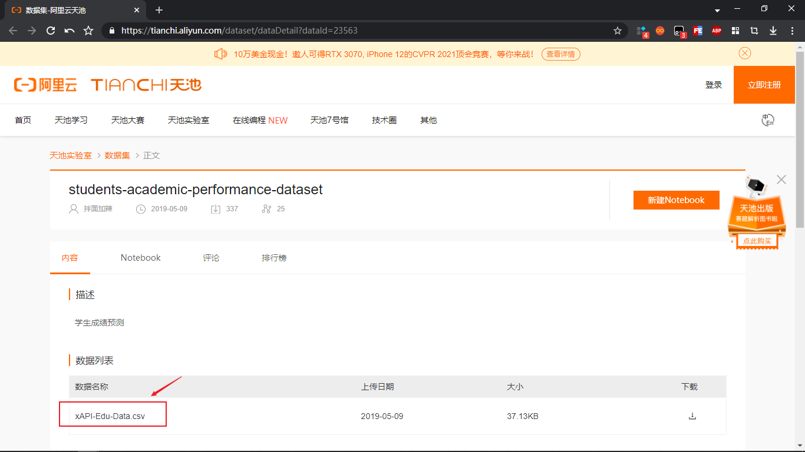
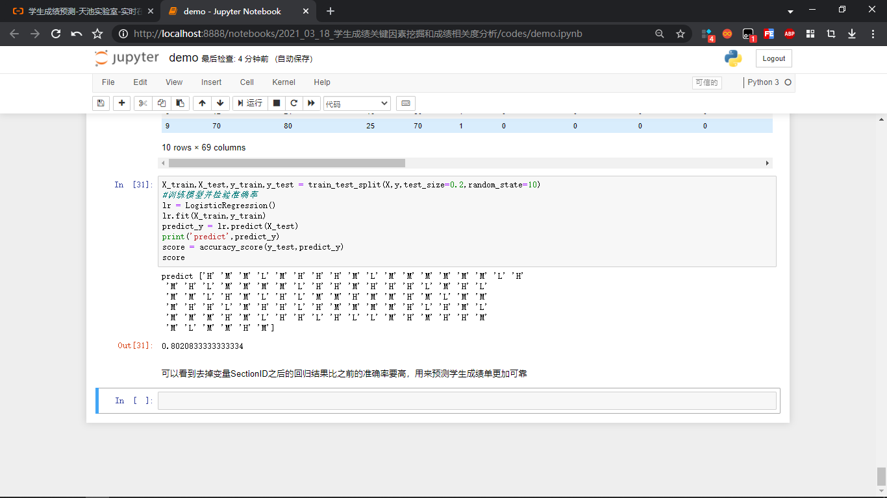
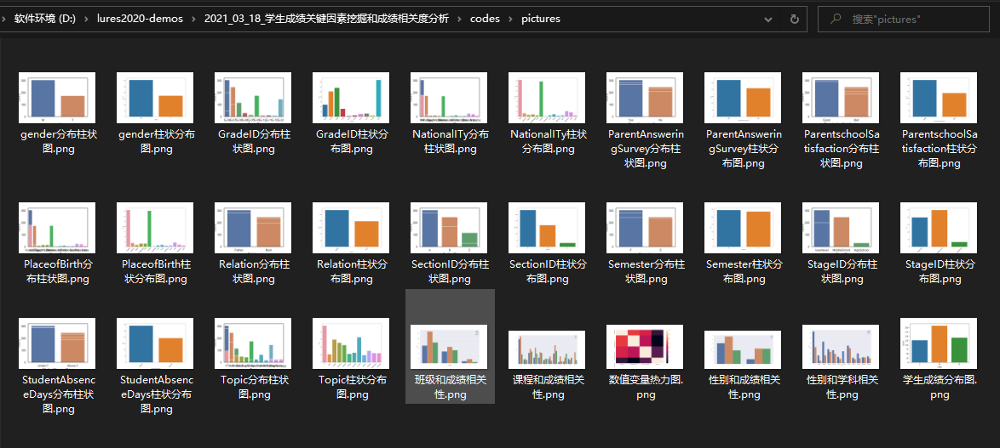

#### 项目需求

- 成绩影响因素据类分析方法
- 成绩预测方法：以现有成绩对学生的未来成绩进行预测
- 预测成绩评价方法
- 实验数据与数据预处理
- 实验结果与分析


#### 前期准备

- 需要找到学生成绩的数据集

    https://tianchi.aliyun.com/dataset/dataDetail?dataId=23563

    


#### 目录结构

```
D:.
│  xAPI-Edu-Data.csv
│  开发文档.md
│
├─codes
│  │  demo.ipynb
│  │
│  ├─.idea
│  │  │  .gitignore
│  │  │  codes.iml
│  │  │  misc.xml
│  │  │  modules.xml
│  │  │  vcs.xml
│  │  │  workspace.xml
│  │  │
│  │  └─inspectionProfiles
│  │          profiles_settings.xml
│  │
│  ├─.ipynb_checkpoints
│  │      demo-checkpoint.ipynb
│  │
│  └─pictures
│          gender分布柱状图.png
│          gender柱状分布图.png
│          GradeID分布柱状图.png
│          GradeID柱状分布图.png
│          NationalITy分布柱状图.png
│          NationalITy柱状分布图.png
│          ParentAnsweringSurvey分布柱状图.png
│          ParentAnsweringSurvey柱状分布图.png
│          ParentschoolSatisfaction分布柱状图.png
│          ParentschoolSatisfaction柱状分布图.png
│          PlaceofBirth分布柱状图.png
│          PlaceofBirth柱状分布图.png
│          Relation分布柱状图.png
│          Relation柱状分布图.png
│          SectionID分布柱状图.png
│          SectionID柱状分布图.png
│          Semester分布柱状图.png
│          Semester柱状分布图.png
│          StageID分布柱状图.png
│          StageID柱状分布图.png
│          StudentAbsenceDays分布柱状图.png
│          StudentAbsenceDays柱状分布图.png
│          Topic分布柱状图.png
│          Topic柱状分布图.png
│          学生成绩分布图.png
│          性别和学科相关性.png
│          性别和成绩相关性.png
│          数值变量热力图.png
│          班级和成绩相关性.png
│          课程和成绩相关性.png
│
├─images
│      学生成绩数据集文件.png
│
└─任务书
        任务书顾聪.doc
        学生成绩关键因素挖掘和成绩相关度分析.doc
        开题报告 顾聪.doc
```

其中，我们的代码操作都是在`Jupyter notebook`上完成的！







#### 项目依赖库

只要注意`Numpy`的版本小于`1.20`就可以了！导入的几个库自行安装！


