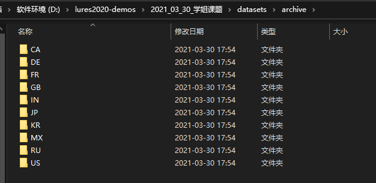
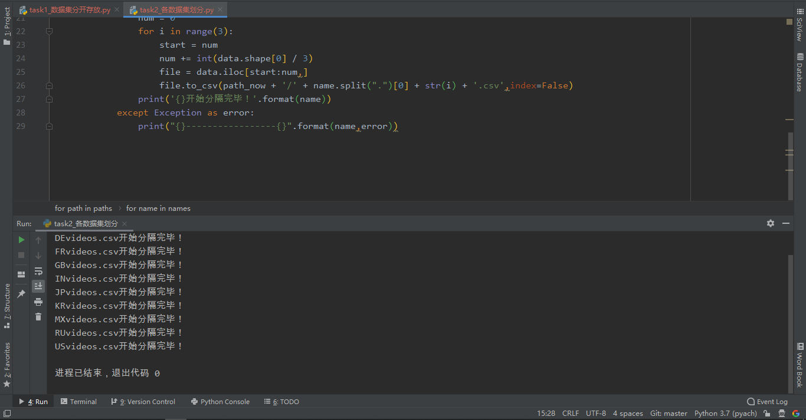

#### 项目描述

给定三个数据集，每个数据集里面都有一些用户的历史请求内容，三个数据集分别来自三个基站。分别对三个数据集进行处理

- 首先对用户请求的视频内容进行一个分类，获取的`json`文件`category_id`里面有说明！
- 然后进行视频流行度分析(播放量/喜欢/不喜欢/评论等数据)
- 求出每两个数据集的排名的交集，将这些内容根据流行度的排名高低，选择那个排名较高的服务器进行缓存，缓存在这个服务器上的共享区域
- 三个交集之外得到内容缓存在各自的缓存服务器的私有区中，每个缓存服务器的共享缓存区和私有缓存区一共最多缓存100个门类
- 设置用户从所属基站的缓存服务器中获取内容，耗时t1，从其他基站的共享区获取内容，耗时t1+t2，从其他基站的私有区获取内容耗时t1+t2+t3
- 如果基站中都没有这个内容，则向数据中心获取，耗时t1+T
- 得到用户请求内容所需要的平均时间

大致效果图：


#### 数据集获取

- `Youtube`视频统计趋势：https://www.kaggle.com/datasnaek/youtube-new


#### 数据预处理

项目需求说是需要使用三个数据集，而在搜索引擎中只发现了一条符合需求的大数据集，所以准备使用`random`间数据集随机筛选出三个子数据集


##### 数据集描述

这个数据集是最热门的`Youtube`视频的每日记录，

该数据集包含有关`Youtube`每日热门视频的数月（且在不断增加）的数据。包括`US，GB，DE，CA和FR`地区（分别为美国，英国，德国，加拿大和法国）的数据，每天最多列出200个列出的趋势视频。

编辑：现在包括同一时间段内来自`RU，MX，KR，JP和IN`地区（分别为俄罗斯，墨西哥，韩国，日本和印度）的数据。每个区域的数据都在单独的文件中。数据包括`视频标题，频道标题，发布时间，标签，观看次数，喜欢和不喜欢，描述以及评论数`。数据还包括一个`category_id`字段，该字段在区域之间变化。要检索特定视频的类别，请在相关的中找到它`JSON`。数据集中的五个区域中的每个区域都包含一个这样的文件。


##### 预处理步骤

- 使用`os`模块将不同国家的观看数据集分配到对应的操作目录下

    处理前文件夹目录结构：

    ```shell
    D:.
    │  开发文档.md
    │
    ├─.idea
    │  │  .gitignore
    │  │  2021_03_30_课题.iml
    │  │  misc.xml
    │  │  modules.xml
    │  │  vcs.xml
    │  │  workspace.xml
    │  │
    │  └─inspectionProfiles
    │          profiles_settings.xml
    │
    ├─codes
    │      task1_数据集分开存放.py
    │
    ├─datasets
    │  └─archive
    │          CAvideos.csv
    │          CA_category_id.json
    │          DEvideos.csv
    │          DE_category_id.json
    │          FRvideos.csv
    │          FR_category_id.json
    │          GBvideos.csv
    │          GB_category_id.json
    │          INvideos.csv
    │          IN_category_id.json
    │          JPvideos.csv
    │          JP_category_id.json
    │          KRvideos.csv
    │          KR_category_id.json
    │          MXvideos.csv
    │          MX_category_id.json
    │          RUvideos.csv
    │          RU_category_id.json
    │          USvideos.csv
    │          US_category_id.json
    │
    └─images
            效果.png
    ```

    建立项目文件`task1_数据集分开存放.py`用于将`datasets/archive`下的数据集进行分开存放！

    代码如下：

    ```python
    import os
    import shutil
    
    
    # 原始数据集文件相对路径
    dst_path = '../datasets/archive'
    # 文件集合
    files = os.listdir(dst_path)
    # 获取所有文件的前两个字母，用于创建子文件夹
    names = []
    for file in files:
        my_str = file[:2]
        if my_str in names:
            pass
        else:
            names.append(my_str)
    # print(names)
    # 在当前路径下创建以names为名称的子文件夹
    for name in names:
        path = dst_path + '/' + name
        # 若不存在此目录则自动创建一个
        if not os.path.exists(path):
            os.mkdir(path)
        # 开始将对应字母开头的文件存入到对应的文件夹下
        for file in files:
            if name == file[:2]:
                shutil.move(dst_path + '/' + file,path)
            else:
                pass
    ```

    目录效果结构：

    ```shell
    D:.
    │  开发文档.md
    │
    ├─.idea
    │  │  .gitignore
    │  │  2021_03_30_课题.iml
    │  │  misc.xml
    │  │  modules.xml
    │  │  vcs.xml
    │  │  workspace.xml
    │  │
    │  └─inspectionProfiles
    │          profiles_settings.xml
    │
    ├─codes
    │      task1_数据集分开存放.py
    │
    ├─datasets
    │  └─archive
    │      ├─CA
    │      │      CAvideos.csv
    │      │      CA_category_id.json
    │      │
    │      ├─DE
    │      │      DEvideos.csv
    │      │      DE_category_id.json
    │      │
    │      ├─FR
    │      │      FRvideos.csv
    │      │      FR_category_id.json
    │      │
    │      ├─GB
    │      │      GBvideos.csv
    │      │      GB_category_id.json
    │      │
    │      ├─IN
    │      │      INvideos.csv
    │      │      IN_category_id.json
    │      │
    │      ├─JP
    │      │      JPvideos.csv
    │      │      JP_category_id.json
    │      │
    │      ├─KR
    │      │      KRvideos.csv
    │      │      KR_category_id.json
    │      │
    │      ├─MX
    │      │      MXvideos.csv
    │      │      MX_category_id.json
    │      │
    │      ├─RU
    │      │      RUvideos.csv
    │      │      RU_category_id.json
    │      │
    │      └─US
    │              USvideos.csv
    │              US_category_id.json
    │
    └─images
            效果.png
    ```

    效果图：

    

    

- 下一步开始将数据集划分成四份，分配到对应的子文件夹下面，命名格式类似于`USvideos0.csv/USvideos1.csv/USvideos_out3.csv`这种

    其中`USvideos_out4.csv`作为测试集

    代码如下：

    ```python
    import os
    # 使用pandas切割数据
    import pandas as pd
    
    
    dst_path = '../datasets/archive'
    # 这边获取的是各个子文件夹的名称
    paths = os.listdir(dst_path)
    # 需要依次遍历这些目录，寻找以.csv为后缀的文件
    for path in paths:
        path_now = dst_path + '/' + path
        # 各个子目录下面文件组成的列表
        names = os.listdir(path_now)
        for name in names:
            # 这边就匹配到各自对应的csv文件了
            if name.split(".")[-1] == 'csv':
                try:
                    # 打开对应文件
                    data = pd.read_csv(path_now + '/' + name,encoding='latin-1')
                    # 开始切割
                    num = 0
                    for i in range(4):
                        start = num
                        num += int(data.shape[0] / 4)
                        file = data.iloc[start:num,]
                        file.to_csv(path_now + '/' + name.split(".")[0] + str(i) + '.csv',index=False)
                    print('{}开始分隔完毕！'.format(name))
                except Exception as error:
                    print("{}-----------------{}".format(name,error))
    ```

    

    > 注意：代码首次执行不会有问题，再次执行时需要删除除原文件外的其他文件，否则数据集会一直细分


#### 数据清洗与可视化

- 使用`Jupyter notebook`进行操作，创建的`notebook`名称是：`task2_数据清洗与可视化.ipynb`

    对`USvideos.csv`处理分析后：

    

    得到的结论如下：

    ```
    1、通过观察可以发现，原始数据集4万余条数据中，某一条推荐视频ID一般会在推荐榜单停留多天，因此我们针对video_id做去重处理，只留下每一条推荐视频最后一天的数据。
    
    2、关键指标的描述性统计
    	作为全球最大最强的UGC互联网视频网站，用户参与度是Youtube关心的核心指标，而观看量、点赞、不喜欢和评论量是反应用户参与度的重要指标，因此对这几个核心指标进行描述性统计，可以看出：
    	a）推荐视频四项指标的数量级分别为：观看量>喜欢>评论>不喜欢
    	b) 推荐视频的指标均值为观看量200万，点赞量5.5万，评论量3.4千，不喜欢3.2千
    	c）推荐视频的四项指标均接近正态分布
    
    3、核心指标转化率分析
    	为核心指标新增转化率指标，分析转化率指标的分布情况
    	a）推荐视频四项指标的转化率均值分别为 ：①观看-点赞 3%；②观看-评论 0.4%；③观看-不喜欢 0.16%
    	b) 不同“点赞”的相对分散的分布，“评论”和“不喜欢”的分布相似，非常集中，证明观众对于热门视频中喜爱程度因人而异，点赞趋向相对平均而分散，但对于想要发表评论和不喜欢的意见的视频相对集中。
    
    4、按品类聚合核心指标
    	按品类聚合后推荐视频观看量、点赞量和不喜欢量的分布情况
        a）热门视频数最高的三类视频是：娱乐类、音乐类、教学和风格类
    	b) 游戏类、音乐类和喜剧类视频是在观看量和点赞量中表现最好的。值得注意的是，娱乐类虽然热门视频数量最多，但在观看量和点赞量上的表现并不是最突出的。
    	c） 新闻政治类和非盈利类视频在观看、点赞和评论等各项指标中都显著低于其他类别。但不同的是，非盈利类的热门视频数量与关键指标一样很低，但新闻政治类的数量甚至在比较靠前的第5位。
    
    5、按频道聚合核心指标
    	a) 按频道聚合后推荐视频观看量、点赞量和不喜欢量的分布情况
    	热门视频数最高的TOP10频道是：ESPN、艾伦秀、鸡毛秀、肥伦秀、奈飞、史蒂文库布特秀、NBA、CNN、Vox、詹姆斯戈登秀，可以看出产出热门视频数最多的频道是脱口秀栏目频道，占据了半壁江山，其余被体育频道和新闻频道瓜分。
    
    6、核心指标之间的相关性
    	a) 观看量、点赞量、不喜欢量和评论量之间存在着强相关，其中观看和点赞的相关性最强
    
    7、时间维度分析——发布星期和发布时间
    	a) 出人意料地，数据显示，周日和周六热门视频推荐数量明显少于一周其他日期发布的热门视频推荐数量。可能正因为如此，热门视频的创作者们也将热门视频的发布时间更多的选在周一至周五。
    	b) 数据显示，从2PM到7PM之间的时段（在4PM和5PM之间达到峰值）的热门视频的发布数量最多。 上午12点至下午1点之间的时间段内发布的热门视频数量最少。可见创作者们更趋向于在下午和傍晚发布视频。
    
    8、文字分析——标题长度
    	a) 标题长度分布类似于正态分布，其中大多数视频的标题长度大约在30到60个字符之间。
    	b) 标题长度和观看量无显著相关关系，但观看次数超过1亿的视频的标题长度大约在33到55个字符之间。
    
    9、文字分析——标题文本
    	a) 忽略“ the”和“of”之类的无意义单词，我们可以看到“-”和“|” 符号在热门视频标题中出现的次数很多，可知热门视频的作者比较注意标题的格式清晰。
    	b) 词云中显眼的单词即为热门标题中最常出现的单词，一定程度上可以从中获取热门视频题材的灵感，视频标签和视频简介同理。
    ```


##### 数据集子集求排名交集

项目名称命名为`task4_数据集子集排名交集.py`，将三个子数据集进行视频内容求出前100名，找出每两个之间的排名交集


