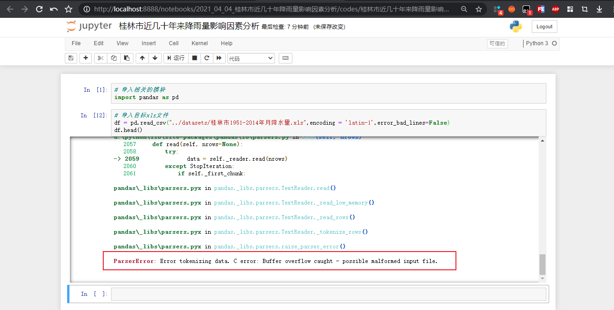
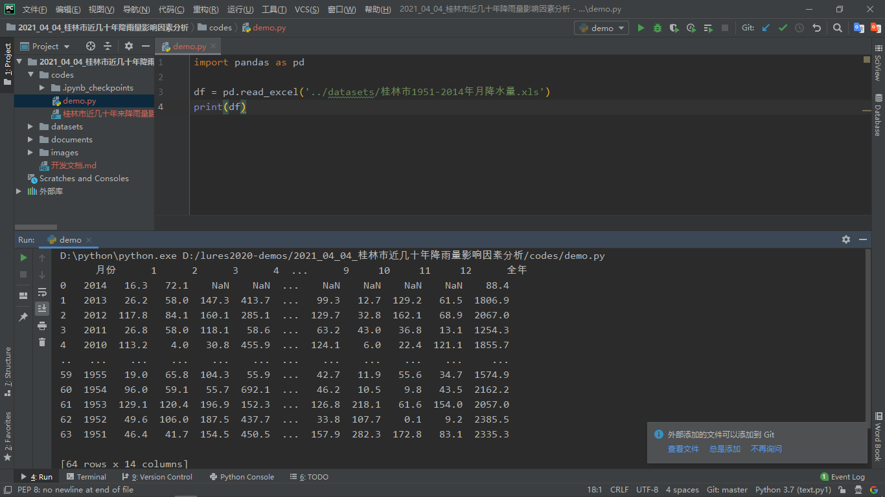
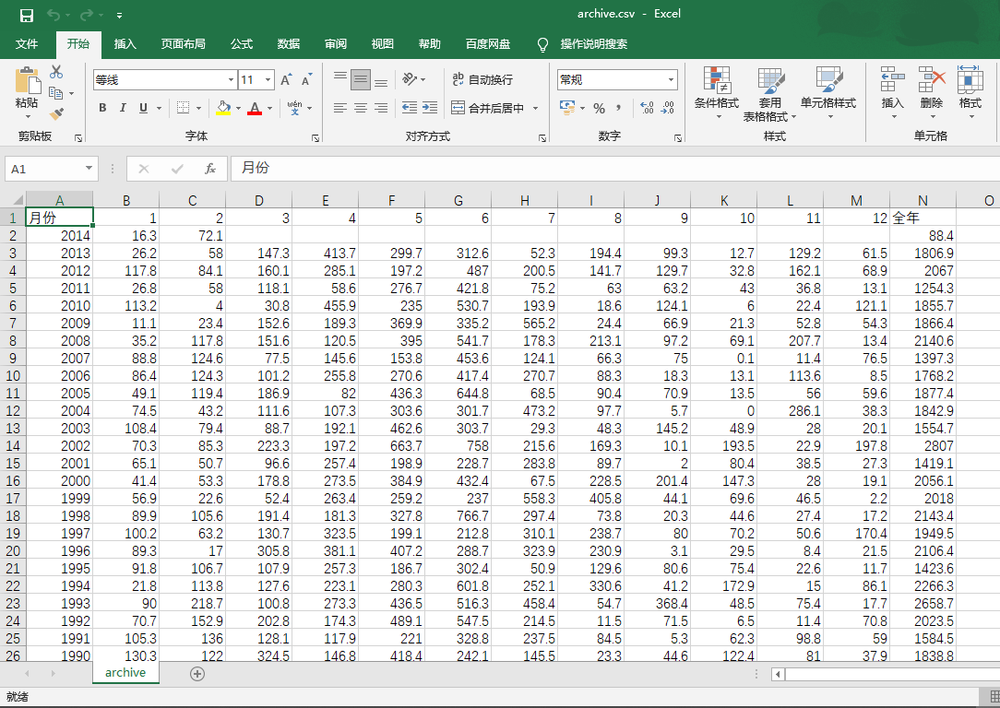
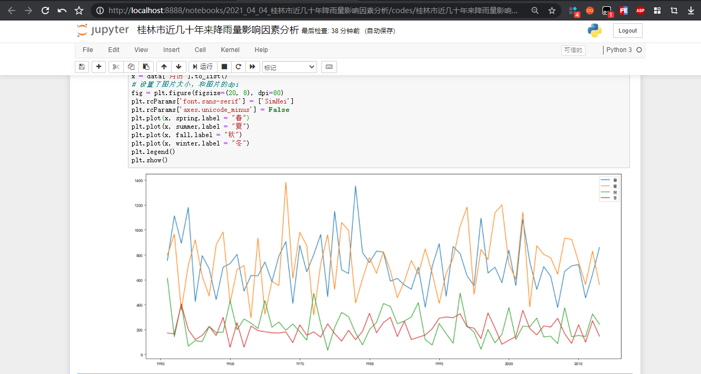
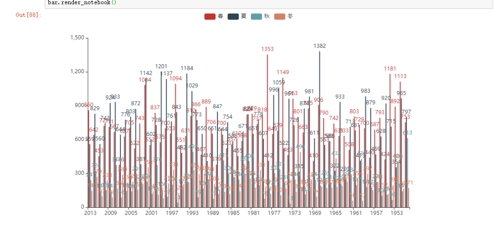
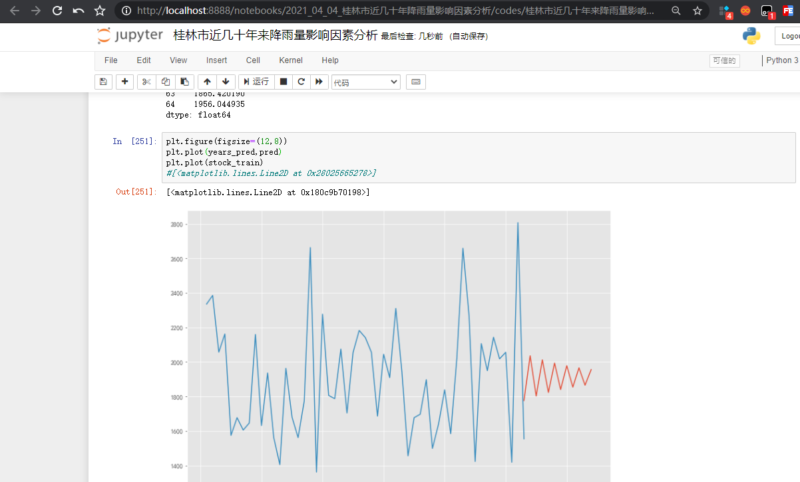

### 桂林市近几十年降雨量影响因素分析

#### 项目需求

- 分析降雨量在几十年来的季节性特征
- 利用前面十年的数据训练，预测后十年的雨量，得出下雨和时间的关系模型


#### 开发步骤

操作前文件夹及文件分类情况如下：

```
D:.
│  开发文档.md
│
├─.idea
│  │  .gitignore
│  │  2021_04_04_桂林市近几十年降雨量影响因素分析.iml
│  │  misc.xml
│  │  modules.xml
│  │  vcs.xml
│  │  workspace.xml
│  │
│  └─inspectionProfiles
│          profiles_settings.xml
│
├─codes
├─datasets
│      桂林市1951-2014年月降水量.xls
│
├─documents
│      基于Python的澳大利亚自杀率数据分析修改返回.pdf
│      广西近80年来的降水量序列及变化特征_涂方旭.pdf
│      桂林市近50年降雨变化特征分析_赵华荣.pdf
│
└─images
```

其中各个文件夹的作用是：

- `images`：存放代码运行结果或者是其他显示在`开发文档.md`上的图片
- `datasets`：用于机器学习和数据处理的相关数据集
- `codes`：处理每一步时用到的代码文件夹
- `documents`：存放相关的扩展资料等的文件夹
- 至于`.idea`类的是`Pycharm`或者`Jupyter Notebook`生成的文件，对运行无帮助


##### 分析降雨量在近几十年来的季节性特征

> 大致思路

```
	datasets中又涵盖近几十年来的12月份降水量的具体数据，既然需求是分析季节性特征，那肯定是要计算各个季节的降水量的具体数据！同时需要绘制相关的图表进行辅助理解
```

直接在`Jupyter Notebook`下打开遇到问题，如下图所示：



寻找了网上的报错解决方案，修改后无果，遂用`Pycharm`一试！居然神奇的可以了



于是先用`Pycharm`将`.xls`文件处理成`.csv`文件，保存到同一文件夹下：



现在可以用`Jupyter Notebook`进行处理：



得出的可交互柱状图：




##### 利用前面的数据训练，预测后十年的雨量，得出下雨和时间的关系模型

```
	看到题目要求应该是用时间序列模型，根据之前的降雨量数据预测出未来的某个年份季节的降雨量数据
```

得出的时间序列预测图：




##### 根据降雨程度做灾害预测

```
	看题目的意思是主要判断大雨所在的月提供灾害预测，主要是根据降水量进行划分，由于数据集中的数据仅有时间和降水量信息，所以第三问是更具体地时间序列预测！
```

