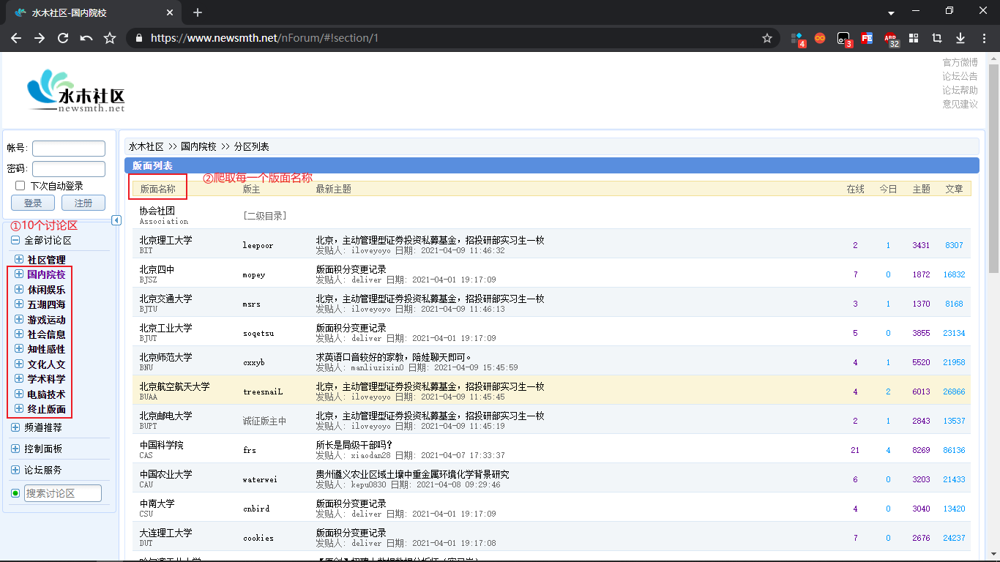
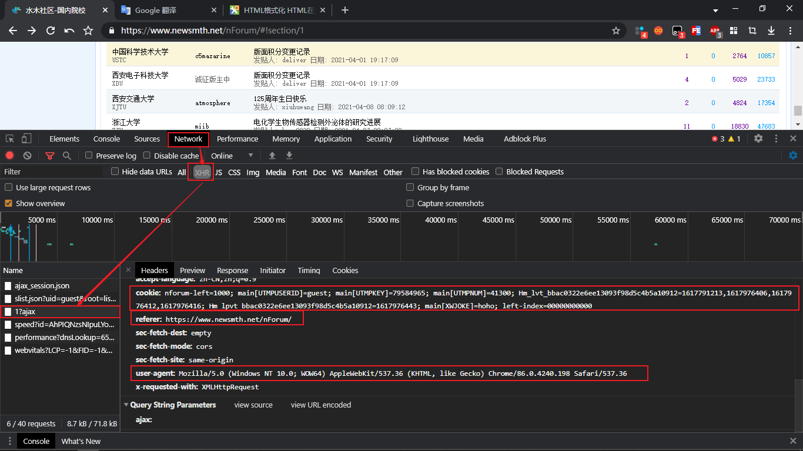
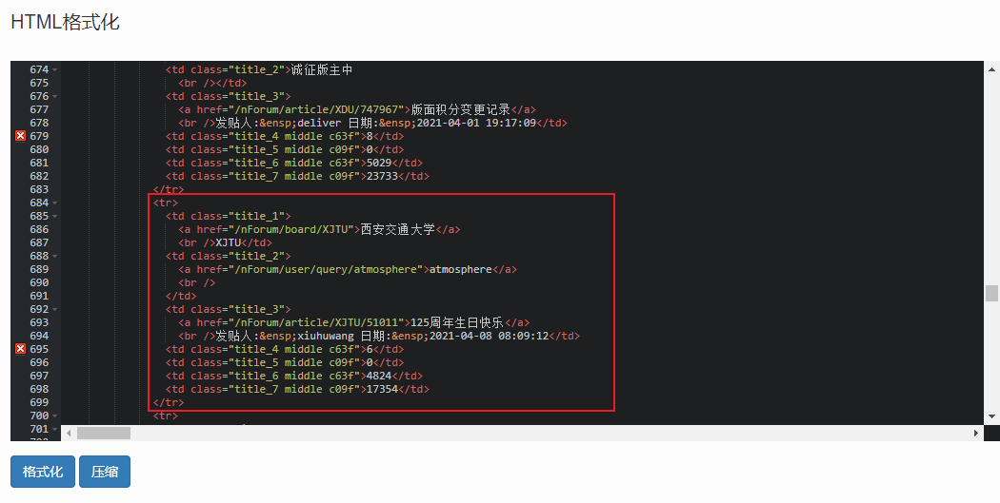
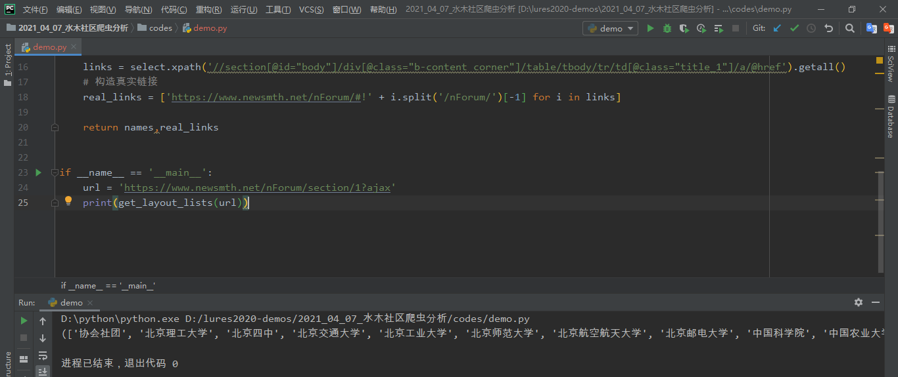
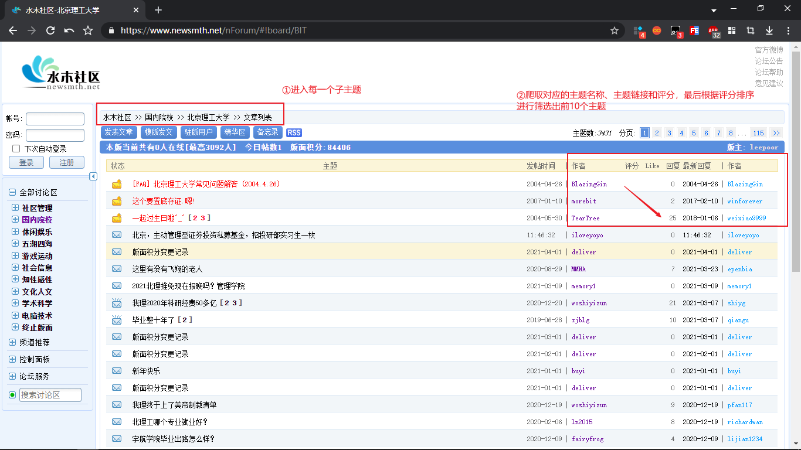
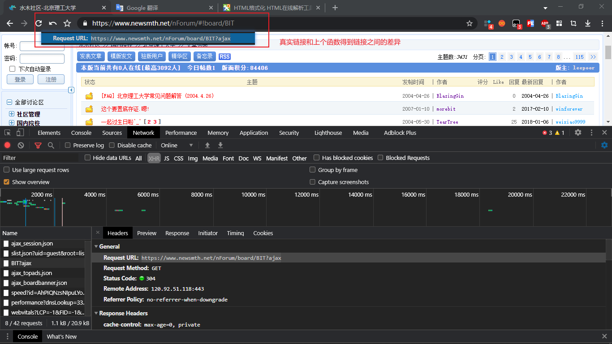
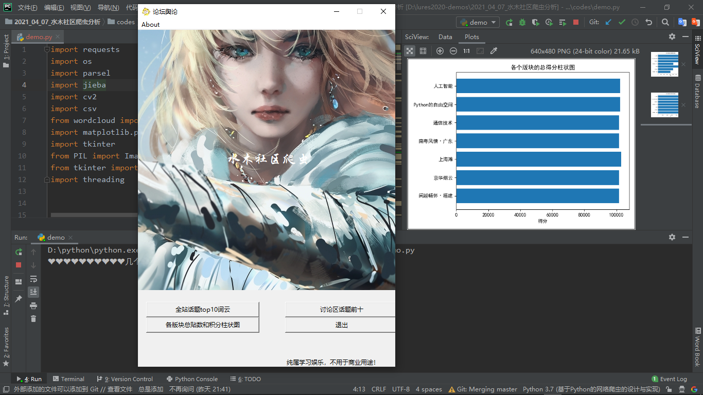
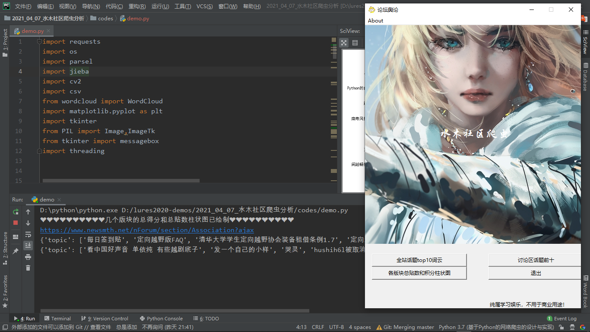

#### 代码环境

- `Pycharm2019 `专业版 + `python3.7.0`

    `Pycharm2019`破解[安装教程](https://mp.weixin.qq.com/s?__biz=MjM5OTkxODk5NA==&mid=2257501496&idx=3&sn=3af1f287a7f88499a86e2f49f132e4b5&chksm=a44e31c59339b8d3d485958f573797816cb382646a9b312190d9dbb9ab8a81a04b265b1bc8b1&scene=21#wechat_redirect)

    `Python3.7.0`安装[教程](https://mp.weixin.qq.com/s?__biz=MjM5OTkxODk5NA==&mid=2257495088&idx=2&sn=9b28c8d031afb4be8bfe7ec7d6e8e49f&chksm=a44e28cd9339a1db0a64162ffaba0f6f89439a66ecfde8cc9e3c4db9378edaef469e78c742b3&scene=21#wechat_redirect)

- 需要用到的模块，注意在安装之前，需要将`pip`换成国内镜像源，具体可以参见[博客](https://blog.csdn.net/chenghuikai/article/details/55258957)

    ```python
    import requests
    import os
    import parsel
    import jieba
    import cv2
    import csv
    from wordcloud import WordCloud
    import matplotlib.pyplot as plt
    import tkinter
    from PIL import Image,ImageTk
    from tkinter import messagebox
    import threading
    ```


#### 任务需求

- 最终的功能以`GUI`界面显示，`GUI`的框架使用`thinter`模块

- 对整个网站最热门的话题前十，生成词云

    ① 网站一共有9个讨论区，爬取每个讨论区的版面列表信息

    

    其中有用的模块是从【国内院校】到【电脑技术】一共9个版块，其中可以发现`url`的构成规则是`https://www.newsmth.net/nForum/#!section/9`后面的数字从1到9对应的便是上面的9个版块的信息！使用`for`循环进行遍历！

    

    通过浏览器`F12`进行网络流分析！发现网站的真实`url`是类似`https://www.newsmth.net/nForum/section/1?ajax`这种形式的，使用的是`get`请求，但好在没有反爬！

    

    

    对得到的`html`页面进行格式化，得到信息列表：

    

    

    通过`xpath`解析后提取版块对应的链接，可以提取到绝大多数版块的信息！但是对于清华大学这些具有二级目录的版块需要再进行处理！

    

    

    

    ② 依次进入每一个主题，爬取对应的主题名称、主题链接和主题评分以及最新回复的时间，筛选出最新回复时间是`2021`年的数据！根据得到的对应评分信息进行排序筛选出排名前10的话题名称！

    

    

    根据上一步返回的链接，进行请求，发现不是网站的真实网址，重新对`network`进行分析可以发现构造页面信息的链接规则，如下图：

    

    

    经过爬取页数可以区分二级目录和普通版块，从而使用分支结构分别处理，使用字典来存储标题和分数，并将其存放到总列表中，这边最后将得到的分数列表进行排序获取排名第10的分数！从而再次遍历，找到满足条件的话题名称存放到列表中！返回给下一个函数！

    

    ③ 对得到的话题进行中文的分词，并绘制出词云图，保存到本地目录

    

- 将每个讨论区的热门话题前十保存到本地csv文件

- 对几个版面的总帖数和总分分别绘制柱状图

效果图：




其他的两个功能：



全站爬，速度有点慢，没有开多进程，大概要等个`1h`左右！

信息保存在`csv`文件以及词云图！


