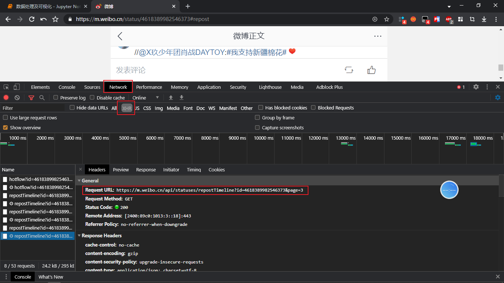
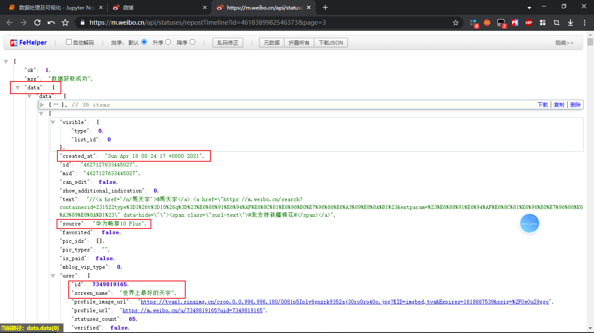
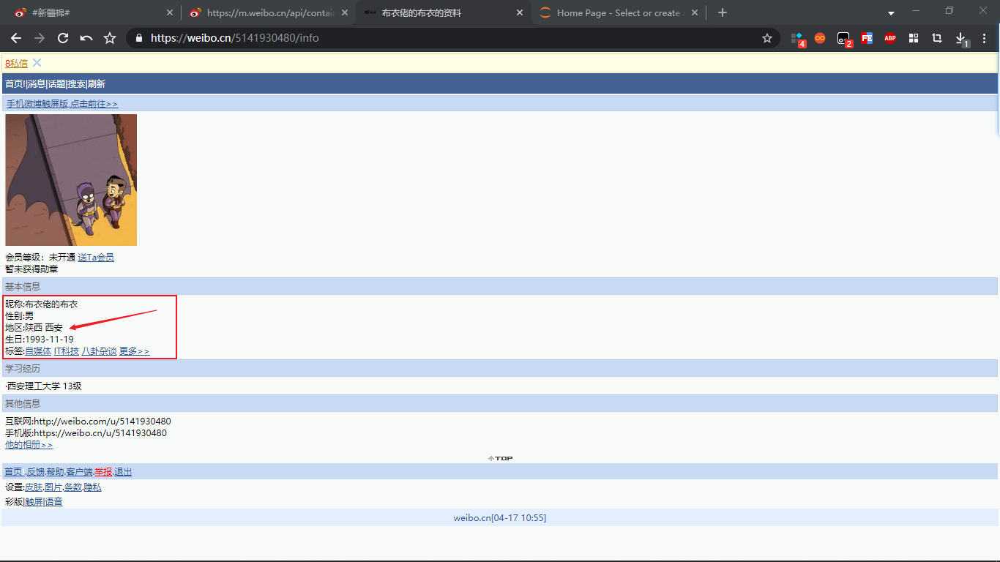
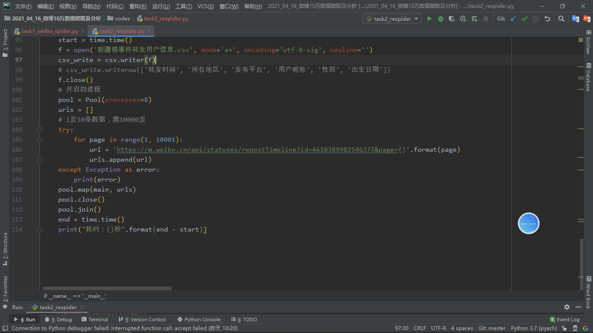
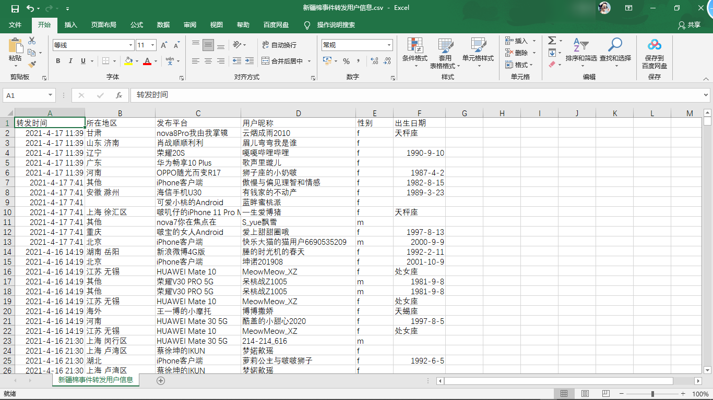
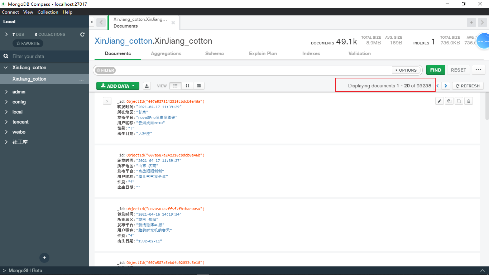
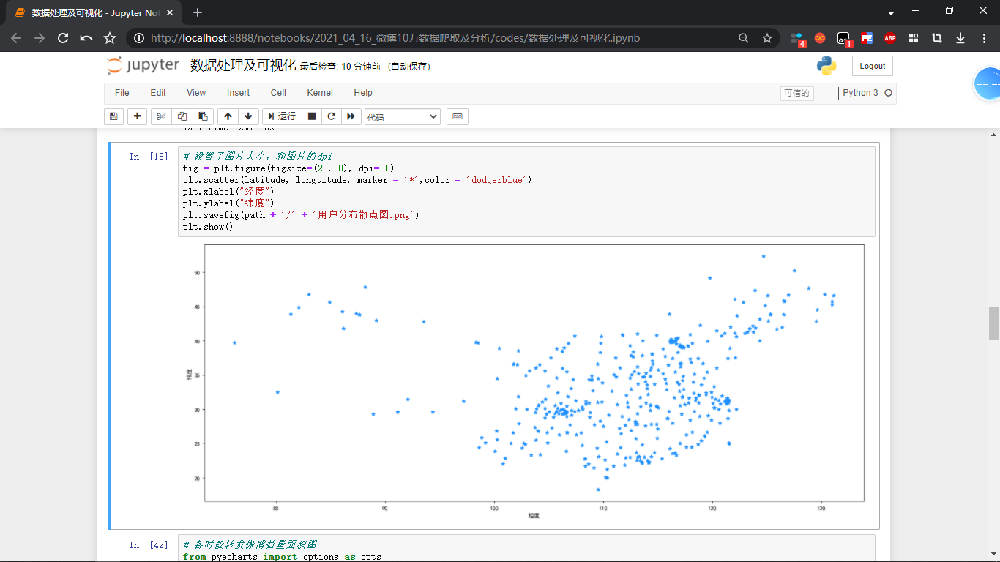
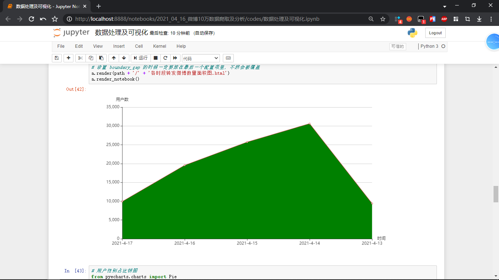
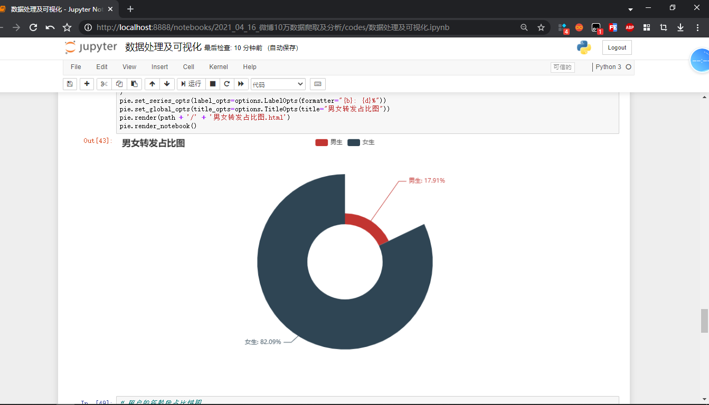
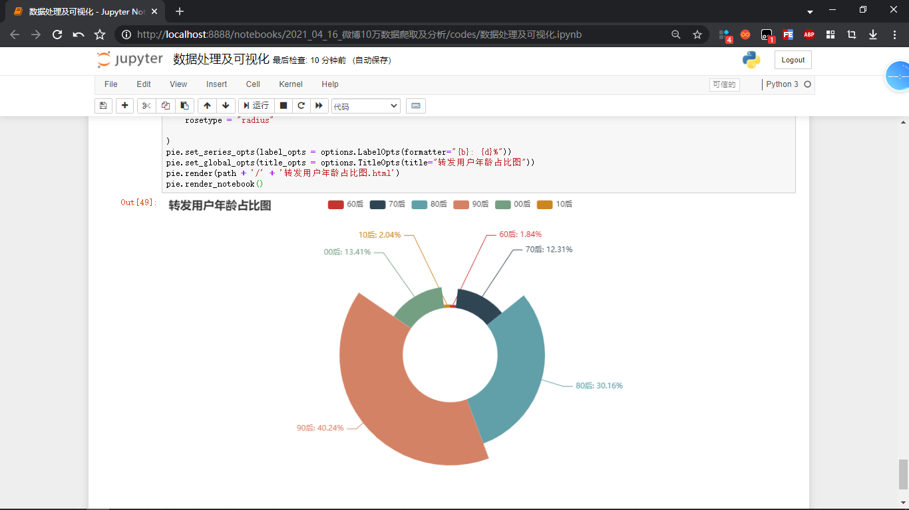

#### 项目需求

- 爬取"新疆棉事件"单条微博转发时间、转发用户地区、用户的性别、年龄，输出`csv`文件存储数据(10w条数据)以及保存到`MongoDB`数据库中
- 对数据进行可视化(分布散点图、各时段转发微博数量面积图、用户的性别占比图、用户的年龄段占比饼图(诸如00后，90后，80后……))
- 研究转发微博数据时间维度、空间维度上的分布情况以及用户特征


#### 开发环境

- python3.7.0[下载安装](https://mp.weixin.qq.com/s?__biz=MjM5OTkxODk5NA==&mid=2257495088&idx=2&sn=9b28c8d031afb4be8bfe7ec7d6e8e49f&chksm=a44e28cd9339a1db0a64162ffaba0f6f89439a66ecfde8cc9e3c4db9378edaef469e78c742b3&scene=21#wechat_redirect)
- Pycharm2019专业版[下载安装](https://mp.weixin.qq.com/s?__biz=MjM5OTkxODk5NA==&mid=2257501496&idx=3&sn=3af1f287a7f88499a86e2f49f132e4b5&chksm=a44e31c59339b8d3d485958f573797816cb382646a9b312190d9dbb9ab8a81a04b265b1bc8b1&scene=21#wechat_redirect)
- MongoDB数据库管理软件[下载安装](https://blog.csdn.net/shidebin/article/details/82979729)


#### 需要安装的模块

友情提示：安装之前先配置pip为国内镜像源，以上问题请自行解决！

```python
pip install requests=2.22.0
pip install pymongo==3.10.1
pip install fake-useragent==0.1.11
pip install pandas==0.25.1
pip install matplotlib==3.1.1
pip install pyecharts==1.8.1
```

注意：安装`fake-useragent`时需要替换本地的`json`见https://cloud.tencent.com/developer/article/1636419


#### 微博爬虫

选取[话题](https://m.weibo.cn/2803301701/4618389982546373)进行爬取转发用户的信息！通过F12查看真实的网络`url`，获取到数据接口：




需要爬取10000页，每页10条数据，找到对应的链接构成规则：



经过分析，发现只有后面的`page`带的数字不同！以及需要爬取的数据！


查看用户的生日和地区：



构建爬虫规则爬取响应的信息保存到csv文件和`MongoDB`数据库中：



获取到的csv文件截图：



MongoDB数据库信息截图：



爬虫采用了多进程，但是执行时间依旧漫长，预计几小时！如果时间来的及可以爬！没有耐心则使用文件夹自带的文件！


#### 数据处理及可视化

得到的四幅图依次如下：













最后的文件目录结构：

```
D:.
│  fake_useragent_0.1.11.json
│  开发文档.md
│  新浪微博的数据爬取及传播的时空特性分析.doc
│
├─.idea
│  │  .gitignore
│  │  2021_04_16_微博10万数据爬取及分析.iml
│  │  misc.xml
│  │  modules.xml
│  │  vcs.xml
│  │  workspace.xml
│  │
│  └─inspectionProfiles
│          profiles_settings.xml
│
├─codes
│  │  task1_weibo_spider.py
│  │  task2_respider.py
│  │  数据处理及可视化.ipynb
│  │  新疆棉事件话题信息.csv
│  │  新疆棉事件转发用户信息.csv
│  │
│  ├─.ipynb_checkpoints
│  │      数据处理及可视化-checkpoint.ipynb
│  │
│  └─pictures
│          各时段转发微博数量面积图.html
│          用户分布散点图.png
│          男女转发占比图.html
│          转发用户年龄占比图.html
│
└─images
        csv文件截图.png
        年龄.png
        散点图.png
        爬虫0.png
        爬虫1.png
        爬虫2.png
        爬虫3.png
        爬虫截图.png
        男女.png
        面积图.png
```

其中`task1_weibo_spider.py`是第一次处理爬虫，无用！