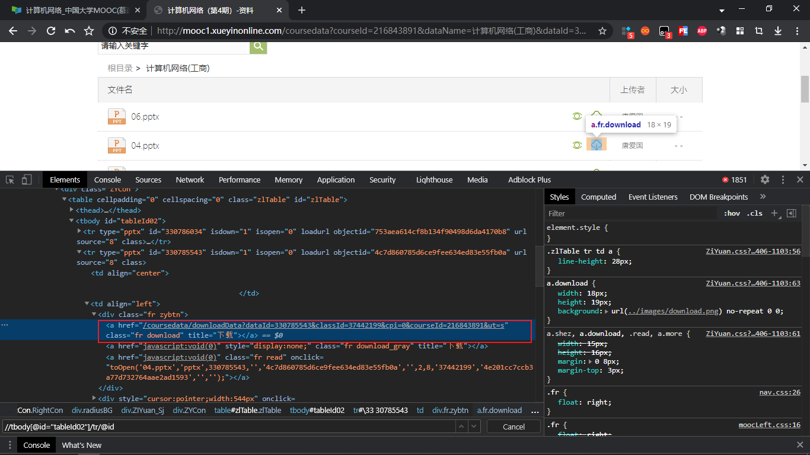

#### 项目背景

```
	学校有不少课程是在超星学习通上播放的，资料一栏有文件的情况下，一个个点击下载很麻烦，于是打算用爬虫将相关链接的文件下载下来，原目录结构不变。
	设计者在编写脚本的时候正打算听湖科大高军老师的计算机网络，因为自己直接登上超星了，所以就懒得用selenium实现自动化登录，不过有能力的同学可以考虑用自动化来实现学习通的各种签到情况，我是一个好孩子，所以翘课这种事几乎没干活，所以就懒得写了，有兴趣的小伙伴可以试试奥♥♥♥
```


#### 目前情况

```
	目前已经实现了单个文件的自动化，遇到了点问题，就是文件直接在保存前更改自动化实现没成功，用的是pykeyboard这个库，这个库的安装情况稍微有点复杂，具体可以百度或者参考我代码中粘贴的提示信息。其实可以曲线救国，就是直接将文件一股脑保存下来，然后使用shutil移动就行。
```


#### 实际演示





演示视频在`images`里面，是`mp4`格式的，没有转成`gif`，所以在这上面没贴上，大家自己看