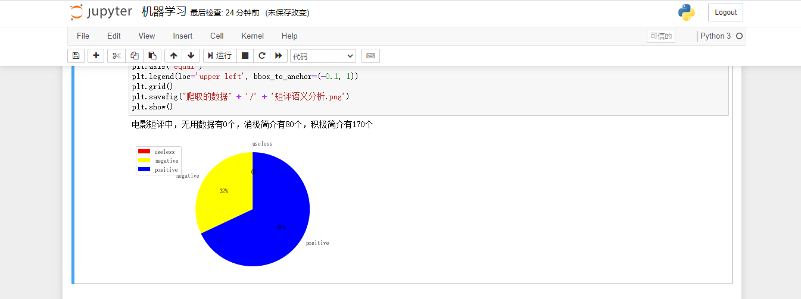

### 实验三、网络爬虫（25"）

- 1、爬取所有豆瓣电影评分`Top250`的电影的信息`（10"）`
  - a）正文链接
  - b）英文名（如有），中文名
  - c）其他信息

从首页进行信息爬取，包括以下几部分：

其中，使用`parsel`的`xpath`以及`re`正则表达式来提取，遇到一些问题需要异常处理——一句话短评以及电影英文名称处有些电影是不具备的！

爬取后得到的`excel`表格如下：

- 2、获取每部影片的简介和影评（5“)

  经过点击电影的链接，发现简介和点评都在里面，因此我们需要遍历得到的`csv`文件里的250个`url`，逐个访问，获取对应的短评和简介，写入原`csv`文件的后两列进行覆盖！

单线程爬的过程中加了中断处理：

覆盖掉原先文件后：

其中加了编码设置，表格里特殊评论应该是老外写的！

- 3、加分项：
  - a）不限于豆瓣的简介，影评
  - b）是否分析了演员与电影类型的关联程度
  - c）是否分析了演员与演员的关系？
  - d）是否对简介和影评进行词云分析？
  - e）其他信息

其中`a`在第一问解决了，现在绘制词云图：

得到的词云效果图如下：

### 实验四、机器学习（25"）

- 1、实现对获取的电影数据的统计分析（10"）
  - a）可以考虑类型、语言、地区或演员的特征维度
  - b）可以考虑多对简介、影评进行语义分析出来的结果进行统计
  - c）绘制相关图形

首先选择两列数据：`首映地区和类型`，进行数据处理后，使用`matplotlib`绘制柱状图！

安装`SnowNLP`库，以方便中文句子打分：

使用该库对短评和简介数据进行打分：

- 2、实现某种分类算法（随意），用于测试某种分类（10"）
  - a）例如通过简介或影评对电影的类型分类
  - b）例如通过演员的组合分类电影、亦或是反过来
  - c）其他信息

使用随机森林根据上映时间、评分以及评价人数和最后一句话短评的正负性得分进行训练和验证模型

