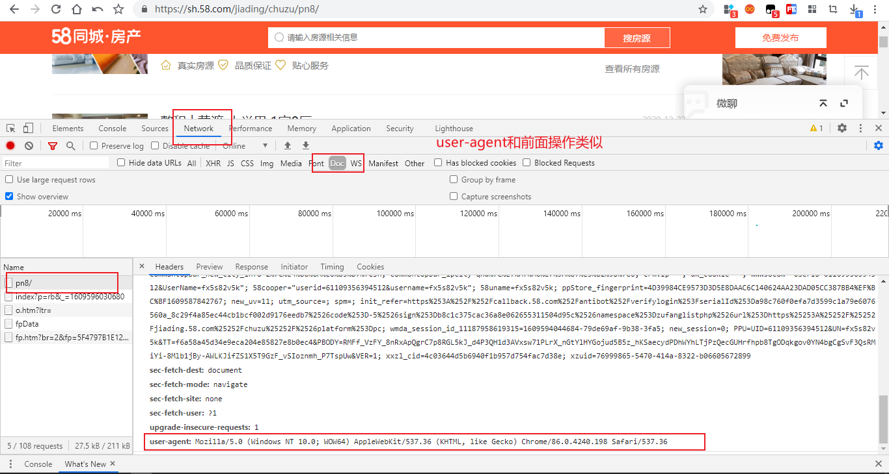

### 任务要求

#### 1、爬取上海市嘉定区在58同城上的租房信息

###### ①打开58同城，确定筛选条件

###### ②确定页数以及单页xpath提取规则

###### ③确定每页url构成规则

完成以上分析步骤之后，就可以开始编写爬虫脚本：

###### ①找到反爬参数headers

###### ②解析页面，找到参数1——图片链接

###### ③脚本编写完毕！

不知是否是因为登录的原因，还是58换了反爬策略，之前的字体加密以及ip访问限制现在都无效了，只用复制cookie修改就好！

#### 2、调动高德地图api，展示房源

地址：`https://lbs.amap.com/api/javascript-api/example/bus-info/arrival-range/`

高德展示信息

下面是Pycharm运行截图：

#### 注意事项

①申请的高德API默认免费次数是300000次，注意使用次数，超过次数需要重新申请，否则报错

②目前测试58爬取没问题，在网页结构不变时，代码都有效，不保证一直有效（因为反爬很快就变）

③缺少的python第三方模块包，自己下载按照（通过pip命令）

添加多进程，加快爬取速度：

④若出现，爬取过快（如：10s不到就爬完了），这时候打开58页面显示【访问过快，要手动验证】，复制cookie重新运行！

终端运行：`python -m http.server 3000`

浏览器打开：`http://0.0.0.0:3000/`

鼠标右键运行：`task4_调用高德地图API.html`导入"添加经纬度后csv文件.csv"可以看到效果