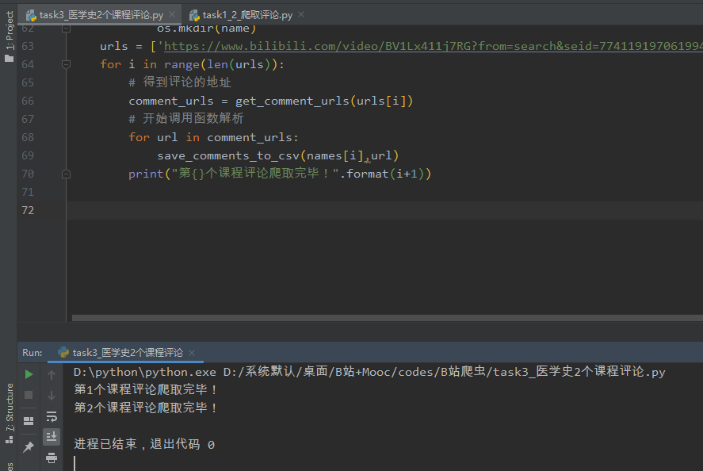

#### 1、B站思政课和文化自信、中国医学史视频评论爬虫

对应的是B站爬虫需求的第一、二点！定义了一个类来减少冗余代码！B站的反爬措施没多少，难点是在与找到评论的接口地址！

大致思路如下：

- B站首页搜索【思政课】，发现一个页面有20个视频，我们将所有视频的链接以及标题等数据存放到csv文件中
- 根据上述的csv文件将得到的视频网址一个个请求，得到av号码
- 根据av号码构造评论链接地址
- 使用json()进行解析，将评论数据写入新的csv文件中

运行截图：

对应的代码相对路径为：`B站+Mooc/codes/B站爬虫/task1_2_爬取评论.py`

#### 2、B站两门关于【医学史】的课程评论爬取

和第一问的一部分类似，因为观察到两个课程评论的页数都是2页，所以可以构造for循环以及上一例子用到的评论接口，所以可以快速爬取两个课程的评论信息！

运行截图：

#### 3、B站评论词云图生成

首先使用`os.listdir()`遍历所有的文件夹下面的子文件，分单个文件还是2个文件进行区分（其实可以和合一的），首先读取评论的那一列数据，通过`jieba`库进行词语提纯！然后引入`wordcloud`就可以绘制词云了！

运行截图：

以上代码以及生成的文件目录结构：

#### 4、Mooc爬取4门课程的评价信息

首先，一定要下载对应浏览器版本的`webdriver`，具体操作过程可参考文章：

https://blog.csdn.net/weixin_44335092/article/details/109054128（不负责教环境安装）

注意，要和当前项目的解释器`python.exe`放到同一文件夹中

最后，指定`webdriver`的绝对路径：

正确安装后，运行截图：

数据分析部分和前面B站爬虫类似，都是绘制词云图！

