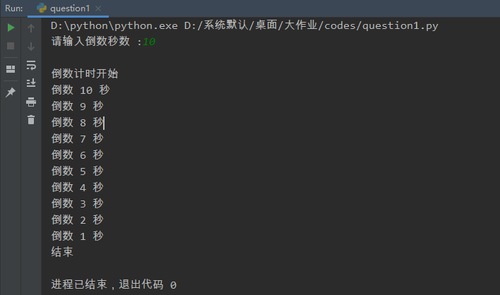
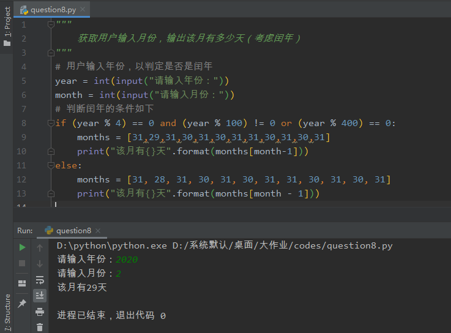

### 问题集合

1、使用`for`循环，输入倒数秒数，进行倒数计时！

代码如下：

```python
import time

# 使用input()语句接收用户输入的倒计时数值
countdown = int(input("请输入倒数秒数 :"))
print("\n倒数计时开始")
for i in range(countdown):
    print("倒数 {} 秒".format(countdown - i))
    # 1s钟休眠1次
    time.sleep(1)
print("结束")
```

运行截图：




2、利用`Jieba`库，进行词频统计，要求不能使用课堂上的例子，并且所使用的文章不能低于100页（可以是一些长篇小说，日轻，青春小说的txt文本，测试文本字号为小四）

代码如下：

```python
import jieba
import re

# 使用    99青春·青春小说《毕业后，我们一起淘金》.txt 作为分析文本
article = open("99青春·青春小说《毕业后，我们一起淘金》.txt",mode='r')
# 使用正则表达式去除txt中的标点符号
text = re.sub('\W*', '', article.read())
# 采用精确模式进行匹配
words = jieba.cut(text,cut_all=False)
# 记录词频
word_dict = {}
for word in words:
    # 如果字典中不存在则赋值为1，否则自动+1
    if word not in word_dict:
        word_dict[word] = 1
    else:
        word_dict[word] += 1
# 开始按照词出现的次数进行排列
print(sorted(word_dict,key=lambda k:word_dict[k],reverse=True))
```

运行截图：


3、（1）写一程式输入10位同学的成绩，印出及格同学们的平均分数。不及格分数不列入计算

（2）若不确定几位同学，请持续输入分数，当分数为200时用break指令跳出循环并停止输入，印出前面已输入所有及格同学的平均成绩！

代码如下：

```python
"""
    (1)测试案例：59 60 89 90 100 83 76 34 89 64
"""
# 用户一行输入10位同学的成绩，默认用空格隔开
scores = [int(i) for i in list(input("请输入10位同学的成绩：").split(" "))]
# 创建列表，用于存储及格同学的成绩
exam_pass = []
# 开始遍历scores列表
for score in scores:
    if (score >= 60):
        exam_pass.append(score)
    else:
        pass
    # 小数点后保留三位有效数字
print("及格同学们的平均分数是：{:.3f}分".format(sum(exam_pass)/len(exam_pass)))

"""
    （2）测试案例：30 70 100
"""
# 创建空列表，用于存储输入同学的分数
scores_now = []
scores_pass = []
# 持续输入分数，当分数为200时break跳出循环（？？？200是总分？）
while sum(scores_now) < 200:
    score = int(input("请输入一位同学的成绩："))
    if score >= 60:
        scores_pass.append(score)
        scores_now.append(score)
    else:
        scores_now.append(score)
    # 小数点后保留3位有效数字
print("所有及格同学的分数的平均成绩是：{:.3f}".format(sum(scores_pass)/len(scores_pass)))
```

运行截图：


4、（1）设计一个程序，假设某人第一天存款1+3+5元，第二天存款1+3+5+7+9元，第三天存款1+3+5+7+9+11+13元，第四天存款1+3+5+7+9+11+13+15+17元，依此类推，请计算第10天存多少元？10共存多少元？

（2）写一程式随机产生一个1~100之间的整数，使用者任意猜个数，若大于该整数，印出请猜小一点，若小于该数，印出请猜大一点，一直到正确印出猜对了。

代码如下：

```python
"""
    （1）可以看出是 第i天存款是1+3+……+（4i+1)元，那么i天总共存款便可以计算出来了！
"""
# 计算每天存款多少元
def save_every_day(i):
    # 用于计数
    count = 0
    # 步长设置为2，将奇数保存下来
    for m in range(1,4*i+2,2):
        count += m
    return count
print("第10天存%s元"%save_every_day(10))
# 计算目标天数内存了多少元
def save_total(i):
    # 用于计数
    count = 0
    for m in range(1,i+1):
        count += save_every_day(m)
    return count
print("10天共存{}元".format(save_total(10)))

"""
    （2）使用random模块进行随机产生1~100之间的整数
"""
import random

def guess_number():
    number = random.randint(1, 100)
    # 设置随机数种子
    random.seed(1)
    while True:
        guess_num = int(input("猜数字："))
        # 进行判断
        if guess_num > number:
            print("请猜小一点")
        elif guess_num < number:
            print("请猜大一点")
        else:
            print("答对了")
            break
guess_number()
```

运行截图：


5、设计一个“逢五拍腿”的游戏（在for循环中使用continue语句），要求从1开始依次数数，当数到5（包括尾数为5的情况）或者5的倍数，则不说出该数，显示“拍一下腿”，最终计算出从1数到100（不包括100），求一共拍了多少次腿？

代码如下：

```python
"""
    求1~100（不包括100），整数满足5的倍数有多少个
"""
# 记录5的倍数的数目
count = 0
for i in range(1,100):
    if i % 5 != 0:
        print(i)
    else:
        count += 1
print("一共拍了{}次腿".format(count))
```

运行截图：


6、设计某商城支持按月分期付款，6期利息0.6%，12期利息0.3%，24期利息0.1%。设计一个程序，根据自己购买手机的价格（请在程序开头输出：手机名字，价格：XXXXX），计算6期，12期和24期每期要偿还的金额！

代码如下：

```python
"""
    按月分期付款
        6期      利息0.6%
        12期     利息0.3%
        24期     利息0.1%
    求不同期限下对应的每期要偿还的金额
"""
# 应该是对应不同期限，每期在上一期基础上*利息，算出总偿还金额，然后按月付款
brand = input("手机名称：")
price = int(input("价格："))

def pay_total(i):
    if i == 6:
        count = price * ((1 + 0.006) ** i)
        return count
    elif i == 12:
        count = price * ((1 + 0.003) ** i)
        return count
    elif i == 24:
        count = price * ((1 + 0.001) ** i)
        return count
    else:
        print("没有对应期限！")

print("6期，12期，24期每期要偿还的金额分别是：{:.2f}元、{:.2f}元、{:.2f}元".format(pay_total(6)/6,pay_total(12)/12,pay_total(24)/24))
```

运行截图：


7、使用键盘上的“-” “," ”#“ ”$“ ”“”字符输出史努比图片

代码如下：

```python
print('''
                .---- .
               .       、
            _·'__       ·
        . --($) ($$)---/#\\
      .`@             /###\\
      :         ,     #####
       `-..__.-'  _.- \###/
           `;_:       `"
             .'""""""`.
            /,  hi,    \\\\
           //  你好！    \\\\
          `-._________.-'
             __`.|.`__
           (_____|_____)
''')
```

运行截图：


8、获取用户输入月份，输出该月有多少天（考虑闰年）

代码如下：

```python
"""
    获取用户输入月份，输出该月有多少天（考虑闰年）
"""
# 用户输入年份，以判定是否是闰年
year = int(input("请输入年份："))
month = int(input("请输入月份："))
# 判断闰年的条件如下
if (year % 4) == 0 and (year % 100) != 0 or (year % 400) == 0:
    months = [31,29,31,30,31,30,31,31,30,31,30,31]
    print("该月有{}天".format(months[month-1]))
else:
    months = [31, 28, 31, 30, 31, 30, 31, 31, 30, 31, 30, 31]
    print("该月有{}天".format(months[month - 1]))
```

运行截图：




9、请定义一个矩形类，在_init_()中定义两个实例属性（长和宽），然后再定义个计算矩形面积和周长的方法，并输出矩形面积和周长的值！

代码如下：

```python
"""
    使用类class
"""
class rectangle(object):
    # 定义矩形类
    def __init__(self,length,width):
        self.length = length
        self.width = width
    # 定义周长函数
    def perimeter(self):
        perimeter = (self.length + self.width) * 2
        print("周长为：{}".format(perimeter))
    # 定义面积函数
    def area(self):
        area = self.length * self.width
        print("面积为：{}".format(area))

if __name__ == '__main__':
    # 请输入矩形的长度
    length = int(input("请输入矩形长度："))
    # 请输入矩形的宽度
    width = int(input("请输入矩形宽度："))
    # 实例化类
    c = rectangle(length,width)
    c.perimeter()
    c.area()
```

运行截图：


10、请使用turtle作图，画一棵树，包括树干和树叶，并涂上颜色（或者画一个国旗，中国国旗不能画）

代码如下：

```python
"""
项目：日本国旗
白底红色圆
长宽比：3：2
圆形直径为旗面宽度的3/5

颜色：
白色：255,255,255
红色：188, 0, 45
"""
import turtle as t

# 设置旗面大小
ch = 900
k = 2 / 3 * ch
t.screensize(canvwidth=ch, canvheight=k, bg=None)
t.speed(6)
t.colormode(255)
f_r = 188, 0, 45
f_w = 255, 255, 255

# 原型直径
l = 3 / 5 * k

t.pencolor(f_r)

# 画旗面
t.penup()
t.goto(-ch / 2, k / 2)
t.pendown()
t.pencolor(f_r)
for i in range(2):
    t.fd(ch)
    t.right(90)
    t.fd(k)
    t.right(90)

t.penup()
t.home()
t.fd(l/2)
t.right(90)
t.fillcolor(f_r)
t.pendown()
t.begin_fill()
t.circle(-l/2)
t.end_fill()

t.hideturtle()
t.done()
```

运行截图：


11、设计一个网络爬虫程序，爬取你喜欢的网站信息。（**网络内容必须符合国家安全要求，不得带那啥信息的，否则这作业0分**）

代码如下：

```python
"""
    爬取 食物营养成分 网站，得到相关数据
    网址类似如下：https://yingyang.bmcx.com/%E9%9D%A2__yingyang/
    要求：输入关键词可以获取到对应的数据保存到csv文件中
"""
import requests
import parsel
import os
import csv

# 爬取总体信息
def get_information(kd):
    url = 'https://yingyang.bmcx.com/{}__yingyang/'.format(kd)
    response = requests.get(url)
    # 万能解码
    response.encoding = response.apparent_encoding
    # 构造xpath提取规则
    select = parsel.Selector(response.text)
    key_words = select.xpath('//div[@id="main_content"]/ul[@class="list"]/li/a/text()').getall()
    hrefs = select.xpath('//div[@id="main_content"]/ul[@class="list"]/li/a/@href').getall()
    # 该链接列表不是完整的链接列表，需要加以构造
    real_links = ['https://yingyang.bmcx.com/' + i for i in hrefs]

    # 返回获取到的信息
    return real_links,key_words

# 爬取单独营养成分表
def get_nutrition(url,kd,link_dict):
    url = url
    keyword = kd
    link_dict = link_dict
    response = requests.get(url)
    response.encoding = response.apparent_encoding
    select = parsel.Selector(response.text)
    # 元素名称，其实这个网站名称都是相同的
    # name1 = select.xpath('//div[@id="main_content"]/table/tr/th/a/text()').getall()
    # 元素的值
    value = select.xpath('//div[@id="main_content"]/table/tr/td/text()').getall()
    # 运算的单位
    # unit1 = select.xpath('//div[@id="main_content"]/table/tr/td/span/text()').getall()

    # 创建对应的csv文件
    name = link_dict[url]
    csv_write.writerow(["",name,value[0],value[1],value[2],value[3],value[4],value[5],value[6],value[7],value[8],value[9],
                        value[10],value[11],value[12],value[13],value[14],value[15],value[16],value[17],value[18],value[19],value[20],
                        value[21],value[22],value[23]])


if __name__ == '__main__':
    # 用户输入关键词
    keywords = ['面条','馒头','油饼','稻米','糯米','玉米','小米','马铃薯','红薯','粉丝','黄豆','豆腐','豆浆',
                '腐竹','豆腐干','素什锦','豆沙','蚕豆','核桃','板栗','鲜花生','葵花子','西瓜子','白萝卜','胡萝卜','黄豆芽',
               '绿豆芽','茄子','番茄','辣椒','甜椒','冬瓜','黄瓜','苦瓜','南瓜','丝瓜','西葫芦','大蒜','洋葱','韭菜','大白菜',
               '小白菜','菜花','菠菜','芹菜茎','香菜','藕','芋头','姜','草菇','金针菇','平菇','木耳','香菇','海带','羊肉','鸡',
               '鸭','鹅','牛乳','酸奶','奶油','鸡蛋','鸭蛋','皮蛋','咸鸭蛋','鹌鹑蛋','草鱼','黄鳝','鲤鱼','鲫鱼','带鱼','对虾',
                '河蟹','鲍鱼','螺','鱿鱼','菜籽油','豆油','花生油','色拉油']
    # 使用utf-8-sig作用是解决中文乱码
    fp = open('所有食物分类以及网址信息.csv',mode='w',encoding='utf-8-sig',newline="")
    csv_write = csv.writer(fp)
    csv_write.writerow(['名称','网址'])
    # 存放所有链接
    urls = []
    for keyword in keywords:
        real_links, key_words = get_information(keyword)
        try:
            csv_write.writerow([key_words[0], real_links[0]])
        except Exception as error:
            print(error)
    fp.close()
    # 读取总文件，将网址和名称放入字典中进行匹配
    file = open("所有食物分类以及网址信息.csv", mode='r', encoding='utf-8')
    csv_reader = csv.reader(file)
    rows = [i for i in csv_reader]
    link_dict = {}
    for row in rows[1:]:
        if row[1] not in link_dict:
            link_dict[row[1]] = row[0]
            urls.append(row[1])
        else:
            pass
    with  open("所有食物相关信息整合.csv", mode='a+', encoding='utf-8-sig', newline="") as f:
        csv_write = csv.writer(f)
        csv_write.writerow(["","食物名","能量/kcal","硫胺素/mg","钙/mg","蛋白质/g","核黄素/mg","镁/mg","脂肪/g","烟酸/mg","铁/mg",
                            "碳水化合物/g","维生素C/mg","锰/mg","膳食纤维/g","维生素E/mg","锌/mg","维生素A/微克","胆固醇/mg","铜/mg",
                            "胡萝卜素/微克","钾/mg","磷/mg","视黄醇当量/微克","钠/mg","硒/微克"])
        try:
            for i in range(len(keywords)):
                get_nutrition(urls[i],keywords[i],link_dict)
                print("{}总结完毕！".format(link_dict[urls[i]]))
        except Exception as error:
            print(error)
    f.close()
```

运行截图：


12、挑一幅你喜欢的图画，编写一个能将其水墨画或者素描效果的程序，并利用PIL库在里面添加文字说明。

代码如下：

```python
from PIL import Image
import numpy as np

a = np.asarray(Image.open('bgc.jpg').convert('L')).astype('float')
depth = 10. # (0-100)

#取图像灰度的梯度值
grad = np.gradient(a)
#分别取横纵图像梯度值
grad_x, grad_y = grad
grad_x = grad_x*depth/100.
grad_y = grad_y*depth/100.
A = np.sqrt(grad_x**2 + grad_y**2 + 1.)
uni_x = grad_x/A
uni_y = grad_y/A
uni_z = 1./A

# 光源的俯视角度，弧度值
vec_el = np.pi/2.2
# 光源的方位角度，弧度值
vec_az = np.pi/4.
#光源对x 轴的影响
dx = np.cos(vec_el)*np.cos(vec_az)
#光源对y 轴的影响
dy = np.cos(vec_el)*np.sin(vec_az)
#光源对z 轴的影响
dz = np.sin(vec_el)

#光源归一化
b = 255*(dx*uni_x + dy*uni_y + dz*uni_z)
b = b.clip(0,255)

#重构图像
im = Image.fromarray(b.astype('uint8'))
im.save('素描.jpg')
```

运行截图：

