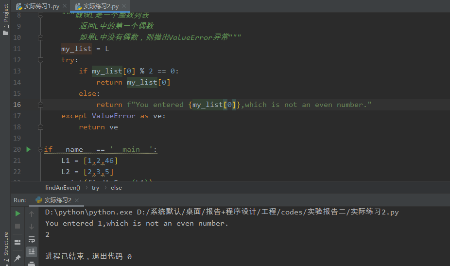

### 实验报告一

1、编写一个程序，检查变量x、y和z，输出其中最大的奇数。如果其中没有奇数就输出一个信息进行说明

```python
# 1、首先，从键盘依次输入三个数，中间用空格隔开
nums = input("请依次输入三个数：")
# 2、因为这三个数据的输入是空格隔开的，加上input输入的默认是字符串，因此可以用split(" ")按照空格分割
# 从而得到三个字符串，用list将其变化为列表形式，最后用[int(i) for i in nums]形式将nums里面的数强制转化为整数
nums_now = [int(i) for i in list(nums.split(" "))]
# 3、依次遍历nums_now列表，判断有无奇数
# 判断标准：奇数 % 2 == 1 而偶数 % 2 == 0
# 4、创建一个空列表，存储奇数
odds = []
# status = False默认表示无奇数
status = False
for num in nums_now:
    if (num % 2 == 1):
        odds.append(num)
        # 若为奇数，则改变status的状态
        status = True
    else:
        pass
# 5、输出部分
if status == False:
    print("您输入的三个数中无奇数！")
else:
    print("您输入的三个数中最大的奇数是：{}".format(max(odds)))
```

① 输入的三个数中无奇数：


② 输入的三个数中有1个奇数：


③输入的三个数中有多个奇数：


2、编写一个程序，要求用户输入10个整数，然后输出其中最大的奇数。如果用户没有输入奇数，则输出一个信息进行说明！

```python
"""
    测试用例：
        10 20 30 40 50 2 4 6 8 0        无奇数
        1 10 20 30 40 50 2 4 6 8        1奇数
        1 3 5 7 10 20 30 40 50 2        多奇数
"""
# 和Question1思路大致一样
# 1、input()得到用户输入的含有10个整数的字符串，输入两数之间空格隔开
nums = input("请输入10个整数：")
# 2、根据split(" ")将字符串进行切割,最后list转换为列表
nums_now = [int(i) for i in list(nums.split(" "))]
# 3、创建一个空列表，用于存储奇数
odds = []
# 4、确定状态status = False,表无奇数情况
status = False
# 5、开始遍历整个列表
for num in nums_now:
    # num % 2 == 1则表示奇数，否则是偶数
    if (num % 2 == 1):
        status = True
        odds.append(num)
    else:
        # pass表占位
        pass
# 6、根据状态结果输出对应信息
if status == False:
    print("您输入的10个数中无奇数！")
else:
    print("您输入的10个数中最大奇数是：{}".format(max(odds)))
```

① 输入的10个数中无奇数：


② 输入的10个数中有1个奇数：


③ 输入的10个数中有多个奇数：


3、编写一个程序，要求用户输入一个整数，然后输出两个整数`root`和`pwr`，满足`0<pwr<6`，并且`root**pwr`对于用户输入的整数。如果不存在这样一对整数，则输出一个信息进行说明！

```python
# 使用穷举法求立方根
x = int(input('输入需要判断的数字：'))
ans = 0
while ans**3 < abs(x):
    ans = ans + 1
if ans**3 != abs(x):
    print(x,'不是立方根数')
else:
    if x < 0:
        ans =- ans
    print('输入数{}的立方根是'.format(ans))
y = int(input('输入需要判断的数字：'))
root = 0
for pwr in range(1,6):#通过for循环遍历几次方
    while root**pwr < abs(y):#使用穷举法寻找方根
        root = root + 1
    if root**pwr != abs(y):
        print("{}不是{}的次方根数".format(y,pwr))
    else:
        if y < 0:
            root =- root
        print('输入数',y,'的',pwr,'次方根是',root)
    root = 0#每一个for结束以后都要进行root=0
```

代码截图：


4、假设s是包含多个小数的字符串，由逗号隔开，如s = `1.23，2.4，3.123`。编写一个程序，输出s中所有数值的和。

```python
# 1、用户输入多个小数，中间用,进行隔开
nums = input("请输入用逗号隔开的多个小数：")
# 2、存放到列表中，并将字符串类型转换为float类型
nums_now = [float(i) for i in list(nums.split(","))]
# 3、计算nums_now数值和
count = sum(nums_now)
print("s中所有数值的和是：{}".format(count))
```

代码截图：


### 实验报告二

4、编写一个Python程序，在给定的列表中指定位置插入元素

```python
"""
    编写一个Python程序，在给定的列表中指定位置插入元素
    测试案例：
        [1,'zls','你好',1.0,True]
"""
my_list = input("请输入一个列表：")
# 使用eval将变成了str类型的列表恢复原来的类型
my_list_now = eval(my_list)
# 在列表允许范围内,用户输入一个位置
location = input("请输入一个0到{}的整数：".format(len(my_list_now)))
# 用户输入一个元素
element = input("请随意输入一个元素：")
my_list_now.insert(int(location),element)
print("在{}位置处插入{}后列表成为{}".format(location,element,my_list_now))
```

代码截图：


5、编写一个Python程序来计算字符串中特定字符出现次数

```python
"""
    编写一个Python程序来计算字符串中特定字符出现次数
    测试案例：
        你好呀，好不好，不好，真不好，实在太不开心了
"""
# 先让用户输入一串字符
string = input("请输入任意字符串：")
# 用户输入一个特定的字符
char = input("请输入一个特定的字符：")
# 创建变量count用来计数,初始化为0
count = 0
for i in string:
    if i == char:
        count += 1
    else:
        pass
print("{}中{}出现的次数是：{}次".format(string,char,count))
```

代码截图：


实际练习1：抛出`ValueError异常`

```python
"""
    实际练习：实现一个满足以下规范的函数
    测试案例：
        [1,2,46]
        [2,3,5]
"""
def findAnEven(L):
    """假设L是一个整数列表
        返回L中的第一个偶数
        如果L中没有偶数，则抛出ValueError异常"""
    my_list = L
    try:
        if my_list[0] % 2 == 0:
            return my_list[0]
        else:
            return f"You entered {my_list[0]},which is not an even number."
    except ValueError as ve:
        return ve

if __name__ == '__main__':
    L1 = [1,2,46]
    L2 = [2,3,5]
    print(findAnEven(L1))
    print(findAnEven(L2))
```

代码截图：




实际练习2：

```python
"""
    实际练习：实现一个满足以下规范的函数。请使用try-except代码块
    测试案例：
        a2b3c
"""
def sumDights(s):
    """假设S是一个字符串
        返回S中十进制数字之和
        例如：如果S是'a2b3c',则返回5"""
    string = s
    # 创建变量count，初始化为0
    count = 0
    for i in string:
        try:
            if i in '0123456789':
                count += eval(i)
        except Exception as error:
            # return error
            pass
    return count

# 执行主程序，格式记住就好
if __name__ == '__main__':
    s = "a2b3c"
    print(sumDights(s))
```

代码截图：


### 大作业

```
	设计一个银行账户管理程序，账户的信息有账号（唯一）、姓名、余额、身份证号码、单位、电话号码、地址等，允许用户进行如下操作：开户、销户、存款、取款、转账、查询。
	要求程序运行时，可以由用户选择进行何种操作，开户操作要求输入用户信息后自动获取账号，用户销户后账号被回收，不允许用户透支，根据姓名或账号可以进行用户的信息查询，所有账户信息应存放到一个文件中，可以随时的访问和更新！
```

代码如下：

```python
"""
    设计一个银行账户管理程序，账户的信息有账号（唯一）、姓名、余额、身份证号码、单位、电话号码、地址等，
        允许用户进行如下操作：开户、销户、存款、取款、转账、查询。
        要求程序运行时，可以由用户选择进行何种操作，开户操作要求输入用户信息后自动获取账号，用户销户后账号被回收，不允许用户透支，
        根据姓名或账号可以进行用户的信息查询，所有账户信息应存放到一个文件中，可以随时的访问和更新！
"""
import datetime
import csv

# 1、创建原始菜单：开户、销户、存款、取款、转账、查询
def show_menu():
    """ 显示菜单栏 """
    menu = """
    ====================银行账户资金交易管理====================
    |   0: 开户                                               |
    |   1: 销户                                               |
    |   2: 存款                                               |
    |   3: 取款                                               |
    |   4：转账                                               |
    |   5：查询                                               |
    |   6：退出                                               |
    ===========================================================
     """
    print(menu)

# 2、开户
def open_an_account():
    """考虑到datatime时间具有唯一性，根据此创建账户"""
    # .replace("-","")意思是将-用空格代替，于是time便表示账户编号
    time = list(str(datetime.datetime.now()).split(" "))[0].replace("-","") + list(str(datetime.datetime.now()).split(" "))[1].split(".")[0].replace(":","")
    # 因为time的唯一性，所以可以省略判断是否早有此账户存在的可能
    f = open("账户信息.csv",mode='a+',newline="",encoding="utf-8-sig")
    csv_write = csv.writer(f)
    # 让用户输入姓名、身份证号码、单位、电话号码和地址信息（一行录入，空格为间隔）
    infor_to_enter = list(input("正在为您开户，请输入姓名、身份证号码、单位、电话号码和地址信息：").split(" "))
    # 录入信息到 账户信息.csv文件中
    csv_write.writerow([time,infor_to_enter[0],0.0,infor_to_enter[1],infor_to_enter[2],infor_to_enter[3],infor_to_enter[4]])
    print("已为您开户，分配账户编号为：{}".format(time))
    """
        测试案例：
            张三 342901200011151115 国企 110119120 南阳街
    """


# 3、销户
def delete_an_account():
    f = open("账户信息.csv", mode='r', encoding="utf-8")
    csv_reader = csv.reader(f)
    # 用户输入要销户的编号
    time = input("请输入您要注销的账户编号：")
    # 将所有的账户信息存放到一个大列表中，方便遍历
    rows = [i for i in csv_reader]
    # 因为第一行是标头，省略
    # 根据rows重写文件
    fp = open("账户信息.csv", mode='w', newline="", encoding="utf-8-sig")
    csv_write = csv.writer(fp)
    for row in rows:
        if row[0] == time:
            # 开始匹配到我们的账户编号
            del row
        else:
            csv_write.writerow(row)
    print("您的账户已注销，希望下次合作！")


# 4、存款
def save_money():
    # 得到用户的编号
    time = input("请输入您要充值的账户编号：")
    money = float(input("请输入您要充值的额度："))
    # 开始读文件，匹配time
    f = open("账户信息.csv", mode='r', encoding="utf-8")
    csv_reader = csv.reader(f)
    # 将所有的账户信息存放到一个大列表中，方便遍历
    rows = [i for i in csv_reader]
    # 因为第一行是标头，省略
    # 根据rows重写文件
    fp = open("账户信息.csv", mode='w', newline="", encoding="utf-8-sig")
    csv_write = csv.writer(fp)
    csv_write.writerow(rows[0])
    for row in rows[1:]:
        if row[0] == time:
            # 开始匹配到我们的账户编号
            row[2] = str(float(row[2]) + money)
            csv_write.writerow(row)
        else:
            csv_write.writerow(row)
    print("已为您{}的账户充值{}元".format(time,money))

# 5、取款
def waste_money():
    # 得到用户的编号
    time = input("请输入您要取款的账户编号：")
    money = float(input("请输入您要取款的额度："))
    # 开始读文件，匹配time
    f = open("账户信息.csv", mode='r', encoding="utf-8")
    csv_reader = csv.reader(f)
    # 将所有的账户信息存放到一个大列表中，方便遍历
    rows = [i for i in csv_reader]
    # 因为第一行是标头，省略
    # 根据rows重写文件
    fp = open("账户信息.csv", mode='w', newline="", encoding="utf-8-sig")
    csv_write = csv.writer(fp)
    csv_write.writerow(rows[0])
    for row in rows[1:]:
        if row[0] == time:
            # 开始匹配到我们的账户编号
            if float(row[2]) - money < 0:
                print("您{}的账户额度不足{}元，取款失败！".format(time, money))
                csv_write.writerow(row)
            else:
                row[2] = str(float(row[2]) - money)
                csv_write.writerow(row)
                print("已为您{}的账户已支出{}元,剩余额度{}元".format(time, money,row[2]))
        else:
            csv_write.writerow(row)


# 6、查询
def view_account():
    time = input("请输入您要查询的账户编号：")
    f = open("账户信息.csv", mode='r', encoding="utf-8")
    csv_reader = csv.reader(f)
    # 将所有的账户信息存放到一个大列表中，方便遍历
    rows = [i for i in csv_reader]
    status = False
    for row in rows[1:]:
        if time == row[0]:
            status = True
            print("您账户的信息如下：账户编号：{}、姓名：{}、余额：{}、身份证号码：{}、单位：{}、电话号码：{}、地址：{}".format(row[0],row[1],row[2],row[3],row[4],row[5],row[6]))
        else:
            pass
    if status == False:
        print("抱歉！未查到对应的信息，请确认账户是否已注销！")


# 7、转账
def sand_money():
    # 得到用户的编号
    time = input("请输入您的账户编号：")
    money = float(input("请输入您要转账的额度："))
    user = input("请输入您要充值的账户编号：")
    # 开始读文件，匹配time
    f = open("账户信息.csv", mode='r', encoding="utf-8")
    csv_reader = csv.reader(f)
    # 将所有的账户信息存放到一个大列表中，方便遍历
    rows = [i for i in csv_reader]
    # 因为第一行是标头，省略
    # 根据rows重写文件
    fp = open("账户信息.csv", mode='w', newline="", encoding="utf-8-sig")
    csv_write = csv.writer(fp)
    csv_write.writerow(rows[0])
    accounts = []
    for row in rows[1:]:
        accounts.append(row[0])
    if user in accounts:
        for row in rows[1:]:
            if row[0] == time:
                # 开始匹配到我们的账户编号
                if float(row[2]) - money < 0:
                    print("您{}的账户额度不足{}元，取款失败！".format(time, money))
                    csv_write.writerow(row)
                else:
                    row[2] = str(float(row[2]) - money)
                    csv_write.writerow(row)
                    print("已为您{}的账户已支出{}元,剩余额度{}元".format(time, money, row[2]))
            elif row[0] == user:
                row[2] = str(float(row[2]) + money)
                csv_write.writerow(row)
            else:
                csv_write.writerow(row)
    else:
        print("您要充值的账户在本银行未开户，无法转账！")
        for row in rows[1:]:
            csv_write.writerow(row)


# 8、循环操作
def goon(i):
    i = i
    while i != 6:
        if i == 0:
            open_an_account()
        elif i == 1:
            delete_an_account()
        elif i == 2:
            save_money()
        elif i == 3:
            waste_money()
        elif i == 4:
            sand_money()
        elif i == 5:
            view_account()
        i = int(input("请选择您要继续的操作编号："))
        goon(i)
    print("谢谢使用本系统！下次再见~")


if __name__ == '__main__':
    # w表示给文件写操作，encoding设置编码，不设置此则会乱码
    f = open("账户信息.csv",mode='w',newline="",encoding="utf-8-sig")
    csv_write = csv.writer(f)
    # 这是csv文件的其实标头
    csv_write.writerow(['账户编号','姓名','余额','身份证号码','单位','电话号码','地址'])
    f.close()
    show_menu()
    # 获取用户输入的编号
    i = int(input("请根据对应的编号选择对应的功能，如：0表示开户"))
    goon(i)
```

运行截图：


