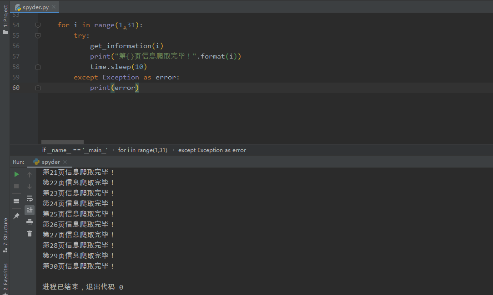
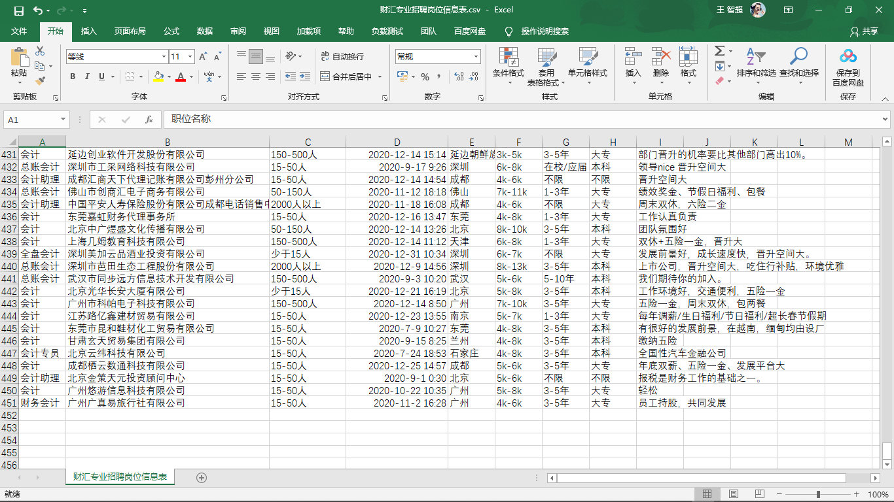
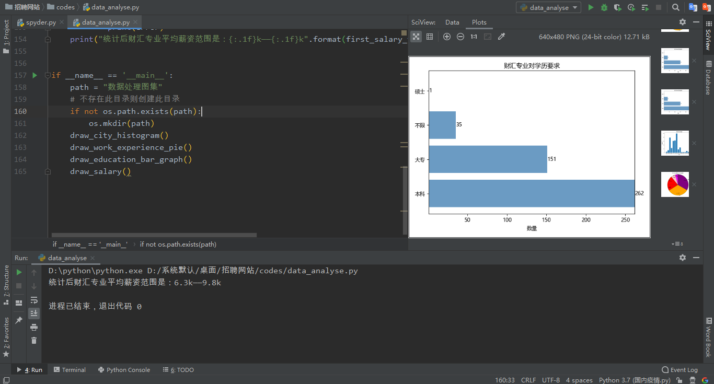
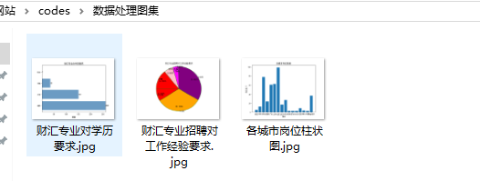

#### 任务要求

```
	爬取就业网站信息进行财汇专业就业市场的分析，程序文件要求使用python文件进行编译，并附加适当的注释方法加以理解。再使用python进行数据清洗和整理！
```

#### 任务难点

拉钩的反爬在于真实`url`的寻找以及对`cookie`失效的处理，为了爬取方便，还是登录网站，另外设置了`time.sleep(10)`伪装成真实用户！

#### 爬虫运行截图



完整30页数据已经爬取完毕！

#### 获得数据截图



#### 数据分析及可视化



可以看到平均的薪资水平范围！

另外得到的效果图是：



分别是对学历的要求、对工作经验的要求、各城市对岗位提供的数量！