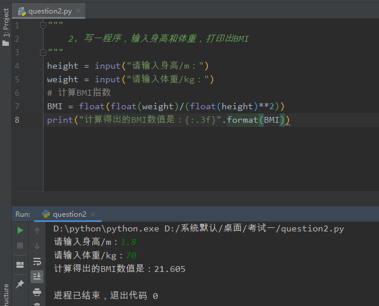
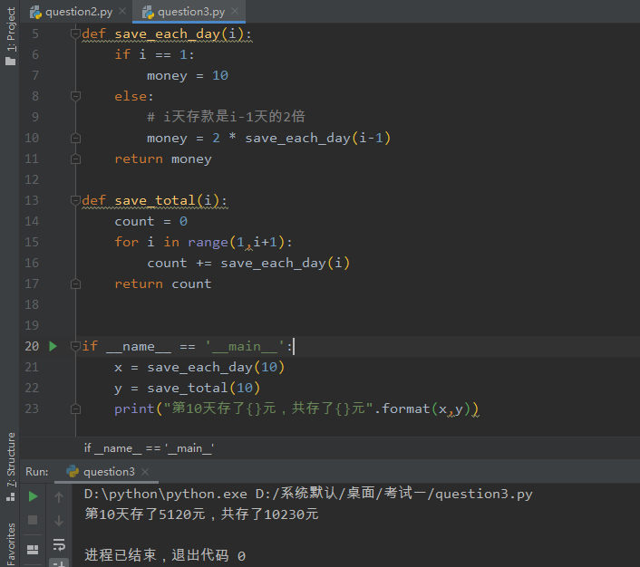
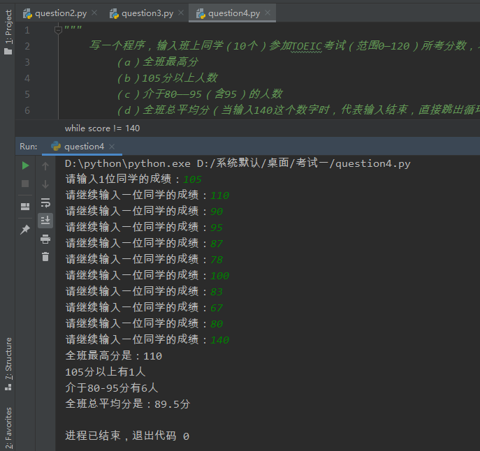
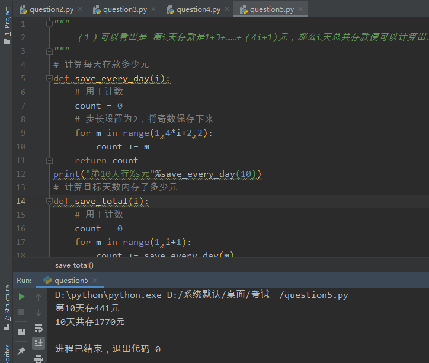
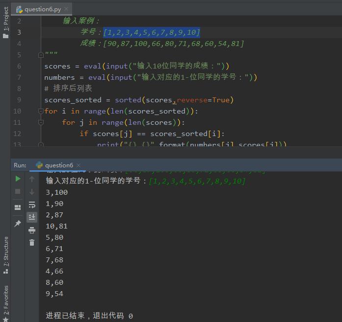
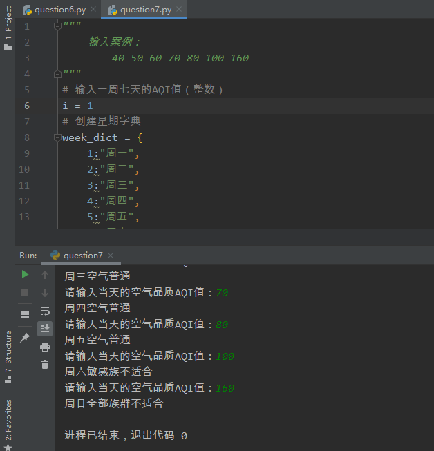

2、写一程序，输入身高和体重，打印出BMI

代码如下：

```python
height = input("请输入身高/m：")
weight = input("请输入体重/kg：")
# 计算BMI指数
BMI = float(float(weight)/(float(height)**2))
print("计算得出的BMI数值是：{:.3f}".format(BMI))
```

运行截图：



算法描述：

```
	首先，用两个input()语句分别来接收身高和体重，然后用公式体重除以身高的平方计算得出BMI，因为input()语句是字符串，所以需要输入的数据变成浮点数，最后打印用格式化语句保留小数点后三位有效数字！
```


3、某人第一天存款10元，第二天存款20元，第三天存款40元，每天的存款为前一天的两倍
请用递归程序来计算第十天时应该存入多少元，10天共存了多少元？

代码如下：

```python
def save_each_day(i):
    if i == 1:
        money = 10
    else:
        # i天存款是i-1天的2倍
        money = 2 * save_each_day(i-1)
    return money

def save_total(i):
    count = 0
    for i in range(1,i+1):
        count += save_each_day(i)
    return count


if __name__ == '__main__':
    x = save_each_day(10)
    y = save_total(10)
    print("第10天存了{}元，共存了{}元".format(x,y))
```

运行截图：



算法描述：

```
	使用两个函数，分别代表每天存钱数以及累计存钱数，唯一参数都是当前天i，其中每天存钱的函数save_each_day(i)判断i为1的话就给出值10，否则就是前一天的两倍（调用本函数）
	累计存钱save_total(i)表示i天累计存钱数，可以用for循环从1遍历到i+1，然后累加，返回值
	主函数部分给出初值，然后分别调用两个子函数，最后格式化输出！
```


4、

```
写一个程序，输入班上同学（10个）参加TOEIC考试（范围0—120）所考分数，求：
    （a）全班最高分
    （b）105分以上人数
    （c）介于80——95（含95）的人数
    （d）全班总平均分（当输入140这个数字时，代表输入结束，直接跳出循环）
输入案例：105 110 90 95 87 78 100 83 67 80 140
```

代码如下：

```python
# 根据题意知道是1位同学1位同学的录入
score = int(input("请输入1位同学的成绩："))
# 创建列表，存储各位同学的成绩
scores_all = []
# 大于105分的列表
scores_bigger = []
# 介于80-95分的列表
scores_80_95 = []
# 判断当前输入的成绩是否跳出循环
while score != 140:
    # 只有在输入不是140的时候有效
    scores_all.append(score)
    if score > 105:
        scores_bigger.append(score)
    if score > 80 and score <= 105:
        scores_80_95.append(score)
    score = int(input("请继续输入一位同学的成绩："))
# 循环结束后
print("全班最高分是：{}".format(max(scores_all)))
print("105分以上有{}人".format(len(scores_bigger)))
print("介于80-95分有{}人".format(len(scores_80_95)))
print("全班总平均分是：{}分".format(sum(scores_all) / len(scores_all)))
```

运行截图：



算法描述：

```
	首先，最开始输入一位同学的成绩，并转换为整型，然后创建几个列表分别来存储全班同学的成绩，大于105的成绩，介于80-95的成绩，然后再while循环里，继续输入9位同学的成绩，使用if分支语句进行判断当前分数所在的段，从而存在不同的列表！
	最后，输入140中断循环，分别打印出以上几个要求！
```


5、某人第一天存款1+3+5元，第二天存款1+3+5+7+9元，第三天存款1+3+5+7+9+11+13元，第四天存款1+3+5+7+9+11+13+15+17元，依此类推，请计算第10天存多少元？10共存多少元？

代码如下：

```python
"""
    （1）可以看出是 第i天存款是1+3+……+（4i+1)元，那么i天总共存款便可以计算出来了！
"""
# 计算每天存款多少元
def save_every_day(i):
    # 用于计数
    count = 0
    # 步长设置为2，将奇数保存下来
    for m in range(1,4*i+2,2):
        count += m
    return count
print("第10天存%s元"%save_every_day(10))
# 计算目标天数内存了多少元
def save_total(i):
    # 用于计数
    count = 0
    for m in range(1,i+1):
        count += save_every_day(m)
    return count
print("10天共存{}元".format(save_total(10)))
```

运行截图：



算法描述：

```
	可以看出是 第i天存款是1+3+……+（4i+1)元，那么i天总共存款便可以计算出来了！
	构造两个函数，唯一参数都是当前天i，首先计算每天存款，这个很明显是所有的加数都是奇数项，然后项的个数满足4*i+1个，所以可以用循环以及range加上步长来计算，当前天累计这个可以调用第一个函数，用for循环从1遍历到i+1，计算得出的便是i天总存款！
```


6、使用列表，输入10位同学的学号（学号为1，2……）和成绩（0—100），根据成绩高低，由高到低印出每位同学的学号和成绩！

代码如下：

```python
"""
    输入案例：
        学号：[1,2,3,4,5,6,7,8,9,10]
        成绩：[90,87,100,66,80,71,68,60,54,81]
"""
scores = eval(input("输入10位同学的成绩："))
numbers = eval(input("输入对应的1-位同学的学号："))
# 排序后列表
scores_sorted = sorted(scores,reverse=True)
for i in range(len(scores_sorted)):
    for j in range(len(scores)):
        if scores[j] == scores_sorted[i]:
            print("{},{}".format(numbers[j],scores[j]))
```

运行截图：



算法描述：

```
	首先将输入的列表数据用eval函数转换为其原来的格式即list，然后创建一个变量，用于给scores列表进行从高到低的排序，加上了reverse = True参数，然后可以用双层for循环，将成绩以及对应的学号输出！
```


7、写一程序，输入一周7天的空气品质AQI值（即一个整数），若AQI值低于50，则“空气良好”，值较高但低于100，则“空气普通”，高于100低于150，则“敏感族不适合”；其他值，则“全部族群不适合”，求当输入特定AQI值，打印出对应的文字结果！

代码如下：

```python
# 输入一周七天的AQI值（整数）
i = 1
# 创建星期字典
week_dict = {
    1:"周一",
    2:"周二",
    3:"周三",
    4:"周四",
    5:"周五",
    6:"周六",
    7:"周日"
}
while i <= 7:
    AQI = int(input("请输入当天的空气品质AQI值："))
    if AQI < 50:
        print("{}{}".format(week_dict[i],"空气良好"))
    elif AQI < 100:
        print("{}{}".format(week_dict[i], "空气普通"))
    elif AQI < 150:
        print("{}{}".format(week_dict[i], "敏感族不适合"))
    else:
        print("{}{}".format(week_dict[i], "全部族群不适合"))
    i += 1
```

运行截图：



算法描述：

```
	首先，需要的是一周7天的空气指标，所以用while循环来解决，另外定义一个字典，通过键值对匹配能输出当前的日期，循环内部是多分支循环结构，根据输入的AQI指标来决定其对应的段，最后打印输出！
```


8、共有25根牙签，依次最多取3根（也可以取1根或者2根），取到最后一根（第25根）牙签就算输，写一程序，让使用者和PC比赛，使用者先开始去取牙签，然后让PC永远胜利！

（ps：PC赢得键：取到第4根—第8根—第12根—第16根—第20根—第24根）

代码如下：

```python

```

运行截图：


算法描述：

```

```

