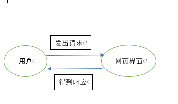
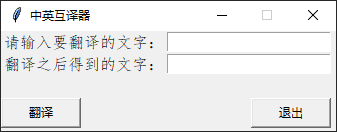
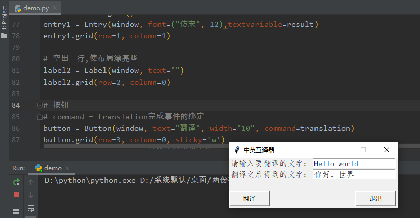
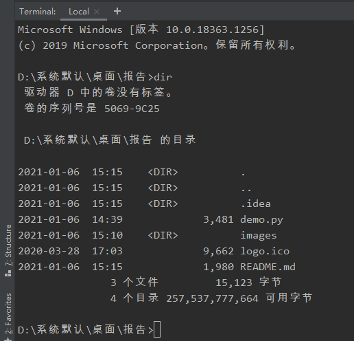
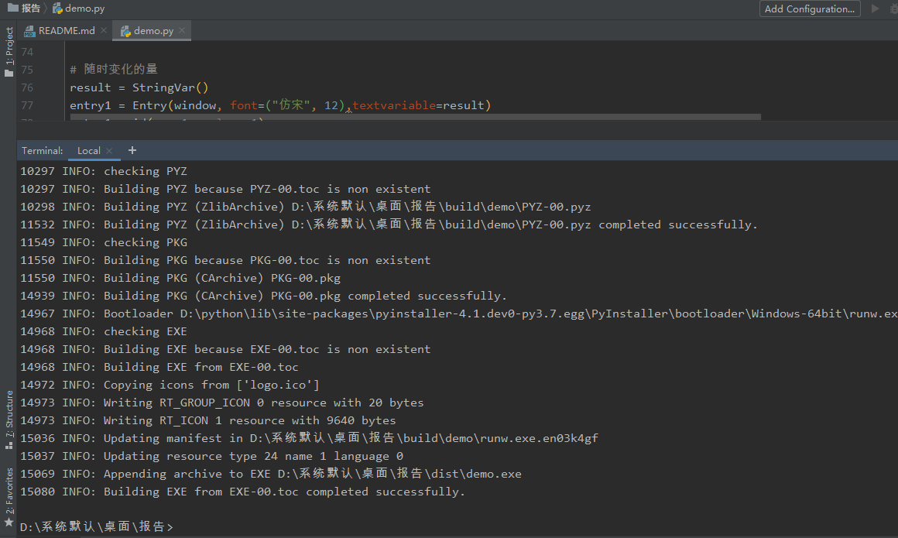
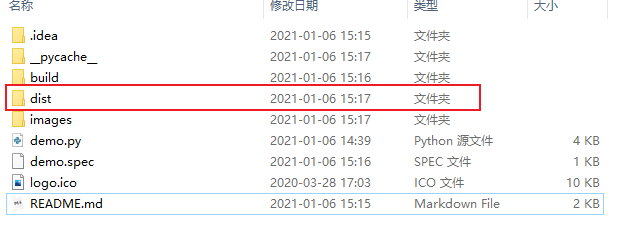

#### 目标：

翻译是科研和学习中非常重要的一个环节，市场上使用较多的是谷歌翻译、有道翻译和百度翻译！但是每次打开网页再去搜翻译似乎有点麻烦（尤其是只查单个单词的时候），所以打算通过`python`爬虫技术以及`python`自带的`GUI`框架`Tkinter`来实现封装程`exe`电脑可执行文件，这样就能方便学习和生活！

#### 软件架构设计：

用户通过交互页面发出请求，爬虫根据用户输入信息从网页获取响应信息，握手成功后成功返回给用户，显示在交互页面上！

#### 设计要点：

主要难点在两个方面：

- 交互页面，功能函数的绑定
- 爬取有道翻译页面，如何成功爬取翻译内容并返回到交互页面上

#### 功能说明：

首先是进行窗口页面的设计，用户输入需要一个文本框`label`来接收内容，得到翻译结果需要显示在另一个文本框`label`中，然后函数触发条件时用户想翻译了就翻译，不想翻译就原样保持不变，所以需要一个按钮`button`控件，最后用户的退出是可以绑定自带的方法`.quit()`！

设计好的界面截图如下：

紧接着，需要解决的难点是有道翻译内容的获取，原`url`的时间戳一直在变化不好解决，通过百度得知去掉`url`中的`o`可以有效解决这个问题，接下来是将得到的信息返回到我们的第二个文本框`label`中，使用`StringVar()`来接收得到的内容，再通过函数里面的`result.set()`将结果展示进去并自动清空第一个文本框`label`

软件运行截图：

将软件封装成`exe`可执行文件：

在`cmd`终端进入到`demo.py`文件所在的路径，放上下载的`logo.ico`，执行命令：

`pyinstaller -F -w -i "logo.ico" demo.py`

其中`-w`是封装后打开exe文件没有黑色终端闪现！

目录结构图：

封装结束后：

得到的exe文件在dist文件夹下：

`__pycache__`以及`build`和`demo.spec`都是封装过程产生的文件，可以删除，`.idea`是`Pycharm`生成的，也可删除！