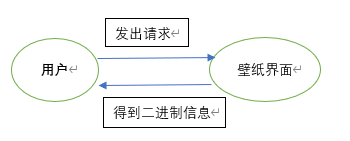
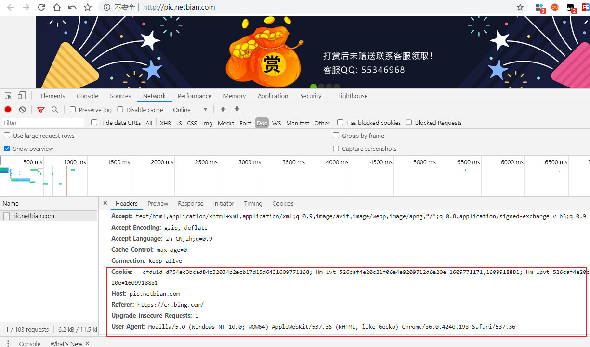

#### 目标

彼岸图网是一个特别好的壁纸类网站，但是普通用户只能每天登录进去下载一张图片，会员则需要充值，为了让电脑能够自动的更换锁屏壁纸，打算用所学的`python`爬虫知识获取多种图片并存放到对应的文件夹中！爬取完毕后就可以将文件夹迁移到锁屏的图片目录！

#### 软件架构设计

用户通过`url`将网页解析得到网页上所有壁纸的单独链接，服务器返回该信息到客户端，然后根据给出的图片链接，通过`python`将二进制信息变成图片保存到特定的目录！

#### 设计要点

主要重点在于：

- 爬虫使用xpath解析页面，添加参数处理反爬信息
- 网页爬虫翻页的实现
- 如何将二进制信息保存为图片

#### 功能说明

首先，通过解析彼岸图网的一页数据，通过谷歌浏览器按下`F12`找到`network`流中的相关参数：`Cookie`、`Host`、`Referer`、`User-Agent`，并且发现网页是`get`请求的方式

然后，通过编写`xpath`规则提取到当前页所有图片的链接以及名称，因为初始界面的图片像素不高，所以需要访问刚才提取到的图片链接网址，通过删除部分参数来提高图片的像素，然后对图片名称做部分修改（因为Windows上名称不支持有些符号），保存到`path`目录下！

一页数据已经爬取完毕，现在是需要爬取多页图片，通过网页分析发现翻译是通过`index`后面的参数`i`来实现的，恰好可以通过`for`循环来实现！

完整效果：

因为是单线程爬取速度较慢，后期可以加上多线程/进程池等来加快爬取速度！