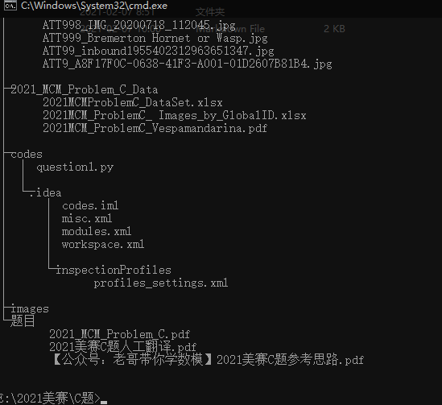
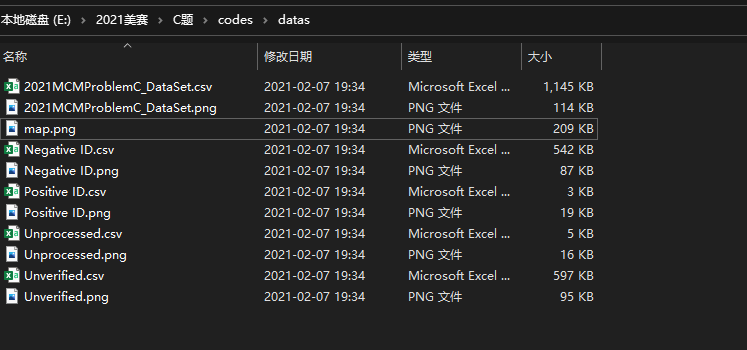
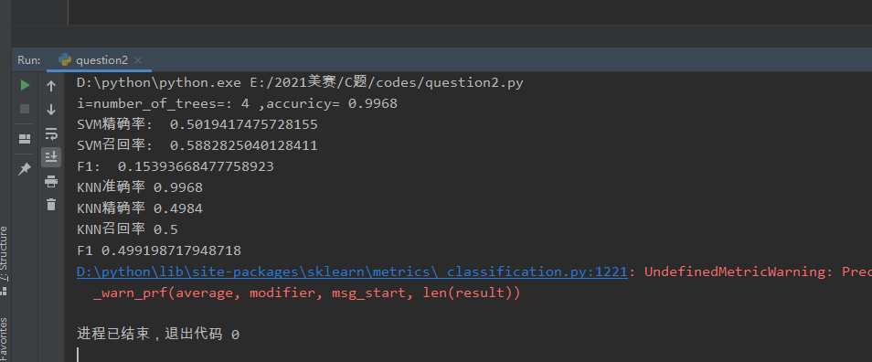
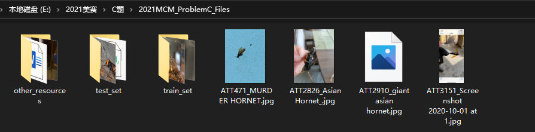
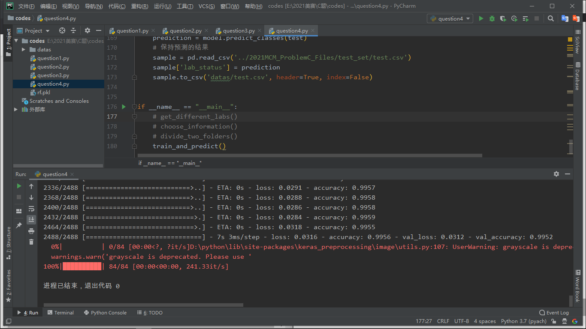

#### 1、题目要求

- 解决并讨论这种有害生物在一段时间内的传播是否可以预测，以及准确度如何
- 大多数报道的目击事件都把其他黄蜂误认为是胡蜂。仅使用提供的数据集文件和(可能)提供的图像文件来创建、分析和讨论一个预测错误分类可能性的模型
- 利用你的模型讨论你的分类分析如何导致优先调查最有可能是正面目击的报告
- 说明随者时间的推移，如果有其他新报告，如何更新模型，以及更新的频率
- 利用你的模型，有什么证据可以证明华盛顿州已经消灭了这种有害生物


#### 2、其他要求

- 定义您使用的所有指标和成本函数
- 参数的任何估计应包括区间估计
- 任何结果应包括对结果拟合优度的估计
- 应明确说明所有假设，尤其是与数据或错误相关的分布
- 应检查与数据相关的所有假设，并检查与这些假设相关的技术的稳健性
- 应明确说明与方法或技术相关的所有假设


#### 3、思路与处理步骤

> 问题1

- `2021MCMProblemC_DataSet.xlsx`文件里面首先根据`Lab Status`将数据集划分成各自的csv文件

- 根据经纬度信息`Latitude`和`Longitude`将数据进行可视化，针对`Lab Status`为`Positive ID`的数据特殊颜色可视化，确定出这些数据的精度范围和纬度范围，缩小胡蜂的空间活动范围。接着根据其对应的`Detection Date`按照时间顺序排列出来，确定其大致的活动时间情况

- 采用`GM`模型、神经网络模型、时间序列模型等对传播范围进行预测，并对拟合优度进行计算(一只新峰后的筑巢距离估计是30km)

- 处理代码

  文件夹大致的目录结构是：

  

  ```python
  from openpyxl import load_workbook
  import os
  import csv
  import matplotlib.pyplot as plt
  from mpl_toolkits.basemap import Basemap
  import pandas as pd
  import numpy as np
  
  
  path = "datas"
  # 1、创建文件夹用于保存处理后的数据以及可视化图片
  if not os.path.exists(path):
      os.mkdir(path)
  
  # 2、将.xlsx换成.csv格式
  def exchange_xlsx_to_csv(path):
      wb = load_workbook("../2021_MCM_Problem_C_Data/2021MCMProblemC_DataSet.xlsx")
      sheet = wb['Sheet1']
      # 得到行数和列数，方便读取每一个单元格的值
      nrows = sheet.max_row
      ncols = sheet.max_column
      # 将xlsx格式整体改成csv格式
      new_files = []
      for i in range(1, nrows + 1):
          rows = []
          for j in range(1, ncols + 1):
              value = sheet.cell(row=i, column=j).value
              rows.append(value)
          new_files.append(rows)
      # 将数据写入csv
      f = open(path + '/' + '2021MCMProblemC_DataSet.csv', mode="w+", newline="", encoding="utf-8-sig")
      csv_write = csv.writer(f)
      for i in range(len(new_files)):
          if i >= 1:
              new_files[i][-2] = float(new_files[i][-2])
              new_files[i][-1] = float(new_files[i][-1])
          csv_write.writerow(new_files[i])
      f.close()
  
  # 3、读取csv文件，进行划分数据集
  def divide_several_csv_files(path):
      f = open("datas/2021MCMProblemC_DataSet.csv",mode='r',encoding="utf-8")
      csv_reader = csv.reader(f)
      rows = [i for i in csv_reader]
      plt.rcParams['font.sans-serif'] = 'SimHei'
      plt.rcParams['axes.unicode_minus'] = False
      latitudes = [eval(row[-2]) for row in rows[1:]]
      longitudes = [eval(row[-1]) for row in rows[1:]]
      fig, ax = plt.subplots(figsize=(9, 6))
      ax.scatter(latitudes, longitudes, alpha=0.3)
      ax.set_xlabel("latitude")
      ax.set_ylabel("longitude")
      plt.savefig(path + '/' + "2021MCMProblemC_DataSet.png")
      plt.show()
      # 需要的数据是    Lab Status，构造一个字典来统计这个分类情况以及各自的数据量
      lab_status_dict = {}
      for row in rows[1:]:
          key = row[3]
          if key not in lab_status_dict:
              lab_status_dict[key] = 1
          else:
              lab_status_dict[key] += 1
      keys = list(lab_status_dict.keys())
      print("2021MCMProblemC_DataSet.csv数据集中lab_status可以分为：{}".format(keys))
      print("对应的数据量分别是：{}".format(list(lab_status_dict.values())))
      files = [[] for i in range(len(lab_status_dict))]
      for i in range(len(files)):
          for row in rows[1:]:
              if row[3] == keys[i]:
                  files[i].append(row)
      # 写入各自的csv文件
      for i in range(len(files)):
          f = open(path + '/' +"{}.csv".format(keys[i]),mode="w+",newline="",encoding="utf-8-sig")
          csv_write = csv.writer(f)
          for row in files[i]:
              csv_write.writerow(row)
          f.close()
  
  
  # 4、根据经纬度坐标进行可视化(散点图)
  def paint_scatter_plot(path):
      filenames = ['Negative ID.csv', 'Positive ID.csv', 'Unprocessed.csv', 'Unverified.csv']
      for i in range(len(filenames)):
          plt.rcParams['font.sans-serif'] = 'SimHei'
          plt.rcParams['axes.unicode_minus'] = False
          f = open("datas/{}".format(filenames[i]),mode="r",encoding="utf-8")
          csv_reader = csv.reader(f)
          rows = [i for i in csv_reader]
          latitudes = [eval(row[-2]) for row in rows]
          longitudes = [eval(row[-1]) for row in rows]
          fig, ax = plt.subplots(figsize=(9, 6))
          ax.scatter(latitudes,longitudes,alpha=0.3)
          ax.set_xlabel("latitude")
          ax.set_ylabel("longitude")
          name = filenames[i].split('.')[0]
          plt.savefig(path + '/' +"{}.png".format(name))
          plt.show()
  
  # 5、根据经纬度进行地图可视化
  def paint_map(path):
      # 绘制基础地图，选择绘制的区域，因为是绘制美国地图，故选取如下经纬度，lat_0和lon_0是地图中心的维度和经度
      map = Basemap(projection='stere', lat_0=90, lon_0=-105,llcrnrlat=23.41, urcrnrlat=45.44,llcrnrlon=-118.67, urcrnrlon=-64.52,rsphere=6371200., resolution='l', area_thresh=10000)
      map.drawmapboundary()  # 绘制边界
      map.drawstates()  # 绘制州
      map.drawcoastlines()  # 绘制海岸线
      map.drawcountries()  # 绘制国家
      map.drawcounties()  # 绘制县
      parallels = np.arange(0., 90, 10.)
      map.drawparallels(parallels, labels=[1, 0, 0, 0], fontsize=10)  # 绘制纬线
      meridians = np.arange(-110., -60., 10.)
      map.drawmeridians(meridians, labels=[0, 0, 0, 1], fontsize=10)  # 绘制经线
      posi = pd.read_csv("datas/2021MCMProblemC_DataSet.csv")
  
      lat = np.array(posi["Longitude"])
      lon = np.array(posi["Latitude"])
      x, y = map(lon, lat)
      map.scatter(x, y,c="g")  # 也可以使用Basemap的methord本身的scatter
      plt.title('America')
      plt.savefig(path + '/' + 'map.png')
      plt.show()
  
  
  if __name__ == "__main__":
      exchange_xlsx_to_csv(path)
      divide_several_csv_files(path)
      paint_scatter_plot(path)
      paint_map(path)
  ```

- 效果图

  

- 遇到的问题及解决

  ① 得到的经纬度信息是字符串，在绘制散点图进行可视化的时候会出现错误，转化成浮点型有效解决；

  ② 地图可视化的时候，直接调用高德API接口发现高德是空白页，于是用`BaseMap`进行绘图，得到了黑白的地图，问题是没有其他有效数据，所以绘制的图不好区分！

> 问题2

- 分别对提供的图像文件和数据集文件上进行训练和预测，我们想要通过目击事件的报告来研究预测错误的可能性，因此在数据集`2021MCM_ProblemC_DataSet.xlsx`上，实际上有用的只有`Detection Date、Notes、Lab Status、Latitude、Longitude`。其中以`Detection Date、Notes、Latitude、Longitude`作为输入，`Lab Status`作为输出进行训练，将数据集划分成训练集和预测集来分别验证预测错误的可能性即模型的准确率。

- 因为涉及到分类预测，那常用的`SVM`就最合适不过了，使用`LIBSVM`通过`svmtrain`和`svmpredict`函数实现训练和预测，而且还可以得到预测的准确率以及一些其他的参数指标。

- 图形识别的话像深度学习神经网络等，跑跑网上的模型代码。再拿到目击的报告后，代入构建好的模型里，会得到一个预测的估计概率，根据概率即可制定优先顺序！

- 处理代码

  ```python
  import pandas as pd
  import matplotlib.pyplot as plt
  from sklearn.model_selection import train_test_split
  from sklearn.ensemble import RandomForestClassifier
  from sklearn import metrics
  import joblib
  from snownlp import SnowNLP
  from sklearn.svm import SVC
  from sklearn.metrics import precision_score
  from sklearn.metrics import recall_score
  from sklearn.metrics import f1_score
  from sklearn.neighbors import KNeighborsClassifier as KNN
  
  plt.rcParams['font.family'] = 'SimHei'
  plt.rcParams['font.size'] = 15
  data = pd.read_csv("datas/2021MCMProblemC_DataSet.csv",encoding="utf-8")
  data.rename(columns={'Lab Status':'lab'},inplace=True)
  column = data.columns.tolist()[:8]
  
  # 选择需要的数据
  data = data.loc[(data['lab'] != 'Unverified') & (data['lab'] != 'Unprocessed')]
  # 将Positive ID和Negative ID分别设为1和0
  data.lab = data.lab.astype(str).map({'Negative ID':0,'Positive ID':1})
  # lab的状态1和0作为输出，输入的数据Detection Date根据月份划分成数字1~12
  data.rename(columns={'Detection Date':'date'},inplace=True)
  dates = []
  for date in data.date:
      try:
          month = date.split("-")[1]
      except Exception as error:
          month = date.split("/")[0]
      dates.append(month)
  notes = []
  for note in data.Notes:
      score = SnowNLP(note).sentiments
      notes.append(score)
  my_list = list(data['date'])
  new_list = list(data['Notes'])
  for i in range(len(my_list)):
      data['date'] = data['date'].replace(my_list[i],dates[i])
      data['Notes'] = data['Notes'].replace(new_list[i],notes[i])
  X = data[['date','Latitude','Longitude','Notes']]
  y = data['lab']
  # 1、使用随机森林进行预测
  # 训练：测试=7：3
  X_train,X_test,y_train,y_test=train_test_split(X,y,test_size=0.3, random_state=1)
  rf = RandomForestClassifier(
      criterion='entropy',
      n_estimators=36,
      max_depth=5,
      min_samples_split=10, # 定义至少多少个样本的情况下才继续分叉
      min_samples_leaf=4,
      min_weight_fraction_leaf=0.05 # 定义叶子节点最少需要包含多少个样本(使用百分比表达), 防止过拟合
      )
  
  # 训练模型
  rf.fit(X_train, y_train)
  # 做预测
  y_pred = rf.predict(X_test)
  # 模型的准确率
  print("i=number_of_trees=:",4,',accuricy=',metrics.accuracy_score(y_test, y_pred))
  # 保存model
  joblib.dump(rf,'rf.pkl')
  
  # 使用SVM进行分类预测
  clf = SVC(kernel='rbf', class_weight='balanced')
  clf.fit(X_train, y_train)
  y_predict = clf.predict(X_test)
  print('SVM精确率: ', precision_score(y_test, y_predict, average='macro'))
  print('SVM召回率: ', recall_score(y_test, y_predict, average='macro'))
  print('F1: ', f1_score(y_test, y_predict, average='macro'))
  
  # 使用KNN进行分类预测
  knc = KNN(n_neighbors =6)
  knc.fit(X_train,y_train)
  y_predict = knc.predict(X_test)
  print('KNN准确率',knc.score(X_test,y_test))
  print('KNN精确率',precision_score(y_test, y_predict,  average='macro'))
  print('KNN召回率',recall_score(y_test, y_predict,  average='macro'))
  print('F1',f1_score(y_test, y_predict,  average='macro'))
  ```

- 效果图

  
  
- 图像处理部分，首先根据那个`GloballID`将两个文件结合起来，得到每个图片后面的`lab_status`特性，然后筛选出我们需要的`positive ID`和`negative ID`，后面处理图片文件夹，通过字典开始判断有

  ```
  {'jpg': 3032, 'png': 79, 'quicktime': 76, 'vnd.openxmlformats-officedocument.wordprocessingml.document': 3, 'mp4': 9, 'x-zip-compressed': 3, 'pdf': 5, 'octet-stream': 1}
  ```

  所以选择需要的`jpg`和`png`格式并且把`png`批量改格式为`jpg`格式(有3个是加上扩展名就可以的)，新建文件夹`other_resources`，将其他形式的文件放入此文件夹中！并针对前面处理的csv文件，更改对应的图片格式名称！

  ```python
  import csv
  from openpyxl import load_workbook
  import os
  from shutil import move
  
  # 1、将xlsx格式文件转换成csv文件，方便后续操作
  def exchange_xlsx_to_csv():
      wb = load_workbook("../2021_MCM_Problem_C_Data/2021MCM_ProblemC_ Images_by_GlobalID.xlsx", read_only=True)
      sheet = wb['AttachmentRelateTable']
      rows = sheet.max_row
      cols = sheet.max_column
      f = open("datas/2021MCM_ProblemC_ Images_by_GlobalID.csv", mode='w+', newline="", encoding="utf-8-sig")
      csv_write = csv.writer(f)
      for i in range(1, rows + 1):
          row = []
          for j in range(1, cols):
              value = sheet.cell(row=i, column=j).value
              row.append(value)
          csv_write.writerow(row)
      f.close()
  
  # 2、对比两个csv文件
  def compare_two_csv():
      f1 = open("datas/2021MCMProblemC_DataSet.csv",mode="r",encoding="utf-8")
      csv_reader = csv.reader(f1)
      rows = [i for i in csv_reader]
      labs = [row[3] for row in rows[1:]]
      ids = [row[0] for row in rows[1:]]
      f2 = open("datas/2021MCM_ProblemC_ Images_by_GlobalID.csv",mode="r",encoding="utf-8")
      csv_reader = csv.reader(f2)
      rows = [i for i in csv_reader]
      fp = open("datas/question2_1_add_status.csv",mode="w+",newline="",encoding="utf-8-sig")
      csv_write = csv.writer(fp)
      rows[0].append("lab_status")
      csv_write.writerow(rows[0])
      for row in rows[1:]:
          for i in range(len(ids)):
              if row[1] == ids[i]:
                  row.append(labs[i])
                  break
          csv_write.writerow(row)
      fp.close()
  
  # 3、根据得到的csv文件筛选出已经检测出是positive和negative的那些信息
  def choose_images_to_train():
      f = open("datas/question2_1_add_status.csv",mode="r",encoding="utf-8")
      csv_reader = csv.reader(f)
      rows = [i for i in csv_reader]
      fp = open("datas/question2_2_choose_images_to_train.csv",mode="w+",newline="",encoding="utf-8-sig")
      csv_write = csv.writer(fp)
      csv_write.writerow(rows[0])
      # 获取图片格式有{'jpg': 3032, 'png': 79, 'quicktime': 76, 'vnd.openxmlformats-officedocument.wordprocessingml.document': 3, 'mp4': 9, 'x-zip-compressed': 3, 'pdf': 5, 'octet-stream': 1}
      # 只选择jpg和png，都转换为jpg格式
      for row in rows[1:]:
          form = row[-2].split("/")[-1]
          new_row = []
          if (row[-1] == "Negative ID") or (row[-1] == "Positive ID") and (form == "jpg" or form == "png"):
              form0 = row[0].split(".")[0] + ".jpg"
              form1 = row[1]
              form2 = row[-2].split("/")[0] + ".jpg"
              form3 = row[-1]
              new_row.append(form0)
              new_row.append(form1)
              new_row.append(form2)
              new_row.append(form3)
              csv_write.writerow(new_row)
      fp.close()
  
  # 4、筛选图片文件，将其他资源信息单独放入一个文件夹内
  def put_other_resources_into_folder():
      path = "../2021MCM_ProblemC_Files/other_resources"
      if not os.path.exists(path):
          os.mkdir(path)
      path_make = "../2021MCM_ProblemC_Files"
      files = os.listdir(path_make)
      for file in files:
          if file == "other_resources":
              pass
          else:
              form = file.split(".")[-1]
              name = file.split(".")[0]
              if (form.lower() == "jpg") or (form.lower() == "png") or (form == name):
                  if (form.lower() == "png") or (form == name):
                      newname = "{}.jpg".format(name)
                      # 注意代码的路径和图片路径不一致
                      src_path = path_make + "/" + file
                      dest_path = path_make + "/" +newname
                      os.rename(src_path,dest_path)
              else:
                  src_path = "../2021MCM_ProblemC_Files/{}".format(file)
                  move(src_path,path)
  
  if __name__ == '__main__':
      exchange_xlsx_to_csv()
      compare_two_csv()
      choose_images_to_train()
      put_other_resources_into_folder()
  ```

  运行时间较久(大概`5min`左右！)

  其中，值得一提的是，`put_other_resources_into_folder()`运行成功后再次运行肯定会出错的！

- 图像预处理到分类

  ```
  1、图片预处理：
  	- (1)建立两个文件夹：一个是训练集文件夹，另一个是测试集文件夹
  	- (2)训练集文件夹：训练集文件夹有一个.csv文件和一个图像文件夹，图像文件存放所有的训练图片，.csv文件存放图片名称，以及其对应的图片标签(lab_status)
  	- (3)测试集文件夹：测试集的.csv文件包含所有的测试图像的名称，但是标签得剔除，模型将在图像上进心训练，标签预测将在测试集得图像上进行(图片中未检测数据)
  	
  2、加载和预处理数据：
  	- 创建一个验证集，这是从训练集划分过来的，即再训练集训练模型，验证集上进行验证，一旦对验证集上的模型性能感到满意，就可以将其用于对测试数据进行预测
  
  3、定义模型结构：
  	- 想要多少个卷积层?
  	- 每层的激活函数应该是什么?
  	- 每层应该有多少个隐藏单元
  	这些本质上是模型的超参数，在决定预测好坏方面起着巨大的作用
  	如何确定这些超参数?
  	- 根据现有的研究来选择这些超参数或继续尝试直到找到最佳匹配，但是这是一个非常耗时的过程！
  
  4、训练模型：
  	- 训练图像及其对应的真实标签
  	- 验证图像及其对应的真实标签(仅在训练阶段使用这些标签来验证模型，而未使用它们)
  
  5、评估模型：
  	最后，加载测试数据(图像)并在此进行预处理步骤，使用训练好的模型来预测这些图像的分类
  ```

  完整代码如下：

  ```python
  import os
  import csv
  from shutil import move
  import keras
  from keras.models import Sequential
  from keras.layers import Dense, Dropout, Flatten
  from keras.layers import Conv2D, MaxPooling2D
  from keras.utils import to_categorical
  from keras.preprocessing import image
  import numpy as np
  import pandas as pd
  import matplotlib.pyplot as plt
  from sklearn.model_selection import train_test_split
  from keras.utils import to_categorical
  from tqdm import tqdm
  
  
  
  # 1、使用字典统计  question2_result.csv里面的各个lab_status的数量
  def get_different_labs():
      labs_dict = {}
      f = open("datas/question2_result.csv",mode="r",encoding="utf-8")
      csv_reader = csv.reader(f)
      rows = [i for i in csv_reader]
      labs = [row[-1] for row in rows[1:]]
      for lab in labs:
          if lab not in labs_dict:
              labs_dict[lab] = 1
          else:
              labs_dict[lab] += 1
      # {'Positive ID': 14, 'Negative ID': 3194, 'Unverified': 86, 'Unprocessed': 11}
      print("处理前：{}".format(labs_dict))
  
  
  # 2、遍历csv文件，判断FileType下只jpg和png格式的4种图片的数量，并将png都改成jpg形式
  def choose_information():
      f = open("datas/question2_result.csv",mode='r',encoding="utf-8")
      csv_reader = csv.reader(f)
      rows = [i for i in csv_reader]
      fp = open("datas/question2_3_information_fixing.csv",mode='w+',newline="",encoding="utf-8-sig")
      csv_write = csv.writer(fp)
      rows[0].append("lab_status")
      csv_write.writerow(rows[0])
      my_dict = {}
      for row in rows[1:]:
          form = row[-2].split("/")[-1]
          name = row[-2].split("/")[0]
          if (form == "jpg") or (form == "png") or (form == name):
              # 将png都改成jpg形式了
              if row[-1] not in my_dict:
                  my_dict[row[-1]] = 1
              else:
                  my_dict[row[-1]] += 1
              row[0] = row[0].replace("png","jpg")
              row[2] = row[2].replace("png","jpg")
              if form == name:
                  row[0] = row[0] + ".jpg"
              csv_write.writerow(row)
          else:
              pass
      fp.close()
      print("处理后：{}".format(my_dict))
  
  
  # 3、根据lab_status将files里面的图片复制到不同的数据集里面,并生成对应的csv文件
  def divide_two_folders():
      """
          将lab_status是Unverified和Unprocessed放到测试集
          将lab_status是Positive ID和Negative ID分别作为训练集和验证集
      """
      path1 = "../2021MCM_ProblemC_Files/test_set"
      path2 = "../2021MCM_ProblemC_Files/train_set"
      if not os.path.exists(path1):
          os.mkdir(path1)
      if not os.path.exists(path2):
          os.mkdir(path2)
      # 创建三个文件夹之后下面接着创建2个csv文件，分别放到对应文件夹下
      f1 = open(path1 + "/" + "test.csv",mode='w+',newline="",encoding="utf-8-sig")
      f2 = open(path2 + "/" + "train.csv",mode='w+',newline="",encoding="utf-8-sig")
      # 下面开始读取原先的csv文件
      fp = open("datas/question2_3_information_fixing.csv",mode='r',encoding="utf-8")
      csv_reader = csv.reader(fp)
      rows = [i for i in csv_reader]
      csv_write1 = csv.writer(f1)
      csv_write1.writerow(rows[0])
      csv_write2 = csv.writer(f2)
      csv_write2.writerow(rows[0])
      # 开始遍历文件
      # 处理后：{'Positive ID': 14, 'Negative ID': 3097, 'Unverified': 73, 'Unprocessed': 11}
      for row in rows[1:]:
          lab = row[-1]
          name = row[0]
          if (lab == "Unverified") or (lab == "Unprocessed"):
              # 删除最后一列lab_status
              del row[-1]
              csv_write1.writerow(row)
              # 根据name将文件剪切到对应文件夹下面
              src_path = "../2021MCM_ProblemC_Files/{}".format(name)
              try:
                  move(src_path,path1)
              except Exception as error:
                  print(error,name)
          else:
              # 将train和predict 按照7：3大致比例划分进对应的文件夹下面(一共3111张图片)
              if name == "ATT3151_Screenshot 2020-10-01 at 1.45.56 PM.jpg":
                  pass
              else:
                  if lab == "Positive ID":
                      row[-1] = 1
                  else:
                      row[-1] = 0
                  csv_write2.writerow(row)
              src_path = "../2021MCM_ProblemC_Files/{}".format(name)
              try:
                  move(src_path, path2)
              except Exception as error:
                  print(error,name)
  
      f1.close()
      f2.close()
      print("数据集划分完毕！")
  
  # 4、开始模型的训练和验证
  def train_and_predict():
      # 加载数据
      train = pd.read_csv('../2021MCM_ProblemC_Files/train_set/train.csv')
      # 将训练集的图片转成训练的数据
      # 我们将读取所有训练图像，将它们存储在列表中，最后将该列表转换为numpy数组。
      # 我们具有灰度图像，因此在加载图像时，我们将保持灰度 = True，如果您具有RGB图像，则应将灰度设置为False
      train_image = []
      for i in tqdm(range(train.shape[0])):
          img = image.load_img('../2021MCM_ProblemC_Files/train_set/' + train['FileName'][i], target_size=(28, 28, 1), grayscale=True)
          img = image.img_to_array(img)
          img = img / 255
          train_image.append(img)
      X = np.array(train_image)
      # 由于这是一个多类分类问题（2个类），我们将对标签进行一次编码。
      y = train['lab_status'].values
      y = to_categorical(y)
      # 根据训练集划分出验证集
      X_train, X_test, y_train, y_test = train_test_split(X, y, random_state=42, test_size=0.2)
      # 定义模型结构
      # 定义2个卷积层，1一个全连接的隐藏层和输出层
      model = Sequential()
      model.add(Conv2D(32, kernel_size=(3, 3), activation='relu', input_shape=(28, 28, 1)))
      model.add(Conv2D(64, (3, 3), activation='relu'))
      model.add(MaxPooling2D(pool_size=(2, 2)))
      model.add(Dropout(0.25))
      model.add(Flatten())
      model.add(Dense(128, activation='relu'))
      model.add(Dropout(0.5))
      model.add(Dense(2, activation='softmax'))
  
      model.compile(loss='categorical_crossentropy', optimizer='Adam', metrics=['accuracy'])
  
      # 训练模型
      model.fit(X_train, y_train, epochs=10, validation_data=(X_test, y_test))
      # 预测数据
      # 读取预测的数据
      test = pd.read_csv('../2021MCM_ProblemC_Files/test_set/test.csv')
      test_image = []
      for i in tqdm(range(test.shape[0])):
          img = image.load_img('../2021MCM_ProblemC_Files/test_set/' + test['FileName'][i], target_size=(28, 28, 1), grayscale=True)
          img = image.img_to_array(img)
          img = img / 255
          test_image.append(img)
      test = np.array(test_image)
      # 开始预测
      prediction = model.predict_classes(test)
      # 保持预测的结果
      sample = pd.read_csv('../2021MCM_ProblemC_Files/test_set/test.csv')
      sample['lab_status'] = prediction
      sample.to_csv('datas/test.csv', header=True, index=False)
  
  
  if __name__ == "__main__":
      # get_different_labs()
      # choose_information()
      # divide_two_folders()
      train_and_predict()
  ```

  效果图

  

  预测的结果：

  


