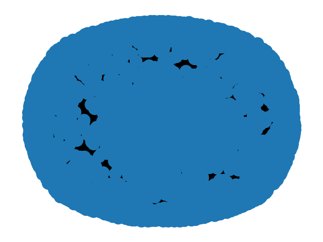
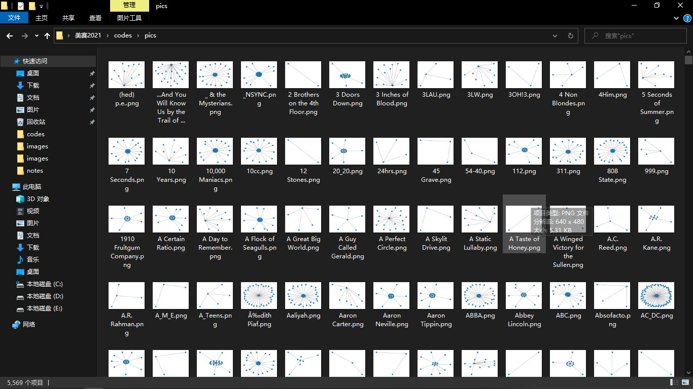

#### 1、目录层级结构图


#### 2、问题一思路

- 题目要求

  使用`Influence_data`数据集或其中的一部分来创建音乐影响力的(多个)定向网络，将**影响者**连接到**追随者**。开发可捕获此网络中"音乐影响力"的参数。通过创建一个直接影响者网络的自网络来探索音乐影响力的子集。描述这个子网，你的"音乐影响"措施在这个子网中显示了什么？

- 思路

  `influence_data`中有`influencer_name`影响者有`follower_name`追随者，把影响者和追随者用一条有向边连起来，A可能影响B，B可能影响C、D。这样把他们都连接起来就可以构造多个定向的网络！通过`Python`的`Networkx`库来实现！

- 具体代码

  ```python
  import csv
  
  # Reading file Influence_data.csv
  f = open("../datas/influence_data.csv",mode="r",encoding="utf-8")
  csv_reader = csv.reader(f)
  # Loading all rows in a list
  rows = [i for i in csv_reader]
  # Headers of the csv file
  headers = rows[0]
  print(headers)
  ```

  得出`influence_data`的表头及其对应中文名称分别是：

  ```
  influencer_id					影响者的人的唯一标识号
  influencer_name					影响者的名称
  influencer_main_genre			最能描述有影响力的艺术家创作的大部分音乐的流派
  influencer_active_start			影响力艺术家开始其音乐事业的10年
  follower_id						关注着艺术家的唯一标识号
  follower_name					跟随有影响力的艺术家的名字
  follower_main_genre				最能描述以下艺术家创作的大部分音乐的流派
  follower_active_start			跟随的艺术家开始其艺术家开始音乐生涯的10年
  ```

  按照题意理解是：有多重边有向图，使用`G = nx.MultiDiGraph()`创建空的网络图！

- 生成的效果图

  

- 代码如下

  ```python
  import csv
  import os
  import networkx as nx
  import matplotlib.pyplot as plt
  
  # Make new folder to save images
  folder = "pics"
  if not os.path.exists(folder):
      os.mkdir(folder)
  
  # Reading file Influence_data.csv
  f = open("../datas/influence_data.csv",mode="r",encoding="utf-8")
  csv_reader = csv.reader(f)
  # Loading all rows in a list
  rows = [i for i in csv_reader]
  # Headers of the csv file
  headers = rows[0]
  # the list contain influencer_name
  influencer_name = [row[1] for row in rows[1:]]
  # the list contain follower_name
  follower_name = [row[5] for row in rows[1:]]
  # Using directed edge connect them
  G = nx.MultiDiGraph()
  for i in range(len(follower_name)):
      G.add_edge(influencer_name[i],follower_name[i])
  nx.draw(G)
  plt.savefig(folder + '/' +'Task1_有向图.png')
  plt.show()
  ```

- 上图过于密集，下面的代码进行优化

  使用字典统计`influencer_name`和`follower_name`中的音乐家总体，可以看到是5568位。使用嵌套循环遍历每一个音乐家，画出其网络节点图！保存到文件夹`pics`里面！

  进行网络拓扑统计指标的计算！加上音乐家姓名统计到`question1_result.csv`文件里面

  ① 度分布

  得到类似这样的数据：

  

  ② 群聚系数

  运行报错，暂没找到解决办法！

  ③ 直径和平均距离

  通过使用`nx.average_shortest_path_length(G)`可以得到图G所有节点间平均最短路径长度！

  ④ 匹配性

  通过使用`nx.degree_assortativity_coefficient(G)`可以得到图G的度匹配性，注意有`nan`类型

  ```python
  import csv
  import os
  import networkx as nx
  import matplotlib.pyplot as plt
  
  
  # Make new folder to save images
  folder = "pics"
  if not os.path.exists(folder):
      os.mkdir(folder)
  
  # Reading file Influence_data.csv
  f = open("../datas/influence_data.csv",mode="r",encoding="utf-8")
  csv_reader = csv.reader(f)
  # Loading all rows in a list
  rows = [i for i in csv_reader]
  # Headers of the csv file
  headers = rows[0]
  # the list contain influencer_name
  influencer_name = [row[1] for row in rows[1:]]
  # the list contain follower_name
  follower_name = [row[5] for row in rows[1:]]
  # Make dict to save all musicians
  musicians_dict = {}
  
  for musician in influencer_name:
      if musician not in musicians_dict:
          musicians_dict[musician] = 1
      else:
          musicians_dict[musician] += 1
  for musician in follower_name:
      if musician not in musicians_dict:
          musicians_dict[musician] = 1
      else:
          musicians_dict[musician] += 1
  # Need to count followers and influencers
  influencers_dict = {}
  followers_dict = {}
  for key,value in musicians_dict.items():
      influencers_dict[key] = 0
      followers_dict[key] = 0
  
  for musician in influencer_name:
      if musician not in influencers_dict:
          influencers_dict[musician] = 1
      else:
          influencers_dict[musician] += 1
  for musician in follower_name:
      if musician not in followers_dict:
          followers_dict[musician] = 1
      else:
          followers_dict[musician] += 1
  
  influencers = list(influencers_dict.values())
  followers = list(followers_dict.values())
  
  # print all musicians of this file
  print(musicians_dict)
  print(len(musicians_dict))
  
  musicians = list(musicians_dict.keys())
  # make several list to save statistics datas
  diameters = []
  assortativitys = []
  
  for musician in musicians:
      # Using directed edge connect them
      G = nx.MultiDiGraph()
      for i in range(len(influencer_name)):
          if musician == influencer_name[i]:
              G.add_edge(musician, follower_name[i])
          if musician == follower_name[i]:
              G.add_edge(influencer_name[i], musician)
      # nx.draw(G)
      diameter = nx.average_shortest_path_length(G)
      diameters.append(diameter)
      assortativity = nx.degree_assortativity_coefficient(G)
      assortativitys.append(assortativity)
      # save pitcure in windows can't use this character
      name = musician.replace('\\',"_").replace("/","_").replace(":","_").replace("*","_").replace("?","_").replace('"',"_").replace("<","_").replace(">","_").replace("|","_")
      # plt.savefig(folder + '/' + '{}.png'.format(name))
      # plt.show()
  
  f = open("question1_result.csv",mode='w+',encoding="utf-8-sig",newline="")
  csv_write = csv.writer(f)
  for i in range(len(musicians)):
      csv_write.writerow([musicians[i],diameters[i],assortativitys[i],influencers[i],followers[i]])
  f.close()
  ```

  运行时间较长，大概2小时左右，没有优化！(除说明语句外注释是为了节省运行时间的！)

  效果图：

  

  

- 开始计算影响因子得分：自己是第零层，自己的影响者是第一层，自己的影响者的影响者是第二层，分别占重是1、0.1、0.01（反过来考虑就是自己是追随者），考虑到实际情况三层循环运行时间很长，还是2层循环跑

  ```python
  import csv
  import os
  import networkx as nx
  import matplotlib.pyplot as plt
  
  
  # Make new folder to save images
  folder = "pics"
  if not os.path.exists(folder):
      os.mkdir(folder)
  
  # Reading file Influence_data.csv
  f = open("../datas/influence_data.csv",mode="r",encoding="utf-8")
  csv_reader = csv.reader(f)
  # Loading all rows in a list
  rows = [i for i in csv_reader]
  # Headers of the csv file
  headers = rows[0]
  # the list contain influencer_name
  influencer_name = [row[1] for row in rows[1:]]
  # the list contain follower_name
  follower_name = [row[5] for row in rows[1:]]
  # Make dict to save all musicians
  musicians_dict = {}
  
  for musician in influencer_name:
      if musician not in musicians_dict:
          musicians_dict[musician] = 1
      else:
          musicians_dict[musician] += 1
  for musician in follower_name:
      if musician not in musicians_dict:
          musicians_dict[musician] = 1
      else:
          musicians_dict[musician] += 1
  # Need to count followers and influencers
  influencers_dict = {}
  followers_dict = {}
  for key,value in musicians_dict.items():
      influencers_dict[key] = 0
      followers_dict[key] = 0
  
  for musician in influencer_name:
      if musician not in influencers_dict:
          influencers_dict[musician] = 1
      else:
          influencers_dict[musician] += 1
  for musician in follower_name:
      if musician not in followers_dict:
          followers_dict[musician] = 1
      else:
          followers_dict[musician] += 1
  
  influencers = list(influencers_dict.values())
  followers = list(followers_dict.values())
  
  # print all musicians of this file
  print(musicians_dict)
  print(len(musicians_dict))
  
  musicians = list(musicians_dict.keys())
  # make several list to save statistics datas
  diameters = []
  assortativitys = []
  
  # count the scores of every musician
  scores = []
  news = []
  for musician in musicians:
      # Using directed edge connect them
      score = 1
      new = 1
      G = nx.MultiDiGraph()
      for i in range(len(influencer_name)):
          if musician == influencer_name[i]:
              G.add_edge(musician, follower_name[i])
              score += 0.1
          if musician == follower_name[i]:
              G.add_edge(influencer_name[i], musician)
              new += 0.1
      scores.append(score)
      news.append(new)
      # nx.draw(G)
      diameter = nx.average_shortest_path_length(G)
      diameters.append(diameter)
      assortativity = nx.degree_assortativity_coefficient(G)
      assortativitys.append(assortativity)
      # save pitcure in windows can't use this character
      name = musician.replace('\\',"_").replace("/","_").replace(":","_").replace("*","_").replace("?","_").replace('"',"_").replace("<","_").replace(">","_").replace("|","_")
      # plt.savefig(folder + '/' + '{}.png'.format(name))
      # plt.show()
  
  f = open("question1_result.csv",mode='w+',encoding="utf-8-sig",newline="")
  csv_write = csv.writer(f)
for i in range(len(musicians)):
      csv_write.writerow([musicians[i],diameters[i],assortativitys[i],influencers[i],followers[i],scores[i],news[i]])
  f.close()
  ```
  
  效果图是`csv`文件最后一列加了得分！
  
  最后求两者加权得分即得到最后的影响因子！

#### 3、问题二思路

- 题目要求

  使用音乐特征的`full_music_data`和/或两个音乐特征摘要数据集(包括艺术家和年份)来制定音乐相似度的度量。用你的方法，同一类型的艺术家比不同类型的艺术家更相似吗？

- 需要使用`full_music_data`和/或音乐特征的两个汇总数据集来研究**音乐的相似性度量**，题目中在`full_music_data`基础上创建了两个汇总数据集，即根据艺术家计算的平均值`data_by_artist`以及根据年份计算的`data_by_year`。因此我们还可以根据这些艺术家所属的流派进行统计，计算不同流派在各个条目中的平均值，进而同那个标准差变异系数等手段来衡量相同流派以及不同流派的离散程度。通过对各个流派的平均值计算相关系数可以得到各个流派间的关联性。用于变量的个数较多，维度较高，分析起来比较麻烦，因此可以采取降维的手段提取出几个重要的维度，诸如主成分分析(`PCA`)、随机森林和低方差滤波等模型等

- 

