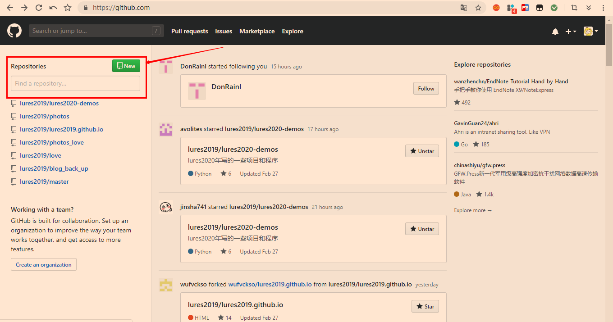

### 6、将Gitbook电子书部署到GitHub上！

```
下载Git软件: https://git-scm.com/downloads
(具体使用教程参考我的公众号文章：https://mp.weixin.qq.com/s?__biz=MzU5OTkzNDMyMQ==&mid=2247484320&idx=1&sn=9b456e9e563a03e1adbea6256cd89224&chksm=feac17bec9db9ea8eb50a38eee3cdebaf7789148736c7871fdd2b5ba58207d790d2b0d8fe950&token=1673133867&lang=zh_CN#rd)

master 分支保存书籍的源码
gh-pages 分支保存书籍编译后的 HTML 文件
	git checkout -b gh-pages
```

```
注册和登录Github的过程我就不详细叙述了！大家可以参考这篇文章：
	https://blog.csdn.net/rj597306518/article/details/71307757
```



