### 1、创建新项目

```
1）Visual Studio2015下载安装教程：
https://mp.weixin.qq.com/s/b_WLV8UQsafFKVOM72BHdw

2）遇到控制台闪退问题：
https://blog.csdn.net/lezeqe/article/details/83185218
```


### 2、大作业（一）

##### ①题目

设计算法，实现从包含n个元素的数组中，查找最大元素和最小元素，并用C语言进行程序设计！

##### ②算法设计说明

```
最容易想到的算法设计是：
依次遍历所给定的数组，将数组中的每个数值分别和最开始给定的最大值和最小值进行比较，然后得到新的最大值和最小值再进行新的一轮比较，直到循环结束！算法的时间复杂度是2N，N是给定的数组的长度！
```

##### ③C语言代码文档

文件相对路径如下：`通信1804-21-20188277-王智超-软件技术基础大作业\Projects\Projects\大作业1.cpp`

##### ④C语言源程序

```c++
# include<iostream>
using namespace std;
int main() {
	int num[] = { 9,32,54,89,101,-2,6 };
	int n = 7;
	int max = num[0];
	int min = num[0];
	cout << num[0];
	for (int i = 0; i < n; i++) {
		if (max < num[i]) {
			max = num[i];
		}
		if (min > num[i]) {
			min = num[i];
		}
	}
	cout << "给定数组中元素最大值是：" << max << endl;
	cout << "给定数组中元素最小值是：" << min << endl;
	return 0;
}
```

程序运行截图：

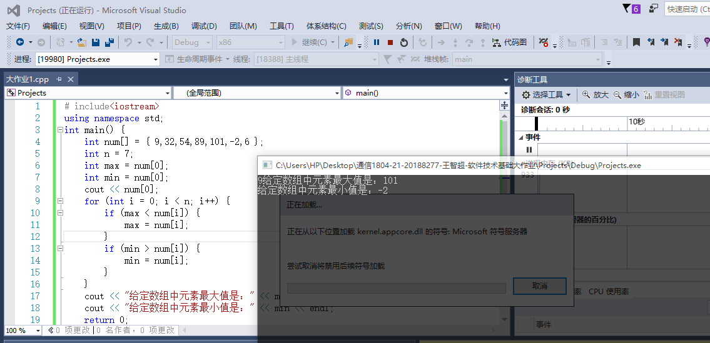

##### ⑤算法优化

```
先遍历一遍数组，两个两个分成一组，小的放在左边大的放在右边，这样比较次数是N/2。N是数组的长度。然后最小的元素一定是在每组的左边，最大的元素在右边。下一步在左边的所有元素中比较N/2次产生最小的，在右边的元素中比较N/2次产生最大的。总共需要比较的次数是3*（N/2）次。
```

源代码：

```C++
#include <iostream>
using namespace std;

int main() {
    int d[] = {9, 6, 7, 5, 13, 6, 2};
    int n = 7;
    int max = d[0];
    int min = d[0];
    bool flag = false;
    if(n % 2) {
        n--;
        flag = true;        
    }   
    for(int i = 0; i < n-1; i+=2) {
        if(d[i] <= d[i+1]) {
            if(d[i] < min)
                min = d[i];
            if(d[i+1] > max)
                max = d[i+1];
        }
        else {
            if(d[i] > max)
                max = d[i];
            if(d[i+1] < min)
                min = d[i+1];
        }   
    }
    //若数组长度为奇数，还需要和最后一个数作比较 
    if(flag) {
        if(d[n] < min)
            min = d[n];
        if(d[n] > max)
            max = d[n]; 
    }
    cout << "The max value of the array is: " << max << endl;
    cout << "The min value of the array is: " << min << endl;   
} 
```


### 3、大作业（2）

##### ①题目

从冒泡、插入、选择、快速、二路归并排序中，选择一种排序方式，用C语言进行程序设计！

##### ②算法设计说明文档

```
选择冒泡排序，首先想到的思路是：
比较相邻的元素，如果反序则交换。通过第一趟排序能找出最大的元素，并使最大的元素移至最后一位，然后通过第二次排序使次大的元素移至倒数第二位，以此类推，直至所有元素有序。
```

##### ③C语言代码文档

文件相对路径如下：`通信1804-21-20188277-王智超-软件技术基础大作业\Projects\Projects2\Projects2\main.cpp`

##### ④C语言源程序

```c++
#include<iostream>
using namespace std;

void print(int arr[], int n)
{
	for (int j = 0; j<n; j++)
	{
		cout << arr[j] << "  ";
	}
	cout << endl;
}

int main()
{
	int s[10] = { 8,1,9,7,2,4,5,6,10,3 };
	int n = 10;
	cout << "初始序列是：";
	print(s, 10);
	for (int i = 0; i < n - 1; i++) {
		for (int j = 0; j < n - 1 - i; j++) {
			if (s[j] > s[j + 1]) {
				int temp = s[j];
				s[j] = s[j + 1];
				s[j + 1] = temp;
			}
		}
	}
	cout << "排序结果是：";
	print(s, 10);
	return 0;
}
```

程序运行截图：

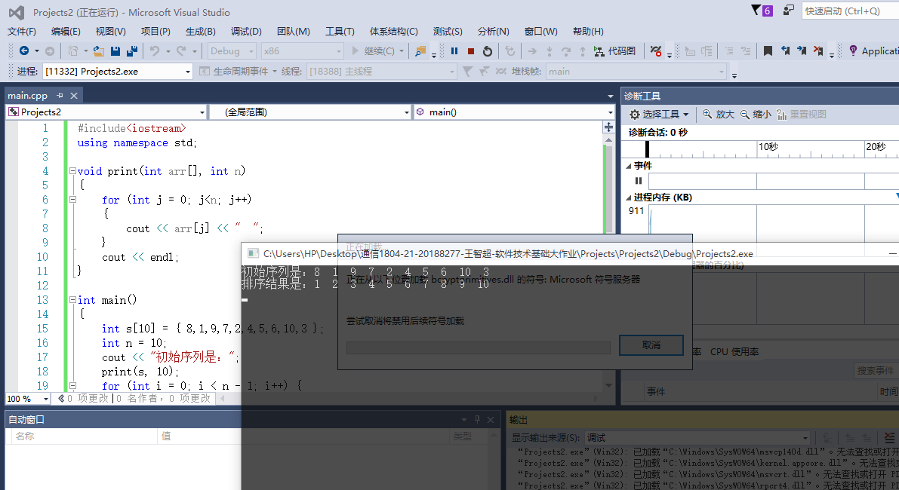


### 4、大作业（3）

##### ①题目

按照中序遍历方式建立一棵二叉树，并用中序遍历的方式访问输出各结点，要求用两棵不同的二叉树做实例验证结果！

##### ②算法设计说明文档

```
思路：
节点不够满二叉树的，空节点也需要补上，这种方法仅限制在无条件建立二叉树，如果二叉排序树建立二叉树，对于左右子树建立时有条件限制，则不需要补空节点！
创建二叉树的二叉链表，其基本思想为：首先对一般的二叉树添加若干个虚结点，使其每一个结点均有左右孩子，然后按先序遍历的顺序依次输入结点信息。若输入的结点不是虚结点，则建立一个新结点，然后依次建立该结点的左孩子和右孩子；否则，新结点为空。
```

##### ③C语言代码文档

文件相对路径如下：`通信1804-21-20188277-王智超-软件技术基础大作业\Projects\Project3\Project3\main.cpp`

##### ④C语言源程序

```C++
#include <stdio.h>
#include <stdlib.h>
//结点结构体
typedef struct BiTNode {
	char data;//数据
	struct BiTNode * lchild, *rchild;//左右孩子指针
}BiTNode, *BiTree;
//初始化二叉树的二叉链表T
void Create_BiTree(BiTree * T) {
	char ch;
	ch = getchar();
	//@ 表示此处无结点，为虚结点
	if (ch == '@') {
		*T = NULL;
	}
	//# 表示构造结束
	else if (ch == '#') {
		return;
	}
	//排除以上两种情况，则为有数据的结点，对其进行构造
	else {
		*T = (BiTree)malloc(sizeof(BiTNode));
		(*T)->data = ch;
		//继续构造其左右孩子结点
		Create_BiTree(&(*T)->lchild);
		Create_BiTree(&(*T)->rchild);
	}
}
//中序遍历二叉树
void InOrder(BiTree T) {
	if (T) {
		//中序遍历，即先遍历左孩子，然后输出结点数据，在遍历右孩子
		InOrder(T->lchild);
		printf("%3c", T->data);
		InOrder(T->rchild);
	}
}

int main() {
	BiTree T;
	printf("input PreOrder str:");
	//构造二叉树
	Create_BiTree(&T);
	printf("\n");
	//按照中序方式遍历二叉树
	printf("\nInOrder list of T :");
	InOrder(T);
}
```

程序运行截图：

1）这是一个二叉树的图：

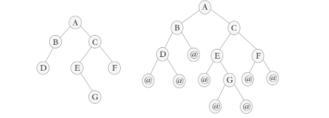

中序遍历结果是：`D B A E G C F`

验证如下：

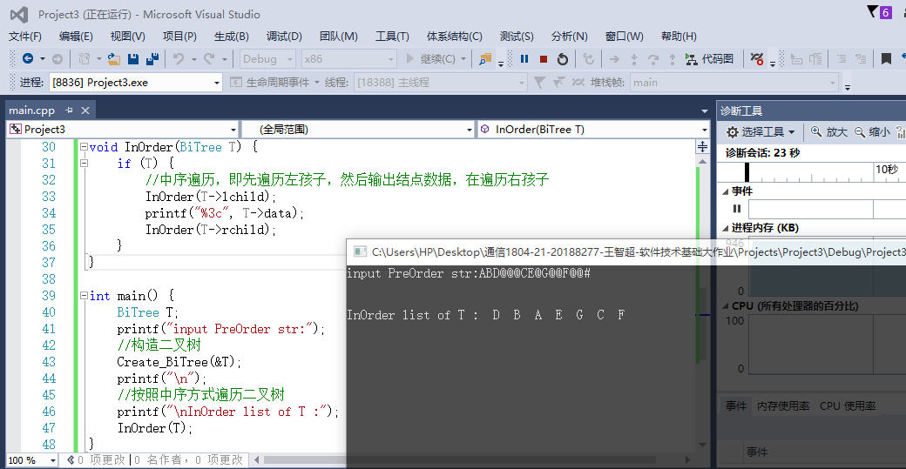


2）另外一个二叉树的图：

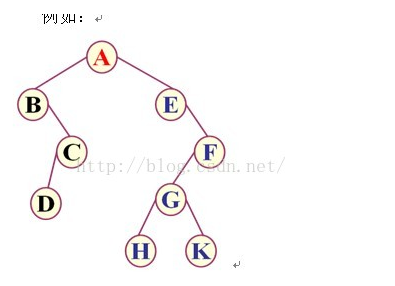

中序遍历结果：`B D C A E H G K F`

验证如下：

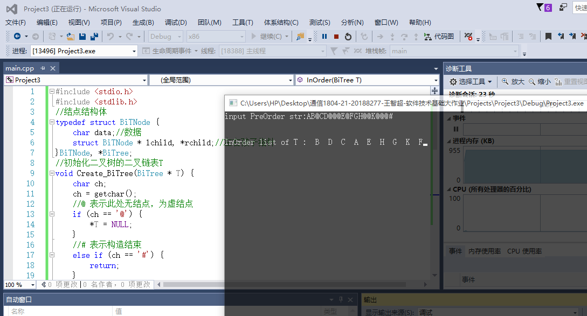


### 5、大作业（4）

##### ①题目

设计一个教务管理系统的E-R模型和关系模型。其中各要素包括：

实体 1：学生 属性:学号,班级序号,姓名,班级,性别

实体 2：教师 属性:姓名,性别

实体 3：课程 属性:课程名,课程编号,学分

学生与课程之间的两个联系为:选课,考试 其中考试的属性:成绩

教师与课程之间的一个联系为:讲授

要求:先建立 E-R 模型,然后将其转换为符合第三范式的关系

##### ②算法设计说明文档

```
对于教务管理系统，我们很容易想到的是，教室有课程名，课程编号，学分的属性；有教师一定有课程，那就给课程编号/名称/学分属性，最后必须要有学生，赋予学号/班级序号/姓名/班级/性别属性。
```

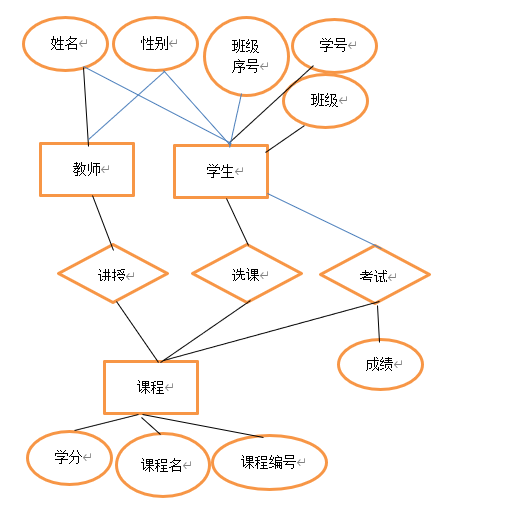

关系不确定！


### 6、大作业（5）

##### ①题目

设计一个算法实现N以内所有2的幂次数的和，画出流程图、N-S图、PAD图

##### ②算法设计说明文档

```
这个算法设计很简单，输入N，使用循环，变量相加，得到最终的结果
```

##### ③C语言代码文档

文件相对路径如下：

##### ④C语言源程序：

```C++
# include<iostream>
using namespace std;
int main() {
	int n,sum=0;
	cin >> n;
	for (int i = 0; i < n; i++) {
		sum += pow(2, i);
	}
	cout << "幂次数和是：" << sum << endl;
	return 0;
}
```

程序运行截图：

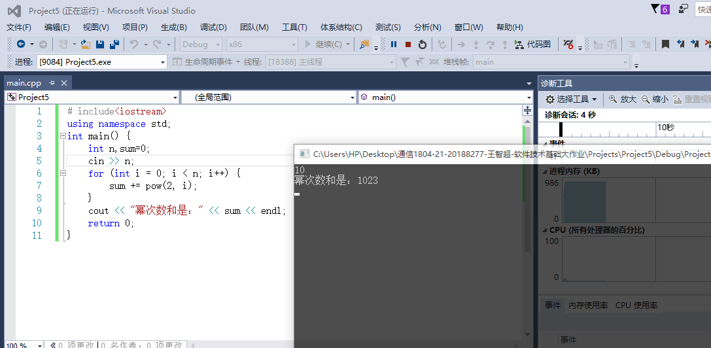

##### ⑤程序流程图

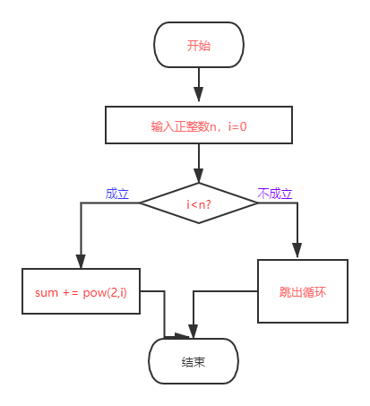

##### ⑥N-S图

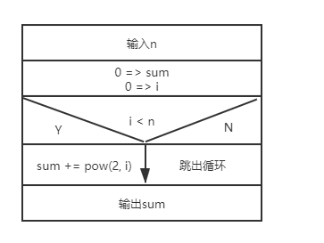

##### ⑦PAD图

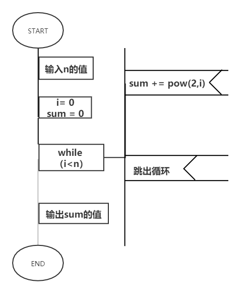

以上图形都是在：`https://www.processon.com/diagrams`制作

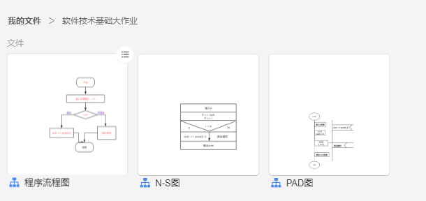

